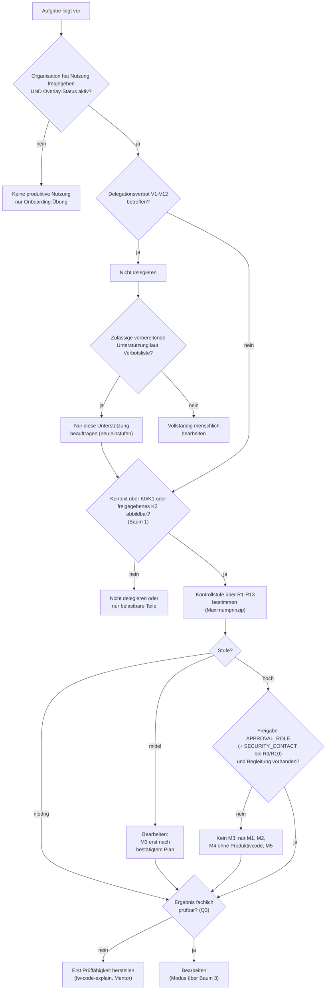

# Entscheidungsbaum 2 – Darf der KI-Client diese Aufgabe bearbeiten?

| Attribut | Wert |
|---|---|
| ID | `FW-DT-02` |
| Version | `0.1.2` |
| Status | `pilot` |
| Owner (Rolle) | `<FRAMEWORK_OWNER>` |
| Anwendung | im Preflight, vor der ersten Anweisung; durch die Bearbeiterin oder den Bearbeiter |
| Quelle | `.koolie/core/framework/core/09-risk-model.md`, `.koolie/core/framework/core/01-governance.md` |

## Textbeschreibung (normativ)

1. **Grundvoraussetzungen:** Ist die KI-Nutzung durch die Organisation freigegeben und das Project Overlay `aktiv`? → Nein: keine produktive Nutzung; zulässig sind nur Onboarding-Übungen auf dem synthetischen Übungsrepository.
2. **Delegationsverbot:** Fällt die Aufgabe unter V1–V12 (`.koolie/core/framework/core/09-risk-model.md`, Abschnitt 4)? → **Nicht delegieren.** Prüfen, ob eine zulässige vorbereitende Unterstützung existiert (Spalte „Zulässige Unterstützung" der Verbotsliste); nur diese darf beauftragt werden.
3. **Kontext beschaffbar:** Ist der für die Aufgabe nötige Kontext vollständig über K0/K1 oder freigegebenes K2 abbildbar (Baum 1)? → Nein: Aufgabe nicht oder nur für die belastbaren Teile delegieren.
4. **Einstufung:** Kontrollstufe über R1–R13 nach dem Maximumprinzip bestimmen; auslösenden Faktor notieren. Im Zweifel höhere Stufe.
5. **Stufenvoraussetzungen** (`09-risk-model.md`, Abschnitt 3): niedrig → bearbeiten. Mittel → bearbeiten; M3 erst nach bestätigtem Plan. Hoch → M3 nur mit dokumentierter Freigabe `<APPROVAL_ROLE>` (bei R3/R10 zusätzlich `<SECURITY_CONTACT>`) und begleitender Person; ohne diese Voraussetzungen M1, M2, M4 ohne Änderung an Produktivcode und M5.
6. **Prüfbarkeit:** Kann die Bearbeiterin oder der Bearbeiter das Ergebnis fachlich prüfen (Q3)? → Nein: erst Prüffähigkeit herstellen (`fw-code-explain`, Mentorin oder Mentor), dann delegieren.

## Diagramm

## Hinweise

- „Nicht delegieren" heißt nicht „nicht erledigen": Die Aufgabe wird von Menschen bearbeitet; der KI-Client darf nur die in der Verbotsliste ausdrücklich genannte Vorbereitung liefern.
- Die Stufe wird während der Bearbeitung neu bewertet, wenn sich der Zuschnitt ändert (S5, Baum 5).
