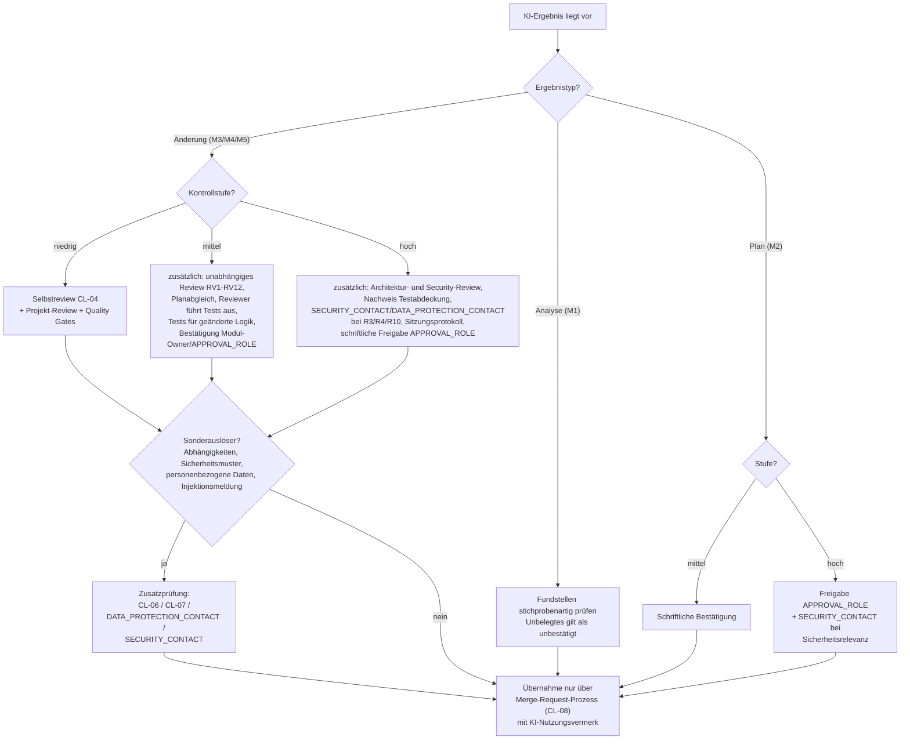

# Entscheidungsbaum 4 – Welche menschliche Prüfung ist erforderlich?

| Attribut | Wert |
|---|---|
| ID | `FW-DT-04` |
| Version | `0.1.2` |
| Status | `pilot` |
| Owner (Rolle) | `<FRAMEWORK_OWNER>` |
| Anwendung | nach Abschluss einer KI-Sitzung, vor Übernahme des Ergebnisses |
| Quelle | `.koolie/core/framework/core/07-review-rules.md`, `05-working-model.md`, `09-risk-model.md`, `.koolie/core/checklists/04-review-ai-code.md` |

## Textbeschreibung (normativ)

1. **Immer:** Kein KI-Ergebnis wird ohne menschliche Prüfung übernommen (P5); keine Einstufung ersetzt sie vollständig.
2. **Ergebnisse ohne Änderung (M1/M2)** (`05-working-model.md`, Abschnitt 2.2): Befunde (M1) werden stichprobenartig an den Fundstellen geprüft; unbelegte Aussagen gelten als unbestätigt. Pläne (M2) werden schriftlich bestätigt (mittel) beziehungsweise durch `<APPROVAL_ROLE>` freigegeben (hoch; bei Sicherheitsrelevanz zusätzlich `<SECURITY_CONTACT>`, `09-risk-model.md` Abschnitt 3), bevor umgesetzt wird.
3. **Änderungen (M3/M4/M5) nach Kontrollstufe** (`07-review-rules.md` Abschnitt 3; Prüfungen, Freigaben und Dokumentation nach `09-risk-model.md` Abschnitt 3):
   - **niedrig:** Selbstreview anhand `.koolie/core/checklists/04-review-ai-code.md` (vollständiges Lesen des Diffs; mindestens RV1, RV2, RV5, RV9, RV10) plus reguläres Projekt-Review und alle Quality Gates.
   - **mittel:** zusätzlich unabhängiges Review aller Punkte RV1–RV12 durch eine zweite Person, Abgleich mit dem bestätigten Plan, eigenständige Testausführung durch die Reviewerin oder den Reviewer; Tests für geänderte Logik; Bestätigung durch Modul-Owner oder `<APPROVAL_ROLE>`.
   - **hoch:** zusätzlich Architektur- und Security-Review durch die im Overlay benannten Rollen; Nachweis der Testabdeckung; bei R3/R4/R10 Einbindung `<SECURITY_CONTACT>` beziehungsweise `<DATA_PROTECTION_CONTACT>`; Prüfung des Sitzungsprotokolls; schriftliche Freigabe `<APPROVAL_ROLE>`.
4. **Sonderauslöser unabhängig von der Stufe:** Berührung von Abhängigkeiten → `.koolie/core/checklists/07-new-dependency.md`; Sicherheitsmuster im Diff → `.koolie/core/checklists/06-security.md`; neue Verarbeitung personenbezogener Daten → `<DATA_PROTECTION_CONTACT>`; gemeldete Injektionsversuche → `<SECURITY_CONTACT>`.
5. **Abschluss:** Übernahme ausschließlich über den bestehenden Review- und Freigabeprozess (`.koolie/core/checklists/08-merge-request.md`); KI-Nutzungsvermerk ist Pflicht.

## Diagramm

## Hinweise

- `fw-review-support` liefert Zulieferung für diese Prüfungen, zählt aber nicht als eine der geforderten menschlichen Prüfungen (V1).
- Reviewerinnen und Reviewer erhalten den Nutzungsvermerk vor Beginn; ohne Vermerk wird das Review nicht begonnen (Prozessbefund).
