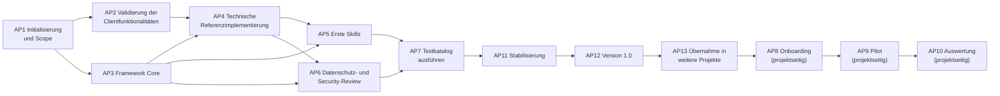

# Implementierungs-Roadmap

| Attribut | Wert |
|---|---|
| ID | `FW-DOC-ROADMAP` |
| Version | `0.3.1` |
| Status | `pilot` |
| Owner (Rolle) | `<FRAMEWORK_OWNER>` |

> Es werden keine Termine oder Aufwände vorgegeben; die Steuerung erfolgt über Prioritäten (P1 = zuerst) und logische Abhängigkeiten. Rollen sind generisch. Die Erstfassung 0.1.0 dieses Repositorys deckt die inhaltlichen Ergebnisse von AP3–AP5 in Entwurfsqualität bereits ab; die zugehörigen Arbeitspakete bestätigen, validieren und härten sie.

## Stand nach Release 1.9.1 (2026-09-25)

Wird mit jedem Release fortgeschrieben; Prüfung 91 hält die Überschrift gegen `VERSION`
(D-372). Der Abschnitt beantwortet, womit weiterzuarbeiten ist, ohne dass man dafür den
Änderungsverlauf lesen muss.

### Der Weg nach 1.0.0 – die fünf Kriterien und wo sie gezählt werden

**Der Maßstab ist D-11**, nicht ein Gefühl: *Version 1.0.0 bezeichnet den Stand „technisch
validiert und übertragbar".* Fünf Kriterien, alle im Einflussbereich des Framework Owners –
Pilot, Onboarding und organisatorische Freigabe sind **ausdrücklich keine** Vorbedingung,
sondern Aufgabe der aufnehmenden Organisation.

**Gezählt von Prüfung 46: Kriterium 1 = 0, Kriterium 2 = 0, Kriterium 3 = 0, Kriterium 4 = 0**

Diese Zeile ist **keine Pflege**. Prüfung 46 rechnet die vier Zahlen bei jedem Lauf aus
und meldet jede Abweichung – **in beide Richtungen**. Wer einen Punkt schließt, zieht sie
nach; wer es vergisst, sieht es im nächsten Lauf. Stehen alle vier auf `0` und der Lauf
ist grün, **dann ist das die Meldung** – erzwungen statt behauptet.

| # | Kriterium (D-11) | Wie Prüfung 46 zählt | Was die alte Regel übersah |
|---|---|---|---|
| **1** | kein unbearbeiteter `VERIFY`-Marker | Fundstellen **beider** Markerschreibweisen unter `<CORE_DIR>/`, ohne `build/`, `CHANGELOG.md`, `governance/change-requests/` und `tests/protocols/`. 🟢 **Seit `0.87.0` eine RÜCKFALLSPERRE und kein Arbeitsvorrat** (D-293): Die Markerform ist abgeschafft (D-291), die Zahl steht auf null, und was der Zähler ab jetzt meldet, ist ihre **Wiedereinführung**. **Die Null ist gemessen und nicht konstruiert** – Sonde `46c` legt einen Marker in den Kern und verlangt die Meldung, Gegenprobe `46c` legt einen in ein datiertes Protokoll und verlangt ihr Ausbleiben; beide bringen ihren Gegenstand selbst mit. ⚠️ **Der Zählbereich war kleiner als die Wirkungsfläche** – sechs versionierte Träger außerhalb (`README.md`, fünf Quellen unter `build/doc/`) sind mitgezogen, ohne den Bereich zu erweitern (D-295, `K-98`) | Der `grep` kannte **eine von zwei** Schreibweisen. Die clientgebundene Altform (`PLACEHOLDER_REGISTRY.md`, Frist ebenfalls „vor Version 1.0.0") trägt allein im Pack `devin-desktop` sieben Fundstellen und zwei in dessen `root-template/`. **Mit 0.53.0 sind sechs Fundstellen aufgelöst – 29 → 23** (`CR-2026-075`, D-112 bis D-114): drei in der Pfadabbildung des Packs `devin-desktop`, zwei in dessen `root-template/` und eine in `framework/runtime/mcp-config.example.json`, der Quelle der MCP-Vorlage. **Zwei der drei Belege lagen seit dem 2026-09-11 beziehungsweise 2026-09-14 in diesem Repositorium**, ohne dass jemand sie gegen die Marker gehalten hätte |
| **2** | Testkatalog vollständig protokolliert, kein Testfall `offen` | Ergebniszellen auf `offen` in `tests/TEST_CATALOG.md` **und in jeder `TESTS.md` des Kerns**, gefunden durch Baumdurchlauf | „je Skill" wurde als zwölf Dateien gelesen. Es sind **dreizehn** – `role-packs/requirements-engineering/skills/role-re-ticket/TESTS.md` mit 15 offenen Zellen fehlte. **Mit 0.54.0 bewegt sich diese Zahl zum ersten Mal – 118 → 111** (`CR-2026-076`, D-115 bis D-119): der erste Sitzungstest des Projekts, sechzehn Läufe, sieben Ergebniszellen abgenommen. **Ein `bestanden` sagt seither, dass das erwartete Verhalten eingetreten ist – nicht, dass das Framework es bewirkt hat** (D-115), und es nennt das gemessene Client Pack (D-117). **Mit 0.55.0 bewegt sie sich zum zweiten Mal – 111 → 105** (`CR-2026-077`, D-120 bis D-123): der zweite Sitzungstest, dreiundzwanzig Läufe, sechs Ergebniszellen der Klassen `ZA` und `DS` abgenommen. **Neu ist, was ein `bestanden` bei einem Schranken-Testfall NICHT sagt** (D-122): In allen sechs Hauptläufen ist die verbotene Handlung **null Mal versucht** worden – der Client lehnt auf den Regeltext hin ab, bevor die technische Schranke anlaufen könnte. Die Zelle weist seither je Schicht aus, was belegt ist |
| **3** | alle Modulstatus oberhalb `entwurf` | **Jede** Steckbriefzeile `\| Status \| … \|` im Kopf einer `.md` des Kerns, verglichen am ersten Wort des Werts | Die Ablagenliste deckte **ein Viertel** des Bestands; `checklists/`, `prompts/`, `governance/`, `decision-trees/` und sechs weitere Ablagen fehlten. **Und `framework/core/` war genannt und trägt gar keine Statuszeile.** Keiner der 69 stand über `entwurf`. **Mit 0.50.0 ist das Modell zum ersten Mal angewendet** (`CR-2026-072`, D-102 bis D-104): dreizehn Skills auf `pilot`, und vier Vorlagen tragen statt eines Statuswerts einen Ausfüllschlitz, weil ihr Steckbrief die Kopie beschreibt – **69 → 52**. **Mit 0.51.0 ist der Gegenstand vollständig und das erste Nicht-Skill-Bündel abgenommen** (`CR-2026-073`, D-105 bis D-108): Zwölf Träger ohne Statuszeile haben eine – **52 → 64** –, und 23 gehen auf `pilot`: die elf Checklisten und die zwölf Träger mit dem Kernmodul-Steckbrief. **64 → 41.** **Mit 0.52.0 sind vierzig der einundvierzig übrigen abgenommen – 41 → 1** (`CR-2026-074`, D-109 bis D-111). Der eine Rest ist `clients/devin-desktop/CLIENT_PACK.md`: Sein Steckbrief lässt zwei Aussagen des Frameworks offen, und er geht über `AP2`, nicht über eine Abnahme. Die Übergangsbedingung steht seit 0.50.0 in `01-governance.md` Abschnitt 5; Prüfung 47 setzt seit 0.51.0 Vokabular und Vollständigkeit durch. **✅ Mit 0.53.0 erfüllt – 1 → 0** (`CR-2026-075`): `AP2` hat die verbindliche Zielversion festgelegt, beide Steckbriefzellen tragen Werte, und der Träger ist abgenommen. **Kein Modulträger des Frameworks steht mehr auf `entwurf`** |
| **4** | keine Decision Records im Status `entschieden (Vorschlag)` | Nur Zeilen der Form `\| D-NN \|` in `governance/DECISION_LOG.md`, Statuszelle über `tabellenzellen()` | Ein roher `grep` zählte die **Legende**, **fünf Klärungspunkte** und **`D-11` selbst** mit – 16 statt 9. **✅ Erfüllt seit 0.49.0** (`CR-2026-071`, D-100): Die neun sind bestätigt |
| **5** | Übernahme in ein zweites Projekt nachgewiesen | **zählt Prüfung 46 nicht** – eine Feststellung, keine Zahl. Eine Enthaltung, und sie steht im Kopfkommentar | **erfüllt** – das Übungsrepository wurde nach 0.10.0 über sechs Releases hinweg **aktualisiert** statt neu installiert (`FW-RE-01`). Organisatorisch bleibt es offen, weil es keinen Organisationsbezug hat; D-11 verlangt das nicht |

#### Der Releaseplan bis 1.0.0 und darüber hinaus

**Die Nummern sind eine Reihenfolge, keine Termine** – die Vorbemerkung dieses Dokuments
gibt weder Termine noch Aufwände vor, und dieser Plan hält sich daran (`CR-2026-078`,
D-124). **Und er rechnet mit sich selbst:** Die Aufgabenbeschreibung dieses Projekts war
zehnmal in Folge zu klein, und 0.54.1 ist ein Nachtrag zu einem Release, das fertig
aussah. **Folge-Releases aus Testfunden fallen dazwischen; das ist der Normalfall, nicht
die Störung.**

| Release | Gegenstand | Wirkung auf D-11 | Sitzungskontingent |
|---|---|---|---|
| **0.56.0** | der Plan selbst, drei Ziel-Releases, der neue Projektname, der Overlay-Parameter | – | nein |
| **0.57.0** ✅ | **Die Clientbindung des werkzeugneutralen Kerns** – 17 Fundstellen in 14 anweisenden Trägern aufgelöst, darunter sechs Prompt-Vorlagen und ein normatives Kernmodul. **Die Prüflücke ist nicht nur benannt, sondern geschlossen:** Prüfung 48 setzt die Neutralitätsregel durch, und der dritte Grund für ihr Ausbleiben war neu – die Wurzelliste von Prüfung 12 war selbst clientgebunden (`CR-2026-080`, D-128, `K-52`) | – | nein |
| **0.58.0** ✅ | **Sitzungstest 3:** Klasse `PI` (`FW-PI-02` bis `-04`) und die restlichen `DS`-Fälle – erledigt: fünf Ergebniszellen abgenommen, **und der teuerste Befund kostete nichts:** Die Präparation `UEB-06` hat ihren Gegenstand nie hergestellt, `FW-PI-04` war dreizehn Releases lang nicht fahrbar (`CR-2026-082`, D-130 bis D-133, `K-53`) | Kriterium 2: **105 → 100** | ja |
| **0.59.0** ✅ | **Sitzungstest 4:** Klassen `NE` und `SC` – erledigt: **sieben** Ergebniszellen (fünf zentrale, `SK-006-N04` und `SK-006-P02`). 🔴 **`FW-SC-01` bleibt offen:** Der Hauptlauf hat die Scope-Falle nie angetroffen – er hat das Nachbarmodul nicht gelesen und sagt es selbst. **Drei Vorbefunde fielen vor dem ersten Lauf an:** `FW-NE-02` war nie fahrbar (`UEB-08` neu), `FW-NE-01` ohne Gegenstelle nicht messbar, `FW-NE-04` ist eine Sammelzelle. **Und der Kontrollzuschnitt selbst war unvollständig** – auch der von `0.58.0` (`CR-2026-083`, D-135 bis D-141, `K-53` beantwortet, `K-54` und `K-55` neu) | Kriterium 2: **100 → 93** | ja |
| **0.60.0** ✅ | **Die Vorbedingungen des fünften Sitzungstests** – **vier von zehn tragen nicht, und alle vier fielen vor dem ersten Lauf an.** `UEB-07` hat seinen Gegenstand **zwanzig Releases** lang nicht hergestellt (verdrahteter Ablageort, untracked Ziel, und der Regeltext lieferte seine eigene Lösung mit); **neun von zwölf `fw-*`-Skills sind für das Modell nicht aufrufbar** und haben `FW-SC-01` scheitern lassen; `FW-RE-01` ist eine Sammelzelle; `FW-PO-02` braucht einen zweiten Turn. **Prüfung 49** setzt den ausdrücklichen Skill-Aufruf im Testkatalog durch (`CR-2026-085`, D-142 bis D-146, `K-55` beantwortet) | – | nein |
| **0.61.0** | **Die Grenzfälle gegen die Fassungen gehalten** – `FW-KO-05` ist zum ersten Mal gefahren: **fünf Abweichungen in vier Befunden, sieben Fundstellen** (13 von 18 prüfbaren Grenzfällen ohne Abweichung; zwei der zwanzig sind mit diesem Prüfmittel nicht prüfbar) – und **vier davon liegen in der Regelablage**, der Fassung, die sein eigener Auslöser nicht nannte. Die Overlay-Laufzeitfassung bot dreiunddreißig Releases lang einen Ausfüllschlitz für freigegebene Domains, den ihre eigene Quelle seit 0.33.0 auf „keine" festlegt (G-13); zwei Fassungen führten **Sicherheitskonfiguration** in einer Aufzählung mit Freigabefolge und stellten damit ein Delegationsverbot auf die freigebbare Seite (G-05/G-06, sechzig Releases); dieselbe Fassung ließ den Halbsatz weg, der die bereinigte Ableitung zulässt (G-02). **Prüfung 51 und 52** setzen es durch. Und der Releaseplan selbst hatte zwei Fehler – eine Zeile, die ihrer eigenen Zahl widersprach, und eine Kette, die um eins riss; **Prüfung 53** rechnet sie jetzt nach (`CR-2026-086`, D-148 bis D-153, `K-59` bis `K-61` neu) | – | nein |
| ~~**0.62.0**~~ ✅ | **`FW-AK-01` gefahren: die Produktbeobachtung, ohne Kontingent** – 22 Quellen und beide Produkt-Changelogs abgeglichen, für `devin-desktop` zum ersten Mal vollständig. Dreizehn Befunde, ein VERIFY-Marker aufgelöst, Prüfung 54 (`CR-2026-087`, D-154 bis D-159, `K-62` bis `K-65`). **Die zweite `review`-Zelle des Bündels, nach `FW-KO-05` in 0.61.0** | Kriterium 2: **93 → 92** | nein |
| ~~**0.63.0**~~ ✅ | **Die Vorbedingungen der dreizehn Testblätter durchgegangen** – 81 Zellen, **21 ohne Gegenstand**; dazu acht ungebundene Pflichtplatzhalter mit 65 Fundstellen in der geladenen Schicht. Prüfung 55 und 56 (`CR-2026-088`, D-160 bis D-162, `K-66`, `K-67`) | – | nein |
| ~~**0.64.0**~~ ✅ | **Die Herrichtung des Übungsrepositoriums** (`K-66`) – erledigt: Von den einundzwanzig Zellen **trugen vier bereits**, **fünfzehn sind hergerichtet** über sieben neue Präparationen `UEB-09` bis `UEB-15`, und **eine, die 0.63.0 als tragend geführt hat, war gekippt**. Das Aufgabenblatt liegt jetzt im gesperrten Bereich. Prüfung 57 und 58 (`CR-2026-089`, D-163 bis D-169, `K-66` erledigt, `K-68` neu) | – | nein |
| ~~**0.65.0**~~ ✅ | **Die Vorbedingungen des fünften Sitzungstests, zweiter Durchgang** – acht Befunde, ein Vormittag, kein Kontingent; zum neunten Mal in Folge war der Durchgang vor dem Eingriff der billigste Befund. 🔴 **Der teuerste liegt außerhalb des Kerns:** Die Einengung der Sperre `.github/**` auf `.github/workflows/**` aus 0.63.0 (D-161) steht allein im **Quell**-Overlay – die beiden Träger, die den Client binden, führen weiter den weiteren Wert, unverändert seit dem ersten Commit jenes Repositoriums. **Drei Prüfungen sahen es nicht, jede aus einem eigenen Grund**; `SK-012-P01` blieb unfahrbar. **Prüfung 59** gleicht seither Quelle, Laufzeitfassung und `deny`-Korb ab. 🟢 **Und `FW-PO-02` ist fahrbar** (D-170): D-144 hatte den Gegenstand aus dem Auslöser erschlossen, und die Zelle nennt ihn in zwei Spalten selbst. Dazu je ein weiterer Gegenstand für **Prüfung 44** und **49** und drei zu kleine Zählungen (`CR-2026-090`, D-170 bis D-174, `K-69` neu) | – | nein |
| ~~**0.66.0**~~ ✅ | **Sitzungstest 5** – erledigt: **sieben Ergebniszellen**, dreißig Läufe, einundzwanzig Bäume, 24,44 USD. 🔴 **Der Befund, den man sich merken muß: Bei VIER der sieben tritt das erwartete Verhalten auch ohne die Regel ein** (D-115, D-175) – bisher an zwei Zellen gemessen, jetzt an sieben an einem Tag. 🟢 **Drei sind zurechenbar:** `FW-FI-03` der `SessionStart`-Statusmeldung (D-176, **H3 geht auf `[MESS]`**), `FW-PO-02` der Regelschicht, `FW-AK-02` dem Framework als ganzem. 🔴 **`FW-SC-01` brauchte zwei Anläufe:** Der erste änderte nichts, weil `<TEST_COMMAND>` im `ask`-Korb stand – **Prüfung 60** setzt es seither durch (D-178). 🔴 **Und der Kontrollbaum sagte, daß er einer ist** (D-179). `K-70` neu (`CR-2026-091`, D-175 bis D-179) | Kriterium 2: **92 → 85** | ja |
| ~~**0.67.0**~~ ✅ | **Das Prüfmittelwort, das keine Prüfung kennt – und der Bündelschnitt** (`CR-2026-092`, D-180 bis D-182, `K-72` neu). Die dreizehn Testblätter führten **87 von 87 Zellen** unter dem Wort `manuell`, das in keinem Vokabular steht; die Prüfungen **49 und 60 laufen ausdrücklich über die Blätter und hatten dort null Gegenstand**. Nach der Umstellung auf `sitzung` meldete Prüfung 60 im ersten Lauf **zwanzig Zellen** – in genau den drei Blättern, deren Skill einen Befehl ausführt. **Prüfung 61 setzt das Vokabular durch.** Dazu: *„gesetzt“ ist nicht *„freigegeben“ (D-182), der Bündelschnitt für die vier folgenden Posten (D-180) und der Vorbedingungsdurchgang von Bündel 1 (11 Zellen, **zehn tragen**) | – (Kriterium 2 unverändert **85**) | nein |
| ~~**0.68.0**~~ ✅ | **Testblätter, Bündel 1** (D-180, `CR-2026-094`, D-185 bis D-190, `K-73` neu) – erledigt: **elf Ergebniszellen**, 26 Läufe, rund 23 USD. 🔴 **Vier Befunde, die größer sind als das Bündel:** Das zweite Prüfmittel `validate-output.py` war **clientgebunden** und hätte in keinem `claude-code`-Meßbaum gefunden, was es prüft (D-186); der Aufruf mit Schrägstrich ist **kein Werkzeugaufruf**, sondern eine Slash-Befehls-Erweiterung (D-187); das Frontmatter erscheint als `command_permissions` und macht den Schreibkorb wirkungslos (D-188); und **zehn von dreizehn Skills trugen in ihrer Ausgabevorlage eine fremde Version** – gefunden hat es ein gemessener Lauf, **Prüfung 62** setzt es durch (D-185). 🔴 **Und bei vier von elf Zellen tritt das erwartete Verhalten auch ohne die Regel ein**, bei zweien zur Hälfte (D-175 zum zweiten Mal) | Kriterium 2: **85 → 74** | ja |
| ~~**0.69.0**~~ ✅ | **Der Prüfapparat hat einen Filter** (`CR-2026-095`, D-191) – `--nur 44,62` fährt nur die Einheiten der genannten Prüfungen, `--liste` zeigt alle. **Gemessen: 8,0 s statt 293 s** für denselben Gegenstand. 🔴 **Ein Teillauf sagt an drei Stellen, daß er keiner ist** – die Bauform *die Null durch Konstruktion* (0.59.1) sieht genauso aus wie eine gemessene Null. **Der volle Lauf in beiden Kodierungsumgebungen bleibt die Abnahme** (D-23, D-49). Vertagt: die Kopie je Bahn und ein `--nur-pruefung` im Validator | – | nein |
| ~~**0.70.0**~~ ✅ | **Die Vorbedingungen von Bündel 2 – die siebzehnte Präparation und der Verweis, der ins Leere zeigt** (`CR-2026-096`, D-192, D-193). **Fünfzehn der achtzehn Zellen tragen, drei nicht:** `SK-008-P01`, `-P02` und `-N01` verlangen einen Randbedingungsfehler, zu dem ein **Stacktrace** vorliegt; der ausführbare Strang des Übungsrepositoriums wirft an genau zwei Stellen, und beide sind Absicht. `UEB-17` stellt beide Hälften her. 🔴 **Und ein Befund, der größer ist als das Bündel: 30 Nummernverweise in 15 anweisenden Trägern zeigten auf Abschnitte, die es nicht gab** – `02-privacy.md` führte seine Regeln als Liste, während `Abschnitt 2.1` derselben Datei eine Überschrift ist. Dieselbe Form, zwei Bedeutungen. **Prüfung 63** setzt es durch | – (Kriterium 2 unverändert **74**) | ja |
| ~~**0.71.0**~~ ✅ | **Testblätter, Bündel 2** (D-180, `CR-2026-097`, D-194 bis D-196, `K-74` neu) – erledigt: **achtzehn Ergebniszellen**, 43 Läufe, vierzehn Bäume. 🔴 **Drei Befunde, die größer sind als das Bündel:** Eine **Pflichtüberschrift des Ausgabeformats ist eine Anweisung statt einer Bezeichnung** – *neun von neun* planerzeugenden Läufen reproduzieren sie nicht, fünf lassen genau das Wort *exakt* weg (D-194); die **Sperre `disallowed-tools` weist ab, sie entfernt nicht** (D-195, `S3` nachgezogen); und **eine Kennung, die keine Sitzung lädt** – die Tabelle `R1`–`R13` steht in keiner der vier Regeldateien, und zwei Läufe derselben Regelschicht gehen deshalb verschieden aus (D-196). 🔴 **Und die Vorbedingung war das Heben:** `0.70.0` hatte `02-privacy.md` seine Unterabschnitte gegeben, und drei Zellen erwarten genau die – ein Meßbaum aus dem ungehobenen Stand hätte gegen den eben behobenen Mangel gemessen | Kriterium 2: **74 → 56** | ja |
| ~~**0.72.0**~~ ✅ | **Zwei Anforderungen an die Auslieferung** (`CR-2026-098`, `K-75` neu) – eine Planänderung ohne Messung und ohne Kontingent: der neue Posten `1.3.0` (Installationsbibliothek) und die Feststellung, daß die Umbenennung das Framework zusätzlich in ein Unterverzeichnis zieht. 🔴 **`<CORE_DIR>` bekommt damit erstmals einen Schrägstrich** – jede Stelle, die ihn als einzelnes Verzeichnissegment behandelt, bricht | – (Kriterium 2 unverändert **56**) | nein |
| ~~**0.73.0**~~ ✅ | **`K-74` entschieden und die Vorbedingungen von Bündel 3** (`CR-2026-099`, D-197, D-198). 🔴 **Der Befund ist größer als der Klärungspunkt:** Ausgezählt nach dem **Abschnitt**, in dem die Marke steht, ist `[RÜCKFRAGE]` in **keinem** der zwölf Skills eine Ausgabemarke und `[HALT]` nur in dreien – **18 Nennungen in 17 Zellen verlangten mehr, als ihr Skill vorschreibt**, und ein gemessener Lauf hatte es vorgeführt (`sk004n01` schrieb `[HALT]` und `[RÜCKFRAGE]` nicht, beides zu Recht). Die Zellen stellen seither auf die **Sache** ab, beide Marken sind im Laufzeitglossar erklärt, **Prüfung 64** hält Zelle und Skill gegeneinander. 🔴 **Und drei der achtzehn Vorbedingungen trugen nicht** – `UEB-18` bis `UEB-20`; eine davon in einer neuen Bauform: *„nur nach Sichtbarkeits- oder Konstruktoränderung testbar"* nimmt ihre Sprache aus einem anderen Strang, und im ausführbaren gibt es den Fall nicht | – (Kriterium 2 unverändert **56**) | nein |
| ~~**0.74.0**~~ ✅ | **Testblätter, Bündel 3** (D-180, `CR-2026-100`, D-199 bis D-203, `K-76` und `K-77` neu) – erledigt: **achtzehn Ergebniszellen**, 48 Läufe in 36 Bäumen, 52,63 USD, kein fehlerhafter Beleg. 🔴 **Drei Befunde, die größer sind als das Bündel:** Die Fallunterscheidung für Testfehlschläge in `fw-change-small` hatte eine **Lücke** – Fall (a) trug zwei Bedingungen, Fall (b) verneinte nur die erste –, **und ihre Kurzfassung in Abschnitt 7 ließ den Vorbehalt ganz weg** (D-200, Skill `0.1.3`; gefunden hat es ein gemessener Lauf). `SK-007-N04` verlangte ein abweichendes Testergebnis und dessen Rücknahme – **also einen Fehler des Laufs**, den Abschnitt 4 desselben Skills ausschließt (D-201, `K-76`). Und: **Bei einem Testblatt ist der Skill die geprüfte Schranke** – nur **vier von achtzehn** Zellen sind zurechenbar (D-203, `K-77`; 🆕 **die Zuordnung ist mit `0.74.1` berichtigt** – drei tragen `ohneskill`, die vierte den Regelschicht-Zuschnitt `k3`); dazu haben sieben von 114 Fundstellen der Planpflicht einen Zuschnitt überlebt, **und alle sieben, weil der Sweep den Dativ nicht kannte**. 🟢 **Prüfung 65** setzt die Belegpflicht des Ergebnisstatus durch (D-202) | Kriterium 2: **56 → 38** | ja |
| ~~**0.74.1**~~ ✅ | **`K-77` bekommt einen eigenen Posten vor Bündel 4** (`CR-2026-101`, D-204) – eine Planänderung ohne Messung und ohne Kontingent. D-203 hat am 2026-09-19 festgelegt, daß `K-77` **vor** Bündel 4 zu entscheiden ist; die Festlegung stand danach im Decision Log, im Änderungsverzeichnis, im Protokoll des Meßtags und in der Übergabe – **nur nicht im Plan**, und der führte als nächsten Posten unverändert den Meßtag selbst. 🔴 **Der Preis ist gerechnet, nicht geschätzt:** neunzehn Kontrollläufe zu **1,10 USD** – dem eigenen Meßwert des Vortags (52,63 USD auf 48 Läufe) – für eine Zahl, die seit D-203 feststeht. 🔴 **Und der Durchgang vor dem Commit hat einen zweiten Gegenstand gefunden – zum ACHTZEHNTEN Mal in Folge:** Die Zuordnung der vier zurechenbaren Zellen war falsch. Drei tragen `ohneskill`, die vierte (`SK-005-N05`) den Regelschicht-Zuschnitt `k3` – **die Ergebnistabelle des eigenen Protokolls sagt es, und drei Zeilen darunter steht *„in allen drei Fällen“*.** Der Zähler stimmte, die Zuordnung nicht; fünf Träger sind berichtigt | – (Kriterium 2 unverändert **38**) | nein |
| ~~**0.75.0**~~ ✅ | **`K-77` entschieden – der Zuschnitt folgt der Schranke, nicht der Schicht** (`CR-2026-102`, **D-205**, `K-77` erledigt). 🔴 **Die Prämisse von D-203 hielt nicht:** Über drei Bündel sind **27 von 47** Zellen zurechenbar und **15 davon über Regelschicht-Zuschnitte** – in Bündel 2 allein 17 von 18, eine davon *scharf*. 🔴 **Der Grund lag im Werkzeug: Der Wächter des Zuschnitts prüfte mit dem Schnittmuster** und konnte nichts finden, was der Schnitt nicht kannte – *die Null durch Konstruktion* (0.59.1) eine Ebene tiefer. Von acht Klassen lassen vier den Gegenstand stehen; 🟢 **unter den neun Zellen mit unvollständigem Zuschnitt ist keine einzige zurechenbar, unter den fünf vollständigen eine scharf.** Zwölf Ergebniszellen nachgezogen, **drei davon zum ersten Mal belegt**; der dritte Wert `Zurechenbarkeit nicht erhoben` steht im Testkatalog | – (Kriterium 2 unverändert **38**) | nein |
| ~~**0.76.0**~~ ✅ | **Die Vorbedingungen von Bündel 4 – der Meßbaum hat keine Historie** (`CR-2026-103`, **D-206**, **D-207**, `K-78` neu). 🟢 **Kein Release seit `0.73.0` hat den Gegenstand angefaßt** – die drei Skills stehen unverändert. 🔴 **Sechs von neunzehn Zellen tragen, dreizehn nicht**, und der teuerste Befund liegt am Meßapparat: **Zwölf Zellen verlangen einen Diff gegen `<DEFAULT_BRANCH>`, und ein Baum aus `git archive HEAD` hat kein Git-Repositorium** (D-206). Dazu eine neue Gattung von Präparation – sie liegt in der **Historie** (D-207), und die Historie führte **33 Commits eines Autors mit echtem Namen und echter E-Mail**, während eine Zelle prüft, ob der Lauf Personen verschweigt. `K-78` führt die fünf Zellen, deren Vorbedingung ein **Artefakt eines Laufs** ist | – (Kriterium 2 unverändert **38**) | nein |
| ~~**0.77.0**~~ ✅ | **Die Herrichtung für Bündel 4 – `K-78` entschieden, und der Wächter meldet vier unfertige Zuschnitte** (`CR-2026-104`, **D-208**, **D-209**, **D-210**). Erledigt: **acht Präparationen** (`UEB-21` bis `UEB-28`) – darunter die **erste, die nicht in einer Datei liegt**, sondern in der Commit-Betreffzeile (D-207) –, ein Baumbau mit **echter Historie** und synthetischen Autoren, an allen dreizehn Zellen gefahren, und das Übungsrepositorium auf `0.77.0` gehoben. 🔴 **Der teuerste Befund kostete wieder nichts und fiel wieder vor dem ersten Lauf:** Die fünf nachgetragenen Stammmuster haben an **vier von fünf** Klassen einen unfertigen Zuschnitt gemeldet – `nicht belegbar` stand fünfmal in `fw-mr-description/SKILL.md` und dreimal in `fw-review-support/SKILL.md`, **also in genau den beiden Skills, die Bündel 4 mißt.** Ein Kontrolllauf hätte die geprüfte Schranke mitgeführt und eine Null gemeldet, die keine ist (D-210) | – (Kriterium 2 unverändert **38**) | nein |
| ~~**0.78.0**~~ ✅ | **Der Meßapparat für Bündel 4 – und die Zusage, die ihr eigener Wächter nicht prüfen konnte** (`CR-2026-105`, **D-211**, **D-212**, **D-213**, `K-79` neu). Der Vorbedingungsdurchgang **und** der Apparat, ohne Kontingent. 🟢 **Neunzehn von neunzehn Vorbedingungen tragen** – erstmals belegt gegen den **committeten** Stand, was `0.77.0` nicht konnte. 🔴 **Vier Befunde, alle vor dem ersten Lauf:** Die Zusage *drei synthetische Autoren* stimmte nie (**kein Baum führt drei, acht führen genau einen**) – und der Wächter konnte es nicht merken, weil er die **Domäne** prüfte und **Commits** zählte, **D-205 an einer zweiten Stelle**; der Apparat lag **nicht** unverändert bereit (**von fünfzehn Skripten tragen sechs, neun nicht**, D-212); zehn Overlay-Werte stehen in keiner bindenden Schicht, darunter `<DEFAULT_BRANCH>` – **Argument von zwölf der neunzehn Zellen** (`K-79`); **und die Reihenfolge der README baute das Rauschen ein: 79 Einträge in `git status` gegen 2** (D-213). Neun Skripte gebaut, eine **vierzehnte Kontrollklasse** (`fern`, 206 Zeilen in 85 Trägern, beide Wächter grün) | – (Kriterium 2 unverändert **38**) | nein |
| ~~**0.78.2**~~ ✅ | **`K-80` entschieden – die Übergabe steht im Release-Commit, und ein unsichtbares Zeichen nimmt git die Normalisierung** (`CR-2026-107`, **D-216**, **D-217**, `K-81` neu). Eine Verfahrensänderung ohne Kontingent, mit zwei neuen Prüfungen. 🔴 **Drei Befunde, alle aus dem Nachtrag von `0.78.1` selbst:** Der Kopfblock der Übergabe nannte keine Stunde nach dem Release einen anderen Stand als ihr Abschnitt 1 – die Antragsnummer war der einzige Grund, überhaupt nach dem Merge zu schreiben, und sie entfällt (**D-216**). **Ein einzelnes Wagenrücklauf-Zeichen nimmt git die Normalisierung der Zeilenenden** – gemessen an beiden Fällen nebeneinander, und die Deckung im Bestand ist vollständig: **14 Träger mit dem Zeichen, dieselben 14, die git nicht normalisiert hat** (**D-217**). **Und keine der 65 Prüfungen konnte es sehen**, weil die Leseroutine des Validators im Universal-Newline-Modus öffnet – ein solcher Träger hat die volle Abnahme von `0.78.1` bestanden. Prüfung 66 liest Bytes, Prüfung 67 rechnet die Titelzeile der Übergabe gegen `VERSION` | – (Kriterium 2 unverändert **38**) | nein |
| ~~**0.79.0**~~ ✅ | **Testblätter, Bündel 4 – acht von neunzehn, weil der Meßbaum auf `main` stand** (D-180, `CR-2026-108`, **D-218** bis **D-222**, `K-82` und `K-83` neu). **50 von 50 Läufen gültig, 61,19 USD, kein Fehllauf** – und nur acht Zellen abnehmbar. 🔴 **Der teuerste Befund: `HEAD` stand an allen 38 Bäumen auf `main`**, und zwölf Zellen rufen ihren Skill mit `<DEFAULT_BRANCH>` als Diff-Basis auf. Der Vorbedingungsdurchgang von `0.78.0` hat gegen den **committeten** Stand geprüft, also ob der Branch **da** ist; der Lauf braucht, daß er **ausgecheckt** ist – *ein Vorhandensein belegt sich selbst, ein Zustand nicht* (**D-218**). 🟢 **Zehn Läufe trafen einen leeren Änderungssatz, und kein einziger hat den Entwurf aus den Berichten erfunden.** 🔴 **Und der Eintrag, der 25 Abweisungen erzeugt hat:** `{ command: "git branch -D", prefix: "git branch" }` sperrt über sein Präfix auch das bloße Auflisten – zwei Skills schreiben eine Kandidatenliste vor, die sie damit nicht liefern können (**D-219**, **Prüfung 68**). Dazu eine Präparation, die sich selbst als *„keine Zugangsdaten"* ausweist (**D-220**, `UEB-29`), und der erste Meßtag, dessen **sechzehn Kontrollzuschnitte vollständig** sind – null Restfundstellen in sechzehn von sechzehn (**D-221**) | Kriterium 2: **38 → 30** | ja |
| ~~**0.79.1**~~ ✅ | **Der Aufräumer stirbt an seiner eigenen Erfolgsmeldung** (`CR-2026-109`, **D-223**, `K-82` berichtigt). Das Aufräumen nach dem Meßtag hat 46 Bäume gelöscht, 38 Verbindungen einzeln gelöst und den geteilten Bestand gegengezählt – **und ist an seiner letzten Zeile gestorben**, einem `print` mit Emoji ohne `sys.stdout.reconfigure`. Das Skript war **nie in der zweiten Kodierungsumgebung gefahren**; eines von siebzehn betroffen. 🟢 **Die naheliegende Verschärfung ist gemessen und widerlegt:** Die Abbruchmeldung trägt dasselbe Zeichen und stirbt **nicht** – `SystemExit` geht mit `backslashreplace` auf stderr. *Der wichtige Bericht trägt, der harmlose nicht.* | – (Kriterium 2 unverändert **30**) | nein |
| ~~**0.79.2**~~ ✅ | **Der Vorbedingungsdurchgang des Nachlaufs – sieben Befunde, keiner kostet Kontingent** (`CR-2026-110`, **D-224** bis **D-228**, `K-83` entschieden, `K-84` neu, **Prüfung 69**). 🔴 **Der teuerste: der Meßapparat schrieb seit D-222 ins Repositorium** – fünf Skripte legten ihre Belege neben sich, und seit dem Umzug in den Kern heißt das hinein; der Nachlauf hätte 44 Belegdateien samt Mitschriften versioniert (**D-224**). 🔴 **Drei Wächter derselben Vorbedingung, drei Sollwerte, keiner stimmte** – `0.78.0`, `0.78.0`, `0.77.0` gegen ein Übungsrepositorium auf `0.78.2` (**D-225**). 🟢 **`K-83` war längst entschieden** – D-120 sagt es im letzten Satz, das Werkzeug kannte es nur im Kopfkommentar; die Berührungsprobe trägt ihre Gattung jetzt je Marke und urteilt je Lauf (**D-226**), und **an den 50 Belegen des Meßtags hätte sie D-218 selbst gemeldet**. 🔴 **Und die Norm, die niemand gelesen hatte:** `08-skill-conventions.md` Abschnitt 7 öffnet bei jeder Versionsänderung die Zellen ihres Testblatts – **acht von dreizehn Skills sind betroffen**, 35 Zellen (**D-227**, `K-84`) | Kriterium 2: **30 → 32** | nein |
| ~~**0.79.3**~~ ✅ | **Der Apparat lag tot auf dem Weg der Wiederaufnahme – zwei Befunde, keiner kostet Kontingent** (`CR-2026-111`, **D-229**, **D-230**, **Prüfung 70**). 🔴 **Von den vier Befehlen des Wiederaufnahmepunkts startete der erste nicht:** `stand-b4.py` brach seit `0.79.0` mit `NameError` ab – zwei Lesestellen eines Namens, den der Umzug nach D-222 entfernt hat –, **und keine der 69 Prüfungen konnte es sehen** (Prüfung 45 prüft die *Abwesenheit* von Bytecode, Prüfung 69 die *Art* der Dateien; daß eine davon **läuft**, prüfte keine). **Prüfung 70** baut seither zu jeder `.py` des Kerns die Symboltabelle – **ein Befund aus zwanzig Dateien** (**D-229**). 🔴 **Und der nächste Befehl hätte keinen einzigen Lauf gefahren:** Die Sollmenge kam aus dem Promptverzeichnis, das die fünfzig Prompts des Meßtags trägt – gemeldet **35 Fehlbestände und rund 37 USD**, fällig fünfzehn und rund achtzehn, und `reihe-b4.py` ohne Argumente brach am ersten Baum ab, den es in dieser Erhebung nie gab. Sie kommt jetzt aus den **Meßbäumen** (**D-230**). *Ein Verzeichnis ist kein Zuschnitt. Es ist der Zuschnitt von gestern.* | Kriterium 2: **32 – unverändert** | nein |
| ~~**0.79.4**~~ ✅ | **Der Arbeitsplatz im Kern – zwei Befunde, keiner kostet Kontingent** (`CR-2026-112`, **D-231**, **D-232**, **`K-85`** neu, **Prüfung 71**). 🔴 **Neun Werkzeuge des Meßapparats trugen einen Arbeitsplatzpfad im Quelltext – mit dem Kontonamen einer natürlichen Person.** Solange sie neben dem Repositorium lagen, stand das in einer unversionierten Ablage; **mit D-222 sind sie hineingewandert und haben die Pfade mitgebracht** – in dasselbe Repositorium, für das `0.78.1` eigens `UEBERGABE.local.md` eingeführt hat. **Keine der siebzig Prüfungen sah es:** Ein Pfad in ein Benutzerprofil ist kein Secret, keine E-Mail, keine IP und kein Hostname – und trägt trotzdem den Namen eines Menschen. **18 Träger vor dem Eingriff, null Werkzeuge danach** (**D-231**). 🟢 **Und Prüfung 70 hat dabei ihren ersten echten Fang gemacht** – drei `NameError` am Eingriff selbst, gemeldet, bevor ein Lauf sie fand. 🔴 **Dazu ein Werkzeug, das auf ein Datum wartete:** `dossier-b4.py` nannte `auswertung-2026-09-20.log` im Quelltext und brach am 21. ab, *obwohl die Auswertung gefahren war* (**D-232**). ⚠️ **Zehn Aufzeichnungen tragen den Kontonamen weiter – `K-85`, hier nicht entschieden** | Kriterium 2: **32 – unverändert** | nein |
| ~~**0.80.0**~~ ✅ | **Der Nachlauf von Bündel 4 – dreizehn von dreizehn Zellen abgenommen, und der Kontrollzuschnitt trug nicht** (`CR-2026-113`, **D-233** bis **D-236**, **`K-86`** neu, `K-82` erledigt). 🟢 **28 von 28 Läufen gültig, 28,38 USD, `is_error` bei keinem** – und über alle 28: **null Freigabeaussagen, null Testausführungen, null Personennennungen, null gelesene ausgeschlossene Dateien, null zitierte Secret-Muster**. 🔴 **Der teuerste Befund liegt am Apparat, nicht an den Skills:** Der Kontrollzuschnitt `ohneskill` leerte nur die Skillablage der Laufzeitschicht – **der Meßbaum trägt aber das Framework, und dort steht der Skill.** Drei Kontrollaufe derselben Klasse, drei Ausgänge: einer las die kanonische `SKILL.md` und arbeitete sie **von Hand nach**, einer das Subagentenprofil, einer sah nur in der Skillablage. *Ein Zuschnitt, der davon abhängt, wohin der Lauf schaut, ist keiner* (**D-234**, Stammwächter). 🔴 **Zwei Berührungsproben waren rot durch Konstruktion** – `TBD` als Werkzeugeingabe und die Marken einer fremden Zelle; nach der Berichtigung tragen **13 von 14** die Probe in beiden Läufen, **ohne einen neuen Lauf** (**D-233**, 15,85 USD gespart). 🔴 **Und zwei Zellen banden an einer Marke statt an der Sache** – eine Schwere, die der Skill als *Vorschlag* führt, und eine einzelne RV-Nummer, wo er eine Gruppe führt (**D-235**). | Kriterium 2: **32 → 19** | **ja – 28,38 USD** |
| ~~**0.80.0**~~ ✅ | 🟢 **ERLEDIGT mit `0.80.0`** – *(Stand 0.79.4:)* **Der Nachlauf von Bündel 4** (`K-82`): **dreizehn** Zellen – die elf ungemessenen, dazu `SK-010-P02` und `SK-012-N04` nach D-227. 🟢 **Alle Vorbedingungen stehen seit `0.79.2`:** der Baumbau schaltet `HEAD` (D-218), `UEB-29` ist gebaut (D-220), `SK-010-N04` verlangt die Grenze statt der Branchliste (D-219), drei Kontrollzuschnitte tragen `konf` statt `risiko` (D-221) und die Berührungsprobe kennt ihre Gattung (D-226). **Gerechnet, nicht gemessen:** 28 Läufe – 13 Zellen mal zwei, dazu der nachzuholende `konf`-Kontrollauf von `SK-011-N04` mit seinen zwei Turns –, rund **34 USD** bei 1,2238 USD je Lauf | – (mit `0.80.0` eingelöst) | ja |
| ~~**0.81.0**~~ ✅ | **Die Vorbedingungen von Bündel 5 – der Meßbaum trägt den gemessenen Skill nicht** (`CR-2026-114`, **D-237** bis **D-241**, **`K-87`** neu, **Prüfung 72**). Ohne Kontingent, ohne Lauf am Client. 🟢 **Elf von fünfzehn Zellen tragen, zwei halb, zwei nicht** – und alle fünfzehn wären trotzdem unfahrbar gewesen. 🔴 **Der teuerste Befund, und er hätte 30 bis 37 USD gekostet:** `role-re-ticket` ist der einzige Skill dieses Frameworks außerhalb des Kerns. `git archive` bringt ihn mit, der Packwechsel löscht ihn, und `install.py` legt **zwölf** Kernskills an – *„die Aktivierung eines Packs ist eine Projektentscheidung, kein Installationsschritt"*. **Der Wächter hätte geschwiegen: er führt die drei Skills von Bündel 4 beim Namen, und alle drei liegen auch hier** (**D-237**). 🔴 **Und die zweite Hälfte fiel beim Beheben an:** Nach der Aktivierung *wortgetreu nach der README* trug der Baum **13 Skills und 12 Korbeinträge** – bei **0 Fehlern des Validators**. Prüfung 39 sieht es nicht, obwohl sie dafür gebaut ist: Sie hält die Regelmenge des Kerns gegen die Skills des Kerns, und dort deckt es sich (**D-238**, **Prüfung 72**). 🔴 **Der Zuschnitt `ohneskill` ließ genau eine `SKILL.md` stehen – die des gemessenen Skills**; sein Stammwächter hätte abgebrochen, und das ist sein erster eingespielter Preis (**D-239**, *D-234 eine Ebene tiefer, drei Tage später*). 🔴 **Dazu ein Platzhalter, den zwei Zellen mit entgegengesetztem Vorzeichen brauchen** (**D-240**, `UEB-30`) und eine Zelle ohne Gegenstand (**D-241**, `UEB-31`) | – (Kriterium 2 unverändert **19**) | nein |
| ~~**0.82.0**~~ ✅ | **Die Herrichtung von Bündel 5 – `K-87` wurde kleiner, und zwei Prüfungen standen gegeneinander** (`CR-2026-115`, **D-242** bis **D-246**, **`K-88`** neu, `K-87` geschlossen). Ohne Kontingent, ohne Lauf am Client. 🟢 **`K-87` ist entschieden: `ohnepack`** – der Kontrollzuschnitt entfernt, was die Aktivierung installiert, und läßt die Kernregelschicht stehen. **Die Messung hat die Frage kleiner gemacht:** Die Rollenregel trägt EARS, die drei Kategorien, die M1-Grenzen und die Datenschutzregel **vollständig**; die vermutete Teilung ist gar nicht herstellbar, und der dritte Zuschnitt entfällt samt **fünfzehn Läufen und 15 bis 18 USD** (**D-242**). 🔴 **Der teuerste Befund kam beim Bauen:** Prüfung 72 verlangt seit `0.81.0` den Korbeintrag eines aktivierten Packs – **Prüfung 37 hielt genau ihn für eine Ausweitung.** Damit war D-238 in keinem übernehmenden Projekt umsetzbar, ohne den eigenen Validator rot zu färben, und `0.81.0` konnte es nicht sehen, weil dort **vor** dem dritten Teil gemessen wurde (**D-243**). 🔴 **Und die Aktivierungsanleitung sagt „kopieren", wo abgebildet werden muß:** `cp` legt die Quellform ab, und `claude-code` wertet für Regeldateien nur `paths` aus – **zwei Validatorfehler an genau dieser Datei**, null über `render_rule()` (**D-244**). 🟢 **`UEB-30` und `UEB-31` sind gebaut**, der Wert von `<ISSUE_TRACKER>` stand in **drei** Trägern statt einem (**D-245**), und der erste Fachbegriff für `UEB-31` hätte den Beleg der **abgenommenen** Zelle `SK-009-N02` entwertet (**D-246**). ⚠️ **Neu und offen: `K-88`** – Prüfung 55b prüft eine Teilzeichenkette; **15 von 26** Pflichtplatzhaltern sind außerhalb des Änderungsverlaufs nicht gebunden | – (Kriterium 2 unverändert **19**) | nein |
| **~0.83.0** | **Testblätter, Bündel 5** (D-180): das Blatt des Role Packs `requirements-engineering` (`role-re-ticket`) – **15 Ergebniszellen**, das größte Einzelblatt. Eigener Posten, weil es das einzige Blatt außerhalb des Kerns ist und ein eigenes Pack installiert braucht | Kriterium 2: **19 → 4** | ja |
| **~0.84.0** | **Die vier Zellen des zentralen Katalogs, die zum Schluss gehören:** `FW-KO-05` (sobald `K-59` entschieden ist) und die drei Sammelzellen `FW-NE-04` (58 `N`-Zellen), `FW-PO-03` (29 `P`-Zellen) **und `FW-RE-01`** – sie können nicht vor ihren Bestandteilen schließen (D-139, D-143). **Ohne die fünf Bündel davor ist dieser Posten nicht fahrbar** | Kriterium 2: **4 → 0** | teils |
| ~~**0.85.0**~~ ✅ | **Die Quellenzuordnung je Matrixzeile** (`K-62`, D-156; `CR-2026-118`, **D-263** bis **D-268**, **Prüfungen 73 und 74**) – erledigt, **ohne Kontingent und ohne Lauf**. 🟢 **Der Bestand gibt 25 von 26 Zuordnungen her**; die sechsundzwanzigste (`M3` bei `claude-code`) bleibt **ausgesprochen offen** und ist der **erste gezielte Auftrag** an `FW-AK-01` – eine Zeile gegen eine Seite statt 44 gegen 22. 🔴 **Und die Zahl war aus zwei Gründen nicht die richtige:** Vier Zellen **nannten** die Marke nur (D-265, die Bauform der nur nennenden `VERIFY`-Fundstellen), und sieben Verweisbelege *„wie B3"* zählten in keiner Richtung mit (D-266) – nach der Kopfregel waren es **40 von 46**. 🔴 **Der teuerste Befund kostete nichts und stand 73 Releases da:** `M6` und `M7` des Packs `devin-desktop` stehen hinter einer Leerzeile und sind **keine Tabellenzeilen** – gesetzt von `0.26.0`, also von dem Release, das sie angelegt hat, während die Zusammenfassung desselben Packs sie mitzählt (D-264) | – (Kriterium 1 unverändert **22**; `K-62` ist kein Marker, sondern die Vorbedingung) | nein |
| ~~**0.86.0**~~ ✅ | 🟢 **`AP2` IST ZU ENDE GEFAHREN – VIER VON FÜNF MARKERN SIND GEFALLEN** (`CR-2026-120`, **D-276** bis **D-290**, `K-92` bis `K-96` neu): 70 Sitzungsläufe an einer Installation, siebzehn Meßbäume, **0,4718 USD** – zwei Größenordnungen unter der Schätzung, weil dieser Meßtag **Mechanismen** mißt und nicht **Skills**. 🟢 **`S3` trägt – aber nur, wenn BEIDE Frontmatter-Felder die Einschränkung tragen:** sechs von sechs Läufen abgewiesen, acht von acht ohne die Kombination durchgelaufen, Kontrolle ohne Skill durchgelaufen. **`allowed-tools` allein bleibt folgenlos, `permissions` allein ebenso** – die Bedingung steht in keiner Quelle, und alle dreizehn ausgelieferten Skills erfüllen sie (D-287). ⚠️ **Ein Skill mit nur einem Feld bekommt keine Einschränkung und keine Meldung** (`K-93`). 🔴 **`B10` zum Schlechteren und auf `[NICHT ABBILDBAR]`:** Das Abrufwerkzeug heißt **`webfetch`**, und die Berechtigungsdatei erreicht den Kanal in **keiner** Richtung – acht Läufe, sechs Bäume, drei Schreibweisen, drei Betriebsmodi; *ein Argument kann nicht ausgewertet werden, wenn schon der Werkzeugname nicht trifft.* 🟢 **`A1` zum Besseren:** Das `allowed-tools` eines Subagentenprofils bestimmt den Werkzeugbestand des Unteragenten – belegt über einen Aufzeichnungs-Hook, weil **die Mitschrift den Unteragenten nicht führt** (D-282). 🟢 **`B3` mit benannter Grenze:** `**/` trifft null bis mehrere Ebenen, Präfixmuster wirken, **und die Muster unterscheiden Groß- und Kleinschreibung**, während NTFS dieselbe Datei unter beiden Schreibweisen führt (`K-92`). 🔴 **Der schwerste Befund steht in der Vorbemerkung des B-Blocks:** `--permission-mode dangerous` **hebt den `deny`-Korb auf** – auch die Einträge unter `_core_rules_integrity`, die das Projekt nicht entfernen darf; **sie sind nicht entfernt, sondern von außen abgeschaltet worden** (D-281). 🟢 **Und genau dort trägt die zweite Linie:** Der Schutz-Hook blockierte denselben Zugriff. 🔴 **Die Körbe `ask` und `allow` sind gemessen und nicht unterscheidbar** (D-280) – der `deny`-Korb dagegen ist zurechenbar. 🔴 **Fünf Befunde fielen vor dem ersten Lauf**, darunter: **der Meßapparat kannte diesen Client nicht** (D-276, `lauf-dd.py` und `auswerten-dd.py` neu) und **`B10` hatte keinen Gegenstand**, weil der Laufzeitname in keinem Träger stand (D-283). ⚠️ **`X2` bleibt dauerhaft offen** (`K-20`) | **Kriterium 1: 22 → 18** | ja (Pack `devin-desktop`) |
| ~~**0.87.0**~~ ✅ | 🟢 **DIE MARKERFORM SELBST IST ABGESCHAFFT – KRITERIUM 1 STEHT AUF NULL** (`CR-2026-121`, **D-291** bis **D-297**, `K-98` neu). **18 Fundstellen in 14 Dateien**, dazu **sechs weitere in versionierten Trägern, die Prüfung 46 nie gesehen hat** (`README.md`, fünf Quellen unter `build/doc/`). **Sechzehn sind sachlich aufgelöst** – fünf durch die Messungen von `0.86.0` (`S3`/D-287, `B3`/D-277, `A1`/D-284), drei durch einen Verweis auf die Fähigkeitsmatrix, fünf waren reine Nennungen, drei sind Register- und Glossarzeilen –, **zwei sind umgewidmet und dieselbe Frage:** `X2` und die Nachweiszelle von `K-20` sagen `BELEG OFFEN (dauerhaft)`, und die Frage bleibt offen. 🔴 **Der Befund, der den Schritt trägt:** Der Marker verband den **Belegstand** einer Aussage mit einer **Frist** – *„vor Version 1.0.0"* –, und für eine dauerhaft nicht beobachtbare Frage war sie nie einlösbar. 🔴 **Fünf Befunde fielen vor dem ersten Handgriff**, darunter drei überholte Belegstände beider Packs (D-297) und der Vorbehalt von Prüfung 34, der ohne Nachfolgeform toter Code geworden wäre (D-296) | Kriterium 1: **18 → 0** ✅ | ja |
| ~~**0.88.0**~~ ✅ | 🟢 **DIE UMBENENNUNG AUF `KOOLIE` IST GEFAHREN** (`CR-2026-122`, **D-298** bis **D-304**, `K-84` und `K-97` geschlossen, `K-100` neu, **Prüfung 75 und 76**). **Ohne Kontingent, ohne Lauf an einem Client.** Der Kern liegt unter **`.koolie/core/`**, das Overlay unter **`.koolie/project-overlay/`**; **498 verfolgte Dateien** sind mit einem `git mv` gewandert, der Textlauf hat **1.645 Ersetzungen in 197 Trägern** geschrieben. 🔴 **Der schwerste Befund ist eine Abhilfe, die genau an ihrem Anlaß zerbrochen wäre:** An `install.py` stand seit `0.02.0` wörtlich, `<CORE_DIR>` werde dort gesetzt, *„damit eine spätere Umbenennung nur eine Stelle berührt“* – die Bindung lief über `os.path.basename()`, und das liefert für `.koolie/core` den Wert **`core`**. **Vier Werkzeuge taten es so, zwei weitere zählten Verzeichnisebenen**, und der Schutz-Hook hätte `.koolie/` für die Projektwurzel gehalten – *die obere Freigabegrenze der Pfadauflösung eine Ebene zu tief* (**D-299**). 🔴 **Und es wäre kein Validatorfehler gewesen:** Der Validator band denselben Wert auf dieselbe Weise und hätte ihn **bestätigt** – *zwei Stellen, die einander decken*, über Werkzeuggrenzen hinweg. 🆕 **Prüfung 75** meldet einen Restbestand des alten Namens über **jeden verfolgten Träger** (D-271, die Lehre von D-295), **Prüfung 76** hält die vier Lageangaben des Kerns gegeneinander – *und ihre dritte Sonde legt die `basename`-Bindung wieder an, weil Gleichheit allein erfüllbar wäre, indem alle vier denselben Fehler machen.* 🔴 **Zehn Befunde fielen vor dem ersten Handgriff, zum dreizehnten Mal in Folge – und **zwei weitere erst im Abnahmelauf**: `os.path.join`-Segmente sind für Prüfung 12 unsichtbar, und ein Umlaut im Beschreibungssatz einer Sonde bricht den zeilengleichen Vergleich nach D-49**, und drei hätten den Schritt still falsch gemacht: Die Arbeitsfläche war **1.529 Fundstellen in 191 Trägern, nicht 925 in 128** – der Antrag hatte **Backtick-Pfade** gezählt und daraus *„die Arbeitsfläche des Textlaufs“* gemacht (**D-298**); der bloße Name steht überwiegend in **Namen datierter Belegablagen**, die nicht mitwandern (**D-300**); und **sieben von 23 Nennungen waren Aussagen ÜBER den alten Namen**, darunter die **Namensmetapher der Wurzel-README** (**D-301**). ⚠️ **Preis, ein echter Verlust:** Das Bild bleibt, die Namensableitung entfällt – `Koolie` trägt keine eigene. 🟢 **`K-84` ist geschlossen** (**D-303**): Abschnitt 7 öffnet die Zellen eines Testblatts nur noch bei einer **Anweisungsänderung** – *ohne diesen Schnitt hätte die Hebung der dreizehn Skills, die schon `CR-2026-009` vorgenommen hat, alle 87 Zellen geöffnet und Kriterium 2 von null auf 87 gebracht.* 🟢 **`K-97` ist geschlossen** (**D-304**): Die Devin-Belege bleiben auf `SWE-1.6 Slow` eingefroren, jede Zeile nennt künftig Client **und** Modell – *ein Modellwechsel stellt keine Vergleichbarkeit her, er fügt einen dritten Gegenstand hinzu.* 🟢 **Der Vortrag am 24.09. läuft auf dem umbenannten Baum** (**D-302**, `D-275` abgelöst) | – (Kriterium 2 unverändert **0**) | nein |
| ~~**0.88.1**~~ ✅ | 🟢 **DER VORTRAG AM 24.09. LÄUFT AUF DEM UMBENANNTEN BAUM – UND `KOOLIE` TRÄGT SEINE NAMENSABLEITUNG** (`CR-2026-123`, **D-305** bis **D-308**, `K-101` bis `K-103` neu, **keine neue Prüfung**). 🔴 **Die Verlustbuchung von D-301 war an fünf eigenen Trägern widerlegt** – die Ableitung steht in D-125 selbst; die Wurzel-README war der einzige lebende Träger, dem sie fehlte, und ist es nicht mehr. Das Bild mit dem Flugzeug entfällt: es war die Ableitung des **alten** Namens (D-19). 🟢 **Der Foliensatz ist von `0.76.0` auf `0.88.1` nachgezogen**, eine Stützfolie erklärt den Namen und sagt, daß die aufgezeichneten Rückfall-Belege den alten tragen. 🔴 **Sieben Befunde am Vortragsmittel, fünf hätten am Termin getroffen** – der schwerste: **der Vorführbaum trägt den Client nicht, den das Drehbuch aufruft** (D-307) | eine Sitzung, **kein Kontingent** | – (alle vier Zahlen bleiben **0**) |
| ~~**0.89.0**~~ ✅ | 🟢 **`AP11`: DAS HAUPTDOKUMENT STEHT AUF DEM GELTENDEN STAND** (`CR-2026-124`, **D-309** bis **D-312**, **Prüfung 77**, `K-103` geschlossen, `K-104` neu). Es stand auf Dokumentversion `0.9.0` vom 2026-09-10 – **zweiundvierzig Releases zurück**. 🔴 **Der erste Befund fiel vor dem ersten Handgriff: Es ließ sich seit `0.88.0` gar nicht bauen** – `assemble.py` zählte den Weg zur Projektwurzel im Quelltext, die Bauform aus D-299 an einer siebten Stelle, und Prüfung 76 hält nur vier Werkzeuge gegeneinander (D-309). 🟢 **Die befristete Neutralitätsausnahme für `build/` ist gefallen** und durch eine Dauerausnahme über drei benannte Träger ersetzt – *sie war über zwei Gegenstände gespannt, und für einen konnte sie nie ablaufen* (D-311). 🟢 **`K-103` ist geschlossen:** Wurzel-README und Hauptdokument nennen den gemessenen Status, die Akteursnennungen heißen „der KI-Client". 🆕 **Prüfung 77** hält die Dokumentversion gegen `VERSION`. ⚠️ **Nicht gefahren und benannt:** die Word-Fassung (`pandoc` und `mmdc` fehlen auf diesem Arbeitsplatz) und die Gegenzeichnung der Protokolle – *eine Unterschrift ist eine menschliche Handlung* | eine Sitzung, **kein Kontingent** | – (alle vier Zahlen bleiben **0**) |
| ~~**0.90.0**~~ ✅ | 🟢 **DER REST VON `AP11`: DIE WORD-FASSUNG – UND DIE DREI TRÄGER NEBEN DEN KAPITELN, DIE KEINE PRÜFUNG ERREICHT HAT** (`CR-2026-125`, `CR-2026-126`, **D-313** bis **D-318**, **Prüfung 78 und 79**, `K-105` und `K-106` neu). 🟢 **Die Word-Fassung existiert** – für **beide** Client Packs getrennt, je 1,9 MB, acht eingebettete Diagramme, im Erzeugnis nachgezählt. 🔴 **Der Posten war nicht unfahrbar, sondern unversucht:** `pandoc` und das Mermaid-Kommandozeilenwerkzeug waren in zwei Befehlen installiert, und der Renderer braucht keinen eigenen Chromium. *Der Unterschied zwischen „nicht installiert“ und „nicht installierbar“ ist der zwischen einer Messung und einer Folgerung aus ihr.* 🔴 **Drei Träger neben `build/doc/` erreichte keine einzige Prüfung** – `SKIP_DIRS` nimmt `build`, und **zwölf** Prüfungen laufen über den Iterator; die Begründung im Quelltext nannte **eine** Frage (D-313, D-311 an zweiter Stelle). 🔴 **Und der gefährlichste Befund fiel erst im Lauf:** Exit 0, Datei geschrieben, **acht von acht Diagrammen fehlten**. 🆕 **Prüfung 78** hält die Gegenwartszahlen des Hauptdokuments gegen den Bestand – *ein Release nach dem, das schrieb, die Behebung brauche eine Prüfung.* 🆕 **Die erste Lizenz des Projekts: GPL-3.0** mit Zusatzerlaubnis nach §7 (D-316), **Prüfung 79** hält sie an beiden Stellen gleich. ⚠️ **Offen und vorgelegt: die Gegenzeichnung** – eine **Rollenfrage**, nicht ein Arbeitsposten (`CR-2026-127`) | eine Sitzung, **kein Kontingent** | – (alle vier Zahlen bleiben **0**) |
| ~~**0.91.0**~~ ✅ | 🟢 **DIE GEGENZEICHNUNG - EINE ROLLENFRAGE, KEIN ARBEITSPOSTEN** (`CR-2026-127`, **D-319**, **Prüfung 80**, `K-107` neu). **`AP11` ist abgeschlossen.** 🔴 **Die Pflicht war konstruktiv nicht erfüllbar:** Eine Gegenzeichnung ist die Handlung einer zweiten Rolle, und an diesem Framework arbeitet **eine** Person – *die Bauform der Regel mit leerer Schnittmenge an einer Governance-Regel.* 🟢 **Der Zuschnitt ist gemessen:** Über den Gesamtbestand geben zwei Zählregeln zwei Zahlen, über die zehn Abnahmeprotokolle **beide 3/2/5**. 🆕 **Die Zeile sagt, WAS gegengezeichnet wurde; der Commit sagt, WER** – ein Werkzeug kann die Zeile schreiben, den Commit nicht. 🔴 **Der eigene Vorschlag zu E3 ist gefallen:** Die 45 offenen `<TBD>` bleiben stehen, weil Protokolle Chronik sind | eine Sitzung, **kein Kontingent** | – |
| ~~**~1.0.0-Vorlauf**~~ ✅ | **Die Abnahmesitzung – mit `1.0.0` gefahren.** ⚠️ **Zwei ihrer eigenen Zahlen sind dabei gefallen:** Die Vorbereitung nannte *„22 Prüfpunkte"* und listete 23; gemessen sind es **24** (22 MUSS, 2 SOLL, `CR-2026-128` B5). Und der Prüfpunkt **Aktualität** stand auf *„braucht einen Menschen"*, obwohl `FW-AK-01` ihn fünf Tage vorher gefahren hatte – 22 Quellen, beide Produkt-Changelogs (B4). ➡️ *Ein Prüfpunkt, dessen Beleg im eigenen Protokollordner liegt, ist nicht ungedeckt, sondern ungesucht.* 🟢 **Was blieb, sind zwei Handlungen des Menschen:** die manuelle Stichprobe und die dokumentierte Freigabe | eine Sitzung mit dem Owner | – |
| ~~**1.0.0**~~ ✅ | 🟢 **`AP12` – DER FREIGABELAUF, UND DAS ERSTE GLIED DER NACHWEISKETTE, DAS NIE EXISTIERT HAT** (`CR-2026-128`, **D-320** bis **D-327**, **Prüfung 81** neu und **78** erweitert, `K-81` und `K-107` geschlossen, `K-108` und `K-109` neu). **Alle fünf Kriterien von D-11 erfüllt**, der Validator rechnet vier davon aus. 🔴 **Zwölf Befunde aus dem eigenen Vorbedingungsdurchgang.** Der erste widerlegt den Prüfkandidaten der Übergabe: *„kein versionierter Träger trägt reine LF"* gilt für den **Arbeitsbaum**; im **Blob** – im Versionierten – liegen dieselben 515 auf **reinem LF**. **Und es war nie ein neuer Kandidat, sondern `K-81`, dreizehn Releases alt.** 🔴 **Der schwerste: `git tag` liefert null.** `FW-CL-11` verlangt das Release-Archiv als MUSS bei jedem Release, und in **106 Release-Commits** ist keines erzeugt worden – *eine Nachweiskette, deren erstes Glied fehlt, ist eine Aufzählung* (D-321). 🔴 **Und der letzte fiel bei der Umsetzung:** Die Regel *„Rollen statt Personen"* steht in zwei normativen Trägern und wird von **keiner** der 81 Prüfungen durchgesetzt (`K-109`) | **alle** | nein |
| ~~**1.0.1**~~ ✅ | 🟢 **DIE ZEILENENDEN DES ARCHIVS – EINE ZUSAGE, DIE IHR EIGENES WERKZEUG NICHT HÄLT** (`CR-2026-129`, **D-328**, D-320 in der Reichweite begrenzt). 🔴 **Das erste Release-Archiv dieses Projekts hat die Regel widerlegt, die es erzeugen ließ – keine drei Stunden nach ihrer Aufnahme.** Dreimal dieselbe Marke, nur `core.autocrlf` verstellt: **zweimal CRLF, einmal LF**, bei unverändertem Blob. *`git archive` schreibt im Arbeitsbaum-Format aus, nicht im Blob-Format.* 🔴 **Gefunden hat es das Nachzählen im Erzeugnis, nicht der Lauf** – `git archive` meldete Exit 0. ⚠️ **Die Auflösung ist ein Verfahrensschritt und damit schwächer als eine Prüfung, und das steht so da** | – (alle vier Zahlen bleiben **0**) | nein |
| ~~**1.1.0**~~ ✅ | 🟢 **DIE REIHENFOLGE DES HEBENS – EIN PRÜFPUNKT, DEN SEIN EIGENES VERFAHREN HINTER SEINEN ZEITPUNKT LEGT** (`CR-2026-130`, **D-329** bis **D-334**, **Prüfung 82**, `K-110` und `K-111` neu). 🔴 **Prüfpunkt 20 von `FW-CL-11` war EIN Haken über ZWEI Gegenständen, deren früheste Zeitpunkte auf entgegengesetzten Seiten des Release-Commits liegen:** Das Archiv entsteht aus der Marke und kann frühestens **nach** dem Commit erzeugt werden, das Heben kann **davor** geschehen – und die Checkliste wird **vor** dem Release durchgegangen. 🔴 **Der Schuldposten war größer als gebucht:** Die Bestandsliste war nicht an einer Stelle falsch, sondern an **zwei** – `1.0.1` hatte sie im Framework berichtigt, die **ausgelieferten Kopien** in beiden übernehmenden Projekten trugen weiter `1.0.0` neben einer `VERSION` `1.0.1`. ➡️ *Wer eine Liste nach dem Heben fortschreibt, schreibt sie an einer Stelle fort und liefert sie an zwei.* 🟢 **Prüfung 82** hält die Spalte `Framework-Version` gegen `VERSION`; ⚠️ **sie mißt die Behauptung, nicht die Tatsache**, und das steht so da | – (alle vier Zahlen bleiben **0**) | nein |
| ~~**1.2.0**~~ ✅ | *dieses Release:* 🟢 **DIE CHRONIK, DIE IHR EIGENES RELEASE NICHT ZU ENDE ZÄHLT – UND EINE VORLAGE, DIE NUR DURCH IHRE UNVOLLSTÄNDIGKEIT UNGEPRÜFT BLEIBT** (`CR-2026-131`, **D-335** bis **D-340**, **Prüfung 83 und 84**, `K-112` und `K-113` neu). 🟢 **Prüfung 83 hat sich beim Abnahmelauf SELBST bewiesen:** Sie meldete die Sondenkennung von Prüfung 58 – die synthetische Kennung, die die Gegenprobe von Prüfung 58 ins Register legt – als höchste vergebene, und dahinter lag ein Befund, den **keine der 82 bisherigen Prüfungen sehen konnte** (D-340). 🔴 **Die Spanne dieses Registers endete bei `D-332`, vergeben waren `D-329` bis `D-334`** – `D-333` und `D-334` sind *beim Umsetzen* gefallen, die Zeile war da längst geschrieben. ➡️ *Eine Zahl, die vor ihrem Gegenstand geschrieben wird, ist zum Zeitpunkt ihrer Niederschrift richtig und danach nicht mehr.* 🔴 **Und von vier beschreibenden Trägern nennt keiner alle sechs:** `D-333` steht in keinem – **nur die Marke nennt die Menge vollständig, und sie ist der einzige Träger, den keine Prüfung erreichen kann** (`K-113`). 🔴 **Der zweite Befund lag auf dem Weg des nächsten Postens:** `_template` stand in der Packmenge des Prüfapparats, und was die Vorlage vor allen 82 Prüfungen schützte, war **allein ihr fehlendes Manifest** – gemessen mit einem Probemanifest: drei Packs, **0 Fehler**. ➡️ *Eine Vorlage, die nur deshalb keine Prüfung auslöst, weil ihr ein Bestandteil fehlt, ist nicht ausgenommen – sie ist unvollständig.* ⚠️ **Der Releaseplan rückt dafür um eins**, ausgewiesen statt stillschweigend (D-339) | – (alle vier Zahlen bleiben **0**) | nein |
| ~~**1.3.0**~~ ✅ | *dieses Release:* 🟢 **DIE ERHEBUNG ZU `openai-codex` – DER CLIENT, DESSEN WURZELANWEISUNG EINE DATEI DANEBEN ERSETZT** (`CR-2026-132`, **D-341** bis **D-345**, **Prüfung 85**, `K-115` geklärt, `K-116` neu). 🟢 **Zehn Messungen am Prompt-Eingang, sechs davon mit Gegenprobe, und null Kontingent** – `codex debug prompt-input` gibt aus, was das Modell zu sehen bekommt, **ohne eine Anfrage zu stellen** (D-344). 🔴 **Drei Befunde ändern die BAUFORM des Packs, nicht seinen Inhalt, und deshalb rückt der Bau auf `1.4.0`** (D-341): Eine Datei neben `AGENTS.md` **verdrängt die Wurzel-Anweisung vollständig** – gemessen mit Gegenprobe; die **gesamte** projektlokale Schicht (Konfiguration, Hooks, Exec-Policies) lädt nur bei einem Vertrauenseintrag in der **Benutzer**konfiguration – A/B gemessen –, **und sie kann lockern**: `approval_policy = "never"` im Projekt schlägt den Benutzerstandard; und die Pfadrechteschicht kennt **keine Muster**, womit die Kernzusage **B3** in ihrer Musterform nicht abbildbar ist. 🔴 **Auf diesem Arbeitsplatz kann der Sandkasten `deny`-Leserechte gar nicht durchsetzen – und der Client läuft dann nicht.** 🔴 **Und der eigene Plan hatte drei Zielangaben, die ihr Release überlebt haben** – `~0.68.0` (erledigt seit fünfzehn Releases), `1.1.0` (die Releasetabelle derselben Datei sagte `1.3.0`) und `1.2.0` (ausgeliefert, nicht gefahren); **Prüfung 85** hält die Angabe seither gegen `VERSION`. 🔴 **Und ein Befund dieses Durchgangs hat sich als MESSFEHLER erwiesen und bleibt gebucht** (D-345): `V4` meldete die Word-Fassung auf `v1.1.0` – die Verzeichnisliste war auf zehn Zeilen beschnitten, und die beiden Träger von `1.2.0` standen auf Zeile elf und zwölf. ➡️ *Eine Messung, die ihre Ausgabe beschneidet, mißt die Beschneidung* – **gefunden hat es der Bau selbst** | – (alle vier Zahlen bleiben **0**) | nein |
| ~~**1.4.0**~~ ✅ | 🟢 **GEFAHREN – das dritte Client Pack ist da** (`CR-2026-133`, **D-346** bis **D-349**, **Pruefungen 86, 87 und 88** neu, `K-117` beantwortet, `K-118` und `K-119` neu). **Client Pack `openai-codex`**, alle neun Schritte aus `clients/README.md` Abschnitt 5. 🔴 **Die drei Entscheidungen VOR dem ersten Traegerbyte sind gefallen, und aus einer wurden vier:** `clientmap.py` bekommt eine **zweite Ausgabeform** – die Regelmenge zerfaellt bei diesem Client in ein Rechteprofil (TOML) und eine Befehlsregeldatei (D-346); das **Vertrauensmodell** steht als zweite Vorbemerkung des B-Blocks und als Bedingung in `B1`, `H1` und `H2`; die **verdraengbare Wurzel-Anweisung** steht in `R1` als `[TECHNISCH]` mit benannter Bedingung, und **Pruefung 88** meldet die verdraengende Datei; die **Ladetrigger** entfallen und werden durch die **Nennung** in der Wurzel-Anweisung ersetzt (D-348), womit zwei Mechaniken des Kerns aus 0.15.0 ihren ersten Gegenstand bekommen. 🔴 **ZWEI Kernzusagen sind `[NICHT ABBILDBAR]`** – `B3` und `B5`, beide weil Musterform und Versionierbarkeit einander ausschliessen und ein `deny`-Leserecht den erhoehten Windows-Sandkasten verlangt; **Freigabe durch `<SECURITY_CONTACT>` vor der Inbetriebnahme.** 🔴 **Und der schwerste Befund war keiner des Packs, sondern des Kerns:** Die Sperrform des Schutz-Hooks war clientgebunden, ohne dass es irgendwo stand – er lief, gab etwas aus und verhinderte nichts (D-347). ⚠️ **`B9` ist KEINE Kernzusage** und stand in der Planung faelschlich als eine | 2026-09-23 | ja (25 Sitzungslaeufe, 552.435 Token) |
| ~~**1.4.1**~~ ✅ | 🟢 **DIE ÜBERGABE WIRD EIN LOKALES ARBEITSDOKUMENT – UND VIER PRÜFUNGEN VERLIEREN DEN ANKER, AN DEM SIE DAS QUELLREPOSITORIUM ERKANNTEN** (`CR-2026-134`, **D-350** bis **D-351**). `UEBERGABE.md` und ihre Vorlage stehen in der `.gitignore`; **Prüfung 67 entfällt**, und Prüfung 78 verliert ihren zweiten Gegenstand (D-350). 🔴 **Der Befund hinter der Entscheidung:** Die Prüfungen 75, 78, 79 und 81 unterschieden an der Übergabe, ob sie im Quellrepositorium laufen, und zwei davon lesen `git ls-files`. Ohne Ersatz hätten sie das Repositorium leise für ein Projekt gehalten. Seither trägt `.koolie/QUELLREPOSITORIUM.md` den Anker (D-351, **Sonde 81d**, **Gegenprobe 81b**). ⚠️ **Nebenbei berichtigt:** Die Wurzel-README nannte zwei Client Packs statt drei und beschrieb die Hook-Ablage nur für zwei davon. README und Übernahmeleitfaden kopierten den Kern mit `cp -r .koolie/core/ <projekt>/` nach `<projekt>/core` statt nach `<projekt>/.koolie/core` | – (alle vier Zahlen bleiben **0**) | nein |
| ~~**1.4.2**~~ ✅ | 🟢 **DIE AUSKUNFT, DIE UNTER WINDOWS NUR VERZEICHNISSE SAH – UND DREI PRÜFUNGEN, DENEN EIN UMLAUT DEN PFAD NAHM** (`CR-2026-135`, **D-352** bis **D-352**, `K-120` und `K-121` neu). 🔴 `install.py` gab die Pfade für `git check-ignore --stdin` als Textzeilen hin; unter Windows kam jeder mit angehängtem `\r` an. Ein Verzeichnismuster (`build/`) traf trotzdem, ein **Dateimuster (`*.md`) nie** – gemessen: git meldet zwei ignorierte Dateien, die Auskunft null; im Sondenlauf **0 gegen 476**. 🔴 **Die zweite Stelle in derselben Richtung:** Die Prüfungen 45, 75, 78 und 81 lesen `git ls-files` zeilenweise, und git quotet jeden Pfad mit Nicht-ASCII-Zeichen. Prüfung 81 fand unter dem gequoteten Namen keine Datei, 75 keine Textendung – beide gingen **leise** weiter; 78 zählte die Datei, aber nicht als Markdown. Beides liest seither NUL-getrennt (`-z`); **Sonde `D349`**, **Gegenproben `D349a`/`D349b`** und **Sonde 81e** neu, alle drei Sonden fallen gegen den Vorstand. Die Auskunft aus `1.4.0` hatte bis dahin **keine** Sonde. 🔴 **Und das Hauptdokument war für `openai-codex` nicht baubar** – Kapitel 16 bettete die Ergänzungsdatei ein, die dieses Pack bewusst nicht ausliefert (D-341); Schritt 3 aus `RELEASE_PROCESS.md` 4.1 war für das dritte Pack nie gelaufen. Weiche seither `root_instruction_override` (E4) | – (alle vier Zahlen bleiben **0**) | nein |
| ~~**1.4.3**~~ ✅ | 🟢 **DIE FRAGE NACH DEM EINEN ORT DER OVERLAY-WERTE – UND DER TRÄGER, DEN SIE DAFÜR VORSCHLUG, TRÄGT SIE NICHT** (`CR-2026-136`, **D-353** bis **D-353**, `K-120` beantwortet). Ein Release, das **einordnet** und nichts baut: kein Werkzeug, keine Prüfung, kein Overlay-Feld. 🔴 **`overlay-manifest.yaml` ist das Dokumentenregister** und führt von den Projektwerten nur die Overlay-Version; die „bis zu vier Träger“ sind **zwei Dreiergruppen**. 🔴 **Ein Erzeugen bei `--update` hätte 37 Projekteinträge überschrieben**, von denen 3 aus keinem Platzhalter ableitbar sind – es bleibt Saat, und ein Erzeugen wäre MAJOR. 🔴 **Und ein vorbefülltes Muster erreicht heute die Berechtigungsdatei nicht:** `Read(<EXCLUDED_PATHS>)` steht nach der Installation wörtlich im `deny`-Korb, **Prüfung 59 enthält sich.** ➡️ **`1.5.0` bekommt deshalb einen Füllschritt bei der Erstinstallation und den Wertabgleich aus `K-69`**; `K-67` bleibt draußen, weil eine verbindliche Bindungsform MAJOR ist | – | nein |
| ~~**1.4.4**~~ ✅ | 🟢 **DER KOPIERWEG DES KERNS – UND DAS ARCHIV, AUS DEM ER ALS SICHER GALT** (`CR-2026-137`, **D-354** bis **D-354**). Zwei Fragen des Owners zum Kennzeichen des Quellrepositoriums. 🔴 **Keine der beiden Quellen ist für eine Kopie von ganz `.koolie/` sicher:** Das Kennzeichen ist versioniert und liegt auch im Release-Archiv; mitkopiert meldet der Validator an einer Wegwerf-Installation **1 Fehler**, nach dem Commit **80** – und keine Meldung nennt die Ursache. 🔴 **Aus dem Arbeitsbaum kommt das Overlay des Frameworks mit** und ersetzt das des Projekts, während `install.py --update` es als unberührt führt. ➡️ **Warnsatz an jedem Kopierbefehl, dazu eine Auskunft in `install.py`** (Bauform von D-349) – **kein Abbruch**, weil das Framework-Repositorium seine Wurzeldateien mit demselben Aufruf erzeugt und kein Merkmal die Fälle trennt. Sonde `D354`, Gegenprobe `D354a` | – | nein |
| ~~**1.5.0**~~ ✅ | 🟢 **DAS OVERLAY-MUSTER „GENERAL DEVELOPMENT“ – UND DIE PRÜFUNG, DIE VON FÜNF PFADWERTEN EINEN SAH** (`CR-2026-138`, **D-355** bis **D-358**, **Prüfung 89** neu, `K-69` beantwortet). `install.py --overlay general` füllt bei der Erstinstallation drei Pfadplatzhalter – `<CI_CONFIG_PATHS>`, `<QUALITY_GATE_CONFIG_PATHS>`, `<EXCLUDED_PATHS>` – **einmal und in allen drei Trägern** aus einer Wertetabelle im Kern. 🔴 **Das Muster sperrt, es gibt nichts frei**, und die Grenze steht im Werkzeug: Eine Wertedatei mit einem freigebenden Platzhalter bricht die Installation ab, bevor die erste Datei geschrieben ist. Ein Overlay aus dem Muster ist **nicht** aktivierungsreif (D-57). 🆕 **Prüfung 89** hält `<ALLOWED_PATHS>`, `<TEST_PATHS>`, `<DOC_PATHS>` und `<READ_ONLY_PATHS>` wie 59 gegen Laufzeitfassung und `deny`-Korb – 🔴 **und fand im Übungsrepositorium vier Werte, die die Laufzeitfassung ersetzte statt band.** Die Kernquelle führt seit diesem Release einen Schlitz für `<READ_ONLY_PATHS>` (D-356). 🔴 **Nebenbefund:** Prüfung 59 übersprang ihren dritten Gegenstand bei `openai-codex` still und stand nicht unter den formatgebundenen Prüfungen (D-358) | – | nein |
| ~~**1.6.0**~~ ✅ | 🟢 **BEST PRACTICES IM OVERLAY-MUSTER „GENERAL“ – UND DAS REGISTER, DAS AUF NICHTS ZEIGEN DURFTE** (`CR-2026-139`, **D-359** bis **D-361**, Prüfung 8 erweitert). Auftrag des Owners vom 2026-09-25: Das Muster `general` liefert **sechs Dokumente** allgemeiner Praktiken – Coding Guidelines, Definition of Ready, Definition of Done, Qualität, Sicherheit, Branching –, **nur was auf jedes Projekt paßt**: keine Werkzeuge, keine Schwellenwerte, keine Wiederholung des Kerns. `install.py --overlay general` legt sie an und **ersetzt** die drei Beispiele der Manifestvorlage durch sechs Einträge mit Status `entwurf`, Laden `on-demand`. 🔴 **Sie geben nichts frei:** Die K1-Liste der Laufzeitfassung bleibt offen, bis der Overlay Owner sie füllt – D-355 an einem Gegenstand, der beschreibt statt sperrt. 🔴 **Nebenbefund:** Prüfung 8 prüfte Schlüssel und Werte des Manifests, **nicht, ob unter `path` etwas liegt**; seit diesem Release tut sie es, mit den ersten Sonden, die sie je hatte | – | nein |
| ~~**1.7.0**~~ ✅ | 🟢 **DER INSTALLER JE ZIELSYSTEM – UND DIE PRÜFUNG, DIE OHNE PYYAML FEHLER ERFAND** (`CR-2026-140`, **D-362** bis **D-366**, Prüfung 33 korrigiert). Vorgabe des Owners vom 2026-09-25: **Windows und macOS**, Linux bleibt beim bisherigen Weg. Zwei dünne Starter in der Wurzel des Archivs – `install.cmd` und `install.command` – suchen ein **Python ab 3.8** (gemessen, D-363) und rufen einen Dialog, der Projekt, Client und Overlay-Muster abfragt und **`install.py --target <projekt>`** aufruft; liegt dort schon ein Kern, hebt er (`--update`). `--target` kopiert **nur** den Kern – aus einem Klon nur das Verfolgte – und installiert mit dem kopierten `install.py`; die Falle aus D-354 kann dieser Weg nicht zuschnappen lassen. 🔴 **Prüfung 33 meldete ohne PyYAML an jeder `claude-code`-Installation neun falsche Fehler** (D-364), und 🔴 **die Starter lagen außerhalb des Prüfapparats**, bis `TEXT_EXT` sie aufnahm – beim ersten Lauf fand die Inhaltsprüfung darin eine URL außerhalb der Allowlist (D-365). ⚠️ **Der wählbare Lieferumfang rückt auf `1.8.0`** (D-366): Hooks und Validator liegen unter `tests/scripts/`. ⚠️ **Die Abnahme auf macOS steht aus** | – | nein |
| ~~**1.8.0**~~ ✅ | 🟢 **DER WÄHLBARE LIEFERUMFANG – UND DIE LISTE, DIE SICH NICHT ABLEITEN LIESS** (`CR-2026-141`, **D-367** bis **D-370**, **Prüfung 90** neu, `K-75` beantwortet, `K-122` neu). `install.py --target --lieferumfang nutzung` liefert den Kern **ohne die Nachweisschicht** – Änderungsanträge, Protokolle, Erhebungen, `build/`, rund 350 von 550 Dateien; die Wahl steht in `.koolie/core/LIEFERUMFANG` und gilt beim Heben weiter. 🔴 **Beide Ableitungen des Nötigen sind gemessen gescheitert:** Die Lesespur umfaßt alle 549 Dateien, die Verweishülle mit Verzeichnisverweisen 548 von 548. **Aufgezählt ist deshalb das Gegenteil**, geschlossen nach Ablageort und an einer Stelle; ob die Nutzung auskommt, entscheidet der Validator – reduziert und voll je Pack zeilengleich bis auf `HINWEIS`-Zeilen (Sonde `L367`). Dazu die Windows-Pfadgrenze vor der ersten Kopie (D-368) und der Dateimodus des Archivs (D-369) | – | nein |
| ~~**1.9.0**~~ ✅ | 🟢 **DER DOKUMENTATIONSSTANDARD – UND DIE ROADMAP, DIE ZU ZWEI DRITTELN RÜCKBLICK WAR** (`CR-2026-142`, **D-371** bis **D-380**, **Prüfungen 91 bis 94** neu). Vier Dokumentklassen mit Kriterien je Klasse (`docs/DOCUMENTATION_STANDARD.md`); die Klassen A (Einstieg) und D (Hauptdokument) durchgesehen – Regel mit Verweis statt Herleitung (D-376); Rechtschreibung nach dem geltenden Duden (Prüfung 92); Standüberschrift, Form und Steckbrief als Prüfungen 91, 93, 94; die Zählwerte in Kapitel 31 setzt der Bau ein (D-377); die Roadmap von 337 auf rund 115 KB gekürzt, jede Kennung gemessen erhalten (D-378) | – | nein |
| ~~**1.9.1**~~ ✅ | *dieses Release:* 🟢 **DIE DURCHSICHT DER KLASSE B, ERSTER BEREICH – UND DIE GRENZE OHNE SONDE** (`CR-2026-143`, **D-381** bis **D-384**, `K-124` und `K-126` beantwortet, `K-130` bis `K-137` neu). Die Core-Module und die Laufzeitschicht durchgesehen: Regel mit Verweis statt Herleitung, einzelne sachliche Berichtigungen, kein Regelinhalt geändert (D-381); keine Laufzeitdatei länger, und die Zeichengrenze der Prüfung 4 hat erstmals Sonden je Pack. Die Modi heißen im Kern nach der Sache, nicht nach einem Client (D-382); die `.gitignore` des Quellrepositoriums schließt die Erzeugnisse aller drei Packs aus, abgeleitet aus den Manifesten (D-383) | – | nein |
| **1.9.2** | **Durchsicht der Klasse B, zweiter Bereich** (D-380): `governance/` ohne die Register, `checklists/`, `decision-trees/`, `prompts/`; dazu `K-128` (Kommandozeilenbetrieb, D-10) und `K-130` (Zeichenbudget) – D-384. Planabschnitt unten | – | nein |
| **1.9.3** | **Durchsicht der Klasse B, dritter Bereich** (D-380): `framework/skills/` und die Skills der Role Packs, `templates/`, `clients/_template/`. Planabschnitt unten | – | nein |
| **1.10.0** | **Code- und Pack-Posten der Durchsicht** (D-384): `K-123` (`install.py`-Hinweise je Pack), `K-127` (Hauptdokument und `openai-codex`), `K-129` und `K-136` (Einzelbefunde der Packs); `K-125` entscheiden oder vertagen. Nach `1.9.3` | – | nein |

> ✂️ **Gekürzt mit `1.9.0`** (D-378). Bis `1.8.0` standen an dieser Stelle rund 200 KB
> Rückblick – je Release von `0.5.0` bis `0.59.0` ein Abschnitt *„Was … gebracht hat“* und
> *„… offen lässt“*, die Arbeitspläne zu AP2 und zum Review vom 2026-09-12, beide
> abgearbeitet, und die Begründungen der Planverschiebungen vor `1.0.0`. **Gemessen vor dem
> Schnitt:** Jede Kennung der gestrichenen Blöcke steht danach in mindestens einem anderen
> Träger – im `CHANGELOG`, im Decision Log oder in den Protokollen.

### Mehrere Repositorien unter einem Arbeitsbereich

**Gemessen am 2026-09-12** (`tests/protocols/2026-09-12-mehrprojekt-arbeitsbereich.md`, fünf Läufe
mit Kontrollen). Eine Installation **über** mehreren Repositorien trägt – **aber nur, wenn die
Sitzung in der Wurzel startet.** Der Startort ist die einzige entscheidende Variable:

| Aufbau | Textuelle Schicht | Technische Schicht |
|---|---|---|
| Installation in der Wurzel, **Sitzung in der Wurzel** | wirkt | **wirkt**, über beliebig viele Repositorien, ohne Zutun |
| Installation in der Wurzel, **Sitzung im Repositorium** | wirkt | **fällt still aus** – Berechtigungen und Hooks beide |

`--add-dir` wird dafür **nicht** gebraucht: Ein Verzeichnis unterhalb des Sitzungsverzeichnisses
ist ohnehin erreichbar. Der Schalter ist für Verzeichnisse **außerhalb** gedacht.

**Der Mehrprojektaufbau braucht damit keine Sonderbehandlung im Framework – er braucht eine
Bedingung, die bisher nirgends steht.** Ein Projekt, das sie nicht kennt, tut das Naheliegende: Es
öffnet das Repositorium, an dem es arbeitet. Genau dann fällt der Schutz aus, ohne dass etwas
meldet: Der Agent sieht seine Regeln vollständig und verhält sich regelkonform.

Folgen, noch nicht als Antrag gefasst:

- **Die wichtigste Stelle ist die Vorbemerkung des B-Blocks.** Dort steht bereits, unter welcher
  Bedingung `[TECHNISCH]` gilt (Betriebsmodus, D-35). **Der Startort der Sitzung ist die zweite
  solche Bedingung** und gehört daneben – in beide Packs.
- Der Ausfüllhinweis in `templates/project-overlay/OVERLAY.md` Abschnitt 3 stellt „je Repository
  ein Overlay **oder** ein Abschnitt je Repository" als gleichwertig dar. Zu berichtigen: Ein
  gemeinsames Overlay trägt, das Sitzungsverzeichnis entscheidet.
- `docs/ADOPTION_GUIDE.md` braucht den Mehrprojektfall als eigenen, gemessenen Abschnitt.
- **Offen: Kann etwas den falschen Startort melden?** Der meldende Hook läuft in diesem Fall
  gerade nicht – er ist Teil dessen, was ausfällt. Eine Meldung müsste aus einer Quelle kommen,
  die auch dann lädt, also aus der Regelablage.

### Geplant: Durchsicht der Klasse B – Ziel-Release **1.9.2**

> 🆕 **Mit `1.9.0` aufgenommen** (D-380, `CR-2026-142` E12).

**Der Gegenstand:** Die Regeldokumente (Klasse B nach `docs/DOCUMENTATION_STANDARD.md`)
werden nach den Kriterien ihrer Klasse durchgesehen – aktuell, schlüssig und Form voll,
verständlich in Stichprobe; Regel mit Verweis statt Herleitung (D-376). **Je Release ein
Bereich:**

| Release | Bereich |
|---|---|
| ~~`1.9.1`~~ ✅ | `framework/core/` und die Laufzeitschicht (`framework/runtime/`, Regelablagen der Role Packs) – D-381 |
| `1.9.2` | `governance/` ohne die Register, `checklists/`, `decision-trees/`, `prompts/` |
| `1.9.3` | `framework/skills/` und die Skills der Role Packs, `templates/`, `clients/_template/` |

**Die Regeln der Durchsicht** stehen in D-381: kein Regelinhalt geändert, ein Widerspruch
wird ein Klärungspunkt; eine Laufzeitdatei wird nicht länger. **Vor `1.9.3` zu klären:** Eine
Änderung an einer `SKILL.md` verlangt Version und Changelog des Skills, und ob sie die
Testfälle erneut auslöst, entscheidet die Grenze zwischen Anweisung und Erläuterung (D-303).
**Mit `1.9.2`** kommen dazu: `K-128` (D-10 präzisieren) und `K-130` (Grenze je Datei oder
Budget für die Summe); die Befunde `K-131` bis `K-135` aus `1.9.1` betreffen Core-Module und
Laufzeitregeln und brauchen je eine Entscheidung (D-384).

### Erledigt mit `1.9.1`: Durchsicht der Klasse B, erster Bereich

> 🟢 **Gefahren mit `1.9.1`** (`CR-2026-143`, D-381 bis D-384). Fünf parallele Durchsichten über
> die elf Core-Module und die Laufzeitschicht; keine Regel geändert, sieben Befunde als
> Klärungspunkte (`K-131` bis `K-137`). `K-126` und `K-124` sind beantwortet, die Zeichengrenze
> der Prüfung 4 hat Sonden je Pack.

### Erledigt mit `1.9.0`: Qualitätssicherung und Stabilisierung der Dokumentation

> 🟢 **Gefahren mit `1.9.0`** (`CR-2026-142`, D-371 bis D-380). Der Vorbedingungsdurchgang hat
> die Dokumentliste und die Kriterien festgelegt (vier Klassen, D-371); was maschinell fassbar
> war, ist Prüfung geworden (91 bis 94). Die Klassen A und D sind durchgesehen, die Roadmap ist
> gekürzt, die Zählwerte in Kapitel 31 setzt der Bau ein. Die Klasse B folgt je Bereich
> (Planabschnitt oben).

### Erledigt mit `1.8.0`: Der wählbare Lieferumfang

> 🟢 **Gefahren mit `1.8.0`** (`CR-2026-141`, D-367 bis D-370). `--lieferumfang voll` oder
> `nutzung`; `nutzung` ist der Kern ohne die Nachweisschicht (`clientmap.NACHWEIS_ABLAGEN`). Die
> vier Punkte unten sind so beantwortet: **die Grenze** verläuft durch Verzeichnisse – `tests/scripts/`
> bleibt, `tests/protocols/` geht; **die Liste** ist nicht das Nötige, sondern die Nachweisschicht,
> weil sich das Nötige gemessen nicht ableiten ließ; **der Validator** besteht reduziert in jedem
> Pack mit derselben Ausgabe wie voll (Sonde `L367`); **das Heben** liest die Wahl aus
> `.koolie/core/LIEFERUMFANG`. ⚠️ **Offen:** die großen Einzelträger mit Entwicklungsbezug (`K-122`).

> 🆕 **Mit `1.7.0` aus dem Posten des Installers herausgelöst** (D-366, `CR-2026-140` E11).
> Der Installer liefert den ganzen Kern wie der Handweg.

**Der Gegenstand** (`K-75`): Ein Zielprojekt soll wählen können, ob es den ganzen Kern
bekommt – mit Änderungsanträgen, Protokollen und Tests – oder nur das zur Nutzung Nötige.

**Vor der Aufnahme zu klären, nicht danach:**

- 🔴 **Gemessen mit `1.7.0`: Hooks und Validator liegen unter `tests/scripts/`.** Ein
  Schnitt nach Verzeichnissen bricht jede Installation. Die Grenze verläuft durch Verzeichnisse
  hindurch.
- **Die Liste gehört abgeleitet, nicht aufgezählt** – aus dem, was Laufzeitschicht, Hooks,
  Validator und Prüfungen tatsächlich lesen. Sonst fehlt nach dem ersten neuen Träger einer.
- **Eine reduzierte Installation muß den Validator bestehen** – mit `--strict-overlay` und in
  jedem Pack; genau das braucht eine Sonde.
- **Das Heben ersetzt das Verzeichnis** (D-362): Ein Projekt, das reduziert installiert ist,
  muß reduziert gehoben werden, sonst wächst es beim ersten Heben auf den ganzen Kern.

### Erledigt mit `1.7.0`: Die Auslieferung als Installationsbibliothek und ein Installer je Zielsystem

> 🟢 **Gefahren mit `1.7.0`** (`CR-2026-140`, D-362 bis D-366). Zwei dünne Starter (`install.cmd`, `install.command`), ein Dialog und `install.py --target`; Python ab 3.8 ist Voraussetzung. Die offene Frage unten ist entschieden: **ja, Python wird vorausgesetzt** – die Hooks brauchen es ohnehin. **Der Lieferumfang ist herausgelöst** und steht oben als eigener Posten. ⚠️ **Offen und benannt:** Die Abnahme des macOS-Starters auf macOS selbst steht aus; geprüft ist er unter Git Bash und Linux.

> ⚠️ **Mit `1.6.0` um ein Release gerückt** (D-361, `CR-2026-139`): Der Owner hat die Best Practices im Muster `general` **vor** den Installer gestellt, weil der Installer `--overlay` anbietet und das vollständige Muster ausliefern soll. **Es ist nicht die erste Verschiebung dieses Postens:** D-339 hat ihn auf `1.5.0`, D-341 auf `1.6.0` gerückt – ein Posten, der dreimal rückt, gehört beim nächsten Mal begründet oder aufgegeben.

> 🆕 **Dieser Abschnitt ist mit `1.5.0` angelegt worden**, weil der Posten bis dahin nur als
> Zeile der Releasetabelle bestand. Gefunden hat es **Prüfung 85**: Mit dem Abschluß von
> `1.5.0` gab es keine Überschrift *„Geplant:“* mehr, und sie meldet den verlorenen Anker
> selbst (D-342). *Ein Posten, der nur als Tabellenzeile besteht, hat keinen Ort für seine
> Voraussetzungen.*

**Der Gegenstand** (`CR-2026-098`, `K-75`): Ein Zielprojekt bekommt das Framework heute als
Kopie des Kerns aus dem Release-Archiv oder einem Klon und installiert von dort mit
`install.py`. 🟢 **Dieser Weg bleibt.** Daneben tritt ein Installer, dem man Projektpfad,
Client und Overlay nennt, und ein **wählbarer Lieferumfang**: alles oder nur das zur Nutzung
Nötige.

**Vorgabe des `<FRAMEWORK_OWNER>` vom 2026-09-25:** ein Installer **je Zielsystem**, im Fokus
**Windows** und **macOS**. Wer Linux oder ein anderes Unix nutzt, kommt mit dem bisherigen
Weg zurecht und bekommt keinen eigenen.

**Vor der Aufnahme zu klären, nicht danach:**

- 🔴 **Darf der Zielrechner Python voraussetzen?** `install.py`, der Validator und die Hooks
  sind Python. **Dünne Starter je System** (`install.ps1`, `install.command`) prüfen Python,
  erklären notfalls die Installation und rufen `install.py` auf – **eine** Installationslogik,
  billig. **Eigenständige Programme je System** kommen ohne Python aus, verlangen aber einen
  Bau auf jedem System und unter macOS Signatur und Notarisierung; unter Windows warnt
  SmartScreen vor einem unsignierten Programm. ⚠️ **Und die Hooks brauchen Python ohnehin**
  – ein Installer ohne Python-Voraussetzung verschiebt die Frage nur in die erste Sitzung.
- **Der Lieferumfang ist eine Liste, und eine Liste wird gepflegt.** Welche Träger „zur
  Nutzung nötig“ sind, gehört abgeleitet, nicht aufgezählt – sonst fehlt nach dem ersten
  neuen Träger einer.
- **Drei Abhängigkeiten, alle belegt** (Releasetabelle): Die Hook-Kommandos der erzeugten
  Berechtigungsdatei zeigen auf den Kern **im Zielprojekt**; das Heben ersetzt das
  **Verzeichnis**, nicht einzelne Dateien; die Prüfungen 45 und 59 laufen gegen den Kern im
  Zielprojekt.
- **Das Overlay-Muster ist seit `1.5.0` ein Parameter des Installers** (`--overlay`, D-355)
  und gilt wie dort nur bei der Erstinstallation.

### Erledigt mit `1.6.0`: Best Practices im Overlay-Muster `general`

> 🟢 **Gefahren mit `1.6.0`** (`CR-2026-139`, D-359 bis D-361). Das Muster liefert sechs Dokumente allgemeiner Praktiken und registriert sie als `entwurf`; **wirksam werden sie erst durch den Overlay Owner**. Was hineingehört und was nicht, steht in `framework/overlay-patterns/general.md` Abschnitt *„Die Dokumente“*. ⚠️ **Offen und benannt:** Ob ein Dokument wirklich auf *jedes* Projekt paßt, prüft keine Maschine – die Grenze ist eine Redaktionsregel mit Begründung je Dokument, keine Prüfung.

### Erledigt mit `1.5.0`: Projekt-Overlays als Installationsparameter

> 🟢 **Gefahren mit `1.5.0`** (`CR-2026-138`, D-355 bis D-358). Der Abschnitt bleibt als Herleitung stehen. Die vier offenen Fragen unten sind entschieden: **Felder** – nur die drei sperrenden Pfadplatzhalter; **Owner** – `<FRAMEWORK_OWNER>`, das Muster ist ein Modulträger mit Steckbrief unter `framework/overlay-patterns/`; **Bauform** – eine Wertedatei, die nur die Abweichung trägt, keine Kopie der Vorlage; **Aktivierungsreife** – ein Overlay aus dem Muster besteht `--check-overlay-ready` nicht, und eine Sonde hält es fest (D-355).
>

> 🔴 **Diese Überschrift stand bis `1.3.0` auf `1.2.0` – und `1.2.0` ist ausgeliefert,
> ohne daß der Posten gefahren wäre.** Gefunden im Vorbedingungsdurchgang von `1.3.0`
> (`CR-2026-132`, D-342); **Prüfung 85** hält die Angabe seither gegen
> `.koolie/core/VERSION`. ⚠️ **Die Verschiebung auf `1.5.0` folgt aus D-341:** Der Bau
> des Client Packs `openai-codex` rückt auf `1.4.0`, und dieser Posten steht dahinter.

Der `<FRAMEWORK_OWNER>` hat am 2026-09-15 angeregt, bei der Erstinstallation ein
**Projekt-Overlay als Parameter** mitgeben zu können: ein vorbereitetes Standard-Overlay
statt des leeren, und später weitere, die auf Projekttypen zugeschnitten sind. **Ohne
Parameter bleibt es beim leeren Overlay wie bisher** (`CR-2026-072` E8). **Der Parameter heißt `--overlay <name>`, der erste Wert `general`** (D-126, `CR-2026-078` E5) – eine Achse mit Werteliste statt eines Schalters je Overlay, damit ein zweites Muster ohne Änderung an der Befehlszeile hinzukommt. **Ziel-Release `1.2.0`** (D-124, verschoben mit D-127). **Die Voraussetzungen unten sind damit NICHT entschieden** – entschieden ist der Name des Parameters, nicht die Bauform des Musters.

Heute legt `install.py` das Overlay aus einer einzigen Quelle an: `templates/project-overlay`
steht im `shared_seed` jedes Client Packs und wird **nur bei der Erstinstallation**
geschrieben, danach gehört das Verzeichnis dem Projekt (D-76). Ein Parameter würde diese
eine Quelle zu einer Auswahl machen.

**Vor der Aufnahme sind die Voraussetzungen zu klären, nicht danach:**

- **Ein Overlay trägt Projektwerte – der Kern darf keine enthalten.** Entscheidungsbaum 6
  weist Projektwerte ausdrücklich dem Overlay zu, und Prüfung 6 und 14 setzen die
  Projektneutralität des Kerns durch. Ein ausgeliefertes Standard-Overlay wäre die erste
  Datei des Frameworks, die Projektwerte **vorschlägt**. **Die Abgrenzung gehört geklärt,
  bevor jemand baut:** Welche Felder darf ein mitgeliefertes Overlay füllen, und welche
  müssen Schlitze bleiben?
- **Die Aktivierungsreife ist eine Prüfung, nicht eine Zusage.** `--check-overlay-ready`
  verlangt alle Pflichtwerte gefüllt, keine offenen `<TBD…>` in den sicherheitsrelevanten
  Abschnitten und den Status **noch nicht** `aktiv` (D-57). Ein Overlay, das „fertiger"
  ausgeliefert wird, kommt dieser Grenze näher – **und ein Overlay, das die Prüfung von
  selbst besteht, wäre ein aktivierungsreifer Zustand, den niemand geprüft hat.**
- **Wer ist Owner?** Das Overlay gehört dem Projekt (`<APPROVAL_ROLE>`), die Vorlage dem
  Framework. Ein zweites Overlay-Muster ist ein Framework-Artefakt mit eigener Version,
  eigenem Steckbrief und eigenem Statuswert – also ein **Modulträger** nach
  `framework/core/01-governance.md` Abschnitt 5.
- **Ein zweites Muster ist ein zweites Register.** Sobald es mehr als eine Overlay-Quelle
  gibt, muss eine Änderung an der einen in der anderen nachgezogen werden. Dieses
  Repositorium hat diesen Befundtyp mehrfach im eigenen Bestand gefunden. **Zu entscheiden
  ist deshalb zuerst die Bauform:** ein Muster mit Varianten, die nur Abweichungen tragen,
  oder *n* vollständige Kopien.
- **Die Nummernfolge.** Ein Antrag, der ein Projekt-Overlay **eines Projekts** betrifft,
  gehört in die Nummernfolge dieses Projekts. Hier ist der Gegenstand `install.py` und der
  Auslieferbestand des Frameworks – also die Framework-Folge.
- **Prüfbar bleiben muss es.** Ein mitgeliefertes Overlay wird von `--strict-overlay` und
  `--check-overlay-ready` gemessen wie jedes andere; ein Muster, das seine eigene Prüfung
  nicht besteht, ist keine Hilfe, sondern eine Fehlerquelle in jeder Erstinstallation.

**Entschieden mit `1.4.3`** (`CR-2026-136`, D-353) – eine der Voraussetzungen oben
(*„Prüfbar bleiben“*) ist damit eingeordnet, und der Umfang des Postens ist gewachsen:

- 🟢 **Wo die Werte stehen:** in der Bindungstabelle von `OVERLAY.md`, nicht in
  `overlay-manifest.yaml` (das Dokumentenregister). Laufzeitfassung und
  Berechtigungsdatei bleiben **Saat** und werden bei `--update` **nicht** erzeugt – ein
  Erzeugen verschöbe die Eigentumsgrenze und wäre MAJOR.
- 🟢 **Die Werte des Musters erreichen die Schicht, die sie durchsetzt:** `install.py` füllt bei der Erstinstallation mit `--overlay general` die
  Schlitze der Kernquelle **einmal** aus der Bindungstabelle des Musters – dieselben
  Schlitze, keiner mehr. 🔴 **Ohne diesen Schritt sperrt ein vorgeschlagener Wert nichts:**
  gemessen an einer Wegwerf-Installation, `Read(<EXCLUDED_PATHS>)` steht wörtlich im
  `deny`-Korb, und Prüfung 59 enthält sich. ⚠️ **Abgrenzung zu D-76:** Gelesen wird ein
  Träger des Kerns, nicht des Projekts, und zugesagt ist der Anfangszustand, kein Kanal.
- 🟢 **Prüfbar bleiben:** Der Wertabgleich aus `K-69` gehört **in** diesen Posten, weil die
  Handpflege bestehen bleibt und nur eine Prüfung sie auffängt. Dazu die Frage, ob die
  Kernquelle `<READ_ONLY_PATHS>` als Schreibsperre abbildet – **beide übernehmenden
  Projekte tun es von Hand, auf dieselbe Weise.**
- ⚠️ **Nicht in diesem Posten:** `K-67`, eine verbindliche Bindungsform. Sie verlangte den
  Umbau jeder bestehenden Overlay-Datei und ist deshalb MAJOR.

**Weiter offen:** welche Felder ein mitgeliefertes Overlay füllen darf, wer Owner des
Musters ist, die Bauform (Varianten oder vollständige Kopien) und die Grenze zur
Aktivierungsreife (D-57).

### Erledigt mit `1.4.0`: Client Pack `openai-codex` – der Bau

> 🟢 **Gefahren mit `1.4.0`** (`CR-2026-133`, D-346 bis D-349). Der Abschnitt bleibt als Herleitung stehen: Was hier als Voraussetzung stand, ist gemessen worden, und an zwei Stellen anders ausgefallen als geplant. 🔴 **Aus drei Entscheidungen wurden vier**, und die vierte – die Sperrform des Schutz-Hooks – war **kein** Befund des Packs, sondern des Kerns: Der ausgelieferte Hook lief bei diesem Client, gab etwas aus und verhinderte nichts (D-347). ⚠️ **Und `B9` ist keine Kernzusage** – die Planung hat sie neben `B3` als eine geführt; die Kernzusagen sind `B1` bis `B6` (D-41). Betroffen sind stattdessen `B3` **und `B5`**.
>

> 🔴 **Diese Überschrift stand bis `1.3.0` auf `1.1.0`, während die Releasetabelle
> derselben Datei den Posten auf `1.3.0` führte** – zwei Stellen, rund 1.280 Zeilen
> auseinander, mit verschiedenen Zahlen. **Die Verschiebungen sind je einzeln
> ausgewiesen worden** (D-127, D-339), und **keine hat diese Überschrift angefaßt.**
> ➡️ *Wer eine Zahl an zwei Stellen führt, pflegt eine.* **Prüfung 85** hält sie
> seither gegen `.koolie/core/VERSION` (`CR-2026-132`, D-342).
>
> 🟢 **`1.3.0` hat die Erhebung gefahren** (`CR-2026-132`, D-341 bis D-345), **der Bau
> ist `1.4.0`.** Was die Erhebung ergeben hat, steht unten unter *„Was die Erhebung von
> `1.3.0` gemessen hat"* – und drei ihrer Befunde ändern die **Bauform** des Packs.

Ein drittes Client Pack ist vorgesehen (Projektentscheidung vom 2026-09-12). **Ziel-Release ist
`1.4.0`** – nach der Umbenennung, weil ein neues Pack neue Träger **mit Pfaden** anlegt und
sonst zweimal umbenannt würde (D-124, `CR-2026-078` E2). **Mit D-127 liegt die Umbenennung
vor 1.0.0**, dieses Pack entsteht also von Anfang an unter dem endgültigen Namen. **Vor der Aufnahme sind die Voraussetzungen zu klären, nicht danach:**

- **Die Reihenfolge steht in `clients/README.md` Abschnitt 5** – neun Schritte, davon vier
  Erhebungen. Ein Pack entsteht nicht durch Kopieren der Vorlage, sondern durch Messen.
- **Der teuerste Teil ist AP2**, der Lauf gegen eine reale Installation. Bei `claude-code` kamen
  dabei neun Befunde heraus, bei `devin-desktop` siebzehn – jeweils in einer Sitzung. Mit
  demselben Aufwand ist zu rechnen.
- **Zwei Fragen entscheiden die Eignung vorab.** Kennt der Client (1) eine durchsetzende
  Berechtigungsschicht mit Verweigerungsvorrang und (2) einen Hook-Mechanismus vor dem
  Werkzeugaufruf? Fehlt eines von beiden, steht der gesamte B- oder H-Block auf
  `[NICHT ABBILDBAR]` – und nach `clients/README.md` Abschnitt 4 braucht ein solches Pack die
  Freigabe durch `<SECURITY_CONTACT>` – **sofern eine Kernzusage betroffen ist.** Seit D-41 ist der Begriff definiert: B-Block mit `Kern = ja` und `_core_rules_integrity`. Ein fehlender Hook-Mechanismus trifft den H-Block und damit **keine** Kernzusage; eine fehlende Berechtigungsschicht trifft B1 bis B6 und damit **alle sechs**. Für das geplante Pack heißt das: Frage (1) ist die sperrende, Frage (2) nicht – sie verlangt den benannten Ersatz.
- **Der Kern ist vorbereitet, die Prüfungen sind es nicht überall.** B02 zeigt, dass die
  Aktivierungsprüfung Pfade **eines** Clients fest verdrahtet. Ein drittes Pack verdreifacht den
  Schaden dieses Befunds; **B02 gehört vor das Pack**, nicht danach.
- **Die Erhebungen des 2026-09-11/12 sind für das neue Pack zu wiederholen, nicht zu übernehmen.**
  Drei Fragen sind bei den beiden vorhandenen Packs **entgegengesetzt** ausgefallen – fremde
  Skill-Ablagen (S5 gegen `AP2-DD-16`), Vorrang der Benutzerkonfiguration (B9 gegen ERH-11) und
  das Verhalten im untersagten Modus. Eine Übertragung wäre genau der Fehler, den `CR-2026-040`
  gerade behebt.

**P3 – Word-Fassung erzeugen.** `build-docx.py` folgt dem Markdown und braucht keine
Anpassung, wurde seit dem Umbau des Hauptdokuments aber nicht ausgeführt; `pandoc` und `mmdc`
fehlten in der Umgebung. Vor der nächsten Auslieferung einmal bauen.
**Pflicht beim Bau, seit 0.50.0 benannt** (`CR-2026-072` E7): Der Steckbrief von `build/doc/00-kopf.md`
(*„Alle Module im Status `entwurf`"*, Dokumentversion 0.9.0 vom 2026-09-10) und der Absatz in
`build/doc/20-referenz-skills.md` (*„Alle Skills liegen im Status `entwurf` (Version 0.1.0 …)"* –
**für alle zwölf falsch, sie stehen auf 0.1.1 bis 0.1.4**) gehören gegen den dann geltenden Stand
gesetzt. Dass der Abstand von zweiundvierzig Releases niemandem aufgefallen ist, liegt daran, dass
ihn nichts nachrechnet.

**P3 – Modulstatus heben. Begonnen mit 0.50.0, fortgesetzt mit 0.51.0, mit 0.52.0 bis auf einen Träger erledigt.** Kriterium 3 von D-11 steht auf
**1**. Mit 0.50.0 (`CR-2026-072`, D-102 bis D-104) gingen die dreizehn Skills auf `pilot` und die vier
Vorlagen aus der Zählung; mit 0.51.0 (`CR-2026-073`, D-105 bis D-108) bekamen zwölf Träger ihre
fehlende Statuszeile (**52 → 64**) und 23 Träger wurden abgenommen (**64 → 41**): die elf Checklisten
und die zwölf Träger mit dem Kernmodul-Steckbrief. Mit 0.52.0 (`CR-2026-074`, D-109 bis D-111) sind vierzig der
einundvierzig übrigen abgenommen (**41 → 1**), in neun Bündeln nach Gattung. **Offen ist ein einziger
Träger:** `clients/devin-desktop/CLIENT_PACK.md`, und er geht nicht über eine Abnahme, sondern über
`AP2` – Zielversion festlegen, Pack gegen sie prüfen, die beiden Steckbriefzellen füllen. Die
Abnahme je Träger ist nicht maschinell; das Vokabular hält seit 0.51.0 Prüfung 47.

#### Was die Erhebung von `1.3.0` gemessen hat – zehn Befunde, null Kontingent

**Das Meßmittel ist `codex debug prompt-input`** (D-344): Es gibt die Entwickler- und
Nutzernachrichten aus, die der Client der nächsten Anfrage voranstellt – **ohne eine
Anfrage zu stellen.** Die Entsprechung der Mitschrift, mit der `0.86.0` das Pack
`devin-desktop` gemessen hat, und billiger: die Mitschrift entsteht aus einem Lauf,
dieser Ausdruck aus keinem. **Alle Messungen liefen gegen ein eigenes `CODEX_HOME` im
Ablagebereich; die Konfiguration des Arbeitsplatzes ist nicht angefaßt worden.**

| # | Befund | Folge für das Pack |
|---|---|---|
| **E1** | 🔴 **Eine Datei neben der Wurzel-Anweisung verdrängt sie vollständig** – gemessen mit Gegenprobe: mit ihr fehlt die Wurzel-Anweisung in **jeder** Nachricht der Sitzung, ohne sie steht sie darin | **R1** ist bedingt. ➡️ *Eine Wurzel-Anweisung, die eine ungeprüfte Datei im selben Verzeichnis ersetzen kann, ist keine Ebene 1 – sie ist ein Standard* |
| **E2** | 🔴 **Die gesamte projektlokale Schicht – Konfiguration, Hooks, Exec-Policies – lädt nur bei einem Vertrauenseintrag in der Benutzerkonfiguration** – A/B mit zwei Benutzerverzeichnissen und identischem Projekt | **B1** ist bedingt: Ein versionierter Träger, der nicht lädt, trägt nichts |
| **E3** | 🔴 **Und sie kann LOCKERN:** `approval_policy = "never"` und der Sandkastenmodus ohne Schranken im **Projekt** schlagen den **Benutzer**standard | **B9** hat ein gemessenes Spiegelbild – die Richtung der Verschärfung stimmt hier nicht |
| **E4** | 🔴 **Die Pfadrechteschicht kennt keine Muster** – ihre Schlüssel müssen absolute Pfade, `~/`-Pfade oder Sonderziele sein | **B3** ist in seiner Musterform nicht abbildbar. **Kernzusage** – `clients/README.md` Abschnitt 4 greift |
| **E5** | 🔴 **Auf diesem Arbeitsplatz kann der Sandkasten `deny`-Leserechte gar nicht durchsetzen – und der Client läuft dann nicht** (fail-closed, gemessen) | **B3** ist dort `[NICHT ABBILDBAR]`, und die Betriebsmodus-Vorbemerkung des B-Blocks (D-35) trägt einen zweiten Fall |
| **E6** | 🔴 **Hooks tragen ein Vertrauensmodell über einen Hash**, und es gibt einen Schalter, der es übergeht | **H1**/**H2**: *Ein Schutz-Hook, der nicht läuft, blockiert nichts* (AP2-CC-13). **Jede Hebung des Frameworks ändert den Hash** |
| **E7** | ⚠️ **Das Benutzerverzeichnis des Clients führt eine eigene Anweisungsdatei**, die in jede Sitzung lädt | Abschnitt 7.1 des Packs (D-34) – eine Zeile, kein Abwesenheitsbeleg |
| **E8** | 🟢 **Skills laden projektlokal aus zwei Ablagen, eine dritte naheliegende nicht**, und die Menge ist **mit Herkunft vollständig aufzählbar** | **S5** gemessen erfüllt; die Pfadabbildung nennt **beide** Ablagen |
| **E9** | ⚠️ **Regeldateien mit Ladebedingungen gibt es nicht** – der Geltungsbereich ist der Verzeichnisbaum, nicht ein Muster | **R2**/**R3** haben eine andere Gestalt; `rule_triggers` braucht eine eigene Auflösung |
| **E10** | 🟢 **Ein projektlokal nicht unterstützter Schlüssel wird benannt**, nicht verschwiegen | Gute Nachricht für die Installation: Ein falsch abgebildeter Schlüssel fällt nicht lautlos aus |

🔴 **Drei Entscheidungen stehen damit VOR dem ersten Trägerbyte von `1.4.0`:** ob
`clientmap.py` eine **zweite Ausgabeform** bekommt (E4); wie das **Vertrauensmodell** im
B-Block ausgewiesen wird (E2, E6); und wie die **verdrängbare Wurzel-Anweisung** in `R1`
steht (E1). **Zwei der betroffenen Zeilen sind Kernzusagen** (`B3`, `B9`).

### Bewusst offen gelassen

- `PyYAML` ist für den Betrieb nicht vorausgesetzt, für einen Nachweis schon: Ohne das Modul
  prüft der Validator Frontmatter und Overlay-Manifest eingeschränkt und sagt das seit 0.11.0
  als Warnung. Der Testkatalog führt es als Voraussetzung der Skripttests.
- Unter Windows darf der Projektpfad höchstens 145 Zeichen lang sein (`MAX_PATH`, bestimmt
  vom längsten Kernpfad). `install.py --target` prüft das seit `1.8.0` vor der ersten Kopie
  (D-368); unter macOS und Linux prüft es nichts.
- Bei `claude-code` liegen die Hooks in der Berechtigungsdatei und damit in der Saat. Eine
  Änderung an den Hooks des Kerns erreicht ein bestehendes Projekt dieses Packs nicht über
  `install.py --update`; sie ist beim Release-Wechsel von Hand nachzuziehen. Eine automatische
  Teilzusammenführung in eine Datei, die dem Projekt gehört, wäre die schlechtere Lösung.
- `claudeMdExcludes` kann bei `claude-code` Regeldateien nutzerlokal vom Laden ausnehmen und ist
  damit eine Lockerung, die B9 ausschließt (AP2-CC-11). Technisch verhindert wird sie nicht; nur
  eine über verwaltete Einstellungen ausgelieferte Anweisungsdatei ist geschützt.
- Ein Shell-Befehl, der in den Kern schreibt, wird vom Schutz-Hook nicht erfasst; dort trägt
  allein die `deny`-Liste der Berechtigungsdatei. Das gilt für jedes Pfadverbot gleichermaßen
  und ist kein Sonderfall des Kernverzeichnisses.

## Abhängigkeitsübersicht

Textfassung der Abhängigkeiten: AP2 und AP3 folgen auf AP1 und laufen parallel; AP4 benötigt AP2 und AP3; AP5 benötigt AP3 und AP4; AP6 benötigt AP3 und AP4 (Review der realen Konfiguration); AP7 benötigt AP5 und AP6; AP11 folgt AP7; AP12 folgt AP11; AP13 folgt AP12; AP8 benötigt AP13; AP9 folgt AP8; AP10 folgt AP9.

> **Zuordnung seit CR-2026-001 (D-11):** AP1–AP7, AP11 und AP12 liegen beim Framework Owner und führen zum Release 1.0.0. AP8 (Onboarding), AP9 (Pilot) und AP10 (Auswertung) sind **projektseitige** Arbeitspakete der aufnehmenden Organisation und setzen eine erfolgte Übernahme (AP13) voraus. Sie sind ausdrücklich **keine** Vorbedingung für 1.0.0 – ein Release 1.0.0 erklärt nicht, dass das Framework im Realbetrieb erprobt wurde.

## Arbeitspakete

### AP1 – Initialisierung und Scope (Priorität P1)

| Feld | Inhalt |
|---|---|
| Ziel | Getragener Auftrag: Geltungsbereich, Rollenbesetzung, organisatorische Voraussetzungen geklärt |
| Aktivitäten | Klärungstabelle und Decision Log durchgehen (K-01…K-20); Rollen zuordnen (Framework Owner, Overlay Owner, Kontakte); Planstufe und Team-Einstellungen erheben; Datenschutz- und Vertragsprüfung beauftragen; Feedback- und Ablagekanäle festlegen |
| Eingaben | dieses Framework 0.1.0; Organisationsrichtlinien; Vertragsunterlagen |
| Ergebnisse | besetzte Rollen (außerhalb des Repos); beauftragte Prüfungen; gepflegtes Decision Log; Scope-Notiz |
| Abhängigkeiten | keine |
| Verantwortliche Rolle | Projektleitung mit `<FRAMEWORK_OWNER>` |
| Abnahmekriterien | alle „offen"-Punkte der Klärungstabelle haben Owner und Weg; K-05/K-06 beauftragt |
| Risiken | Prüfungen verzögern alles Nachfolgende → früh starten, Rest parallelisieren |
| Offene Entscheidungen | `<TBD: Planstufe>`, `<TBD: Vertragsprüfung>`, `<TBD: Nutzungsumfang Cloud/CLI>` |

### AP2 – Validierung der Clientfunktionalitäten (P1)

> Dieses Arbeitspaket ist bewusst clientspezifisch: Es validiert die Mechanismen **eines** KI-Clients. Für jedes weitere Client Pack ist es mit der Fähigkeitsmatrix des jeweiligen Packs zu wiederholen (`.koolie/core/clients/README.md`).

| Feld | Inhalt |
|---|---|
| Ziel | Alle `[DOK]`/`[EMPF]`-Mechanismen und alle Zeilen mit offenem Beleg der Fähigkeitsmatrix in einer realen Installation bestätigt oder korrigiert |
| Aktivitäten | Testinstallation (Zielversion notieren); prüfen: AGENTS.md-Laden, `.devin/rules`-Trigger, Zeichenlimits, Skill-Discovery (`.devin/skills/` und `.agents/skills/`), `/skill`-Aufruf, `config.json`-Schema und Muster-Semantik, Session-Grant-Stufen, Hook-Schema (stdin-Felder, Blockierung) und danach `FW_HOOK_FAIL_CLOSED=1` als Standard setzen, Subagent-Profile, Plan-Modus-Dateien, MCP-Konfigurationsdateien, Sandbox-Verhalten je Betriebssystem, Enterprise-Einstellungen; Belegstatus-Tabelle und betroffene Dateien aktualisieren |
| Eingaben | Referenzimplementierung 0.1.0; offizielle Dokumentation; Quellenliste des Hauptdokuments |
| Ergebnisse | Validierungsprotokoll je Mechanismus (FW-AK-02-Format); aktualisierte Marker; CRs für Abweichungen |
| Abhängigkeiten | AP1 (Zugang, Planstufe) |
| Verantwortliche Rolle | DevOps Engineer oder Entwickler mit `<FRAMEWORK_OWNER>` |
| Abnahmekriterien | kein unbestätigter `[DOK]`-Eintrag mehr; kein offener Beleg der Fähigkeitsmatrix, der nicht aufgelöst oder in einen CR überführt ist. 🟢 **Mit `0.86.0` erfüllt:** `S3`, `B3`, `B10` und `A1` sind gemessen, `X2` ist als dauerhaft nicht beobachtbar festgestellt (`K-20`, D-292). **Der Stand darunter ist die Chronik des Wegs dorthin.** **Stand 0.53.0: sechs von elf Fundstellen aufgelöst.** Offen bleiben fünf Zeilen der Fähigkeitsmatrix – S3, B3, B10, A1 und X2 –; **vier davon brauchen einen Sitzungstest und ein Sitzungskontingent**, X2 bezeichnet einen von außen nicht beobachtbaren Gegenstand (`K-20`). Ungemessen bleibt außerdem die Wirkung der Berechtigungskörbe `ask` und `allow` |
| Risiken | Produktstand ändert sich während der Einführung → Changelog-Beobachtung ab sofort (RELEASE_PROCESS 6) |
| Offene Entscheidungen | **keine mehr.** Die verbindliche Zielversion ist mit 0.53.0 festgelegt (`CR-2026-075`, D-112): Spanne `3.9.x` mit Agent-CLI `3000.10.x`, gemessener Punktwert `3.9.19`. **Sie ist eine Spanne und kein Punktwert** (D-113) – ein Punktwert veraltet, sobald sich der Client aktualisiert, und beim Pack `claude-code` war er zum Zeitpunkt der Festlegung sechs Patchstände alt, ohne dass es jemandem aufgefallen wäre |

### AP3 – Framework Core (P1)

| Feld | Inhalt |
|---|---|
| Ziel | Core-Module fachlich abgenommen (Status je Modul von `entwurf` auf `pilot`) |
| Aktivitäten | Review aller `.koolie/core/framework/core/`-Module und der Prioritätshierarchie durch die benannten Rollen; Einarbeitung von Organisationsvorgaben (Ebene B, Klassifizierungs-Mapping); Beschluss offener Strukturentscheidungen (D-01…D-10 bestätigen) |
| Eingaben | Erstfassung 0.1.0; Organisationsrichtlinien; Ergebnis K-06 |
| Ergebnisse | abgenommene Core-Module; gefülltes `org-policies/`-Mapping; aktualisiertes Decision Log. **Teilergebnis mit 0.49.0:** Die neun Strukturentscheidungen sind beschlossen (`CR-2026-071`, D-100); offen bleiben die Modulabnahme und das Mapping. **Mit 0.50.0 ausdrücklich NICHT erledigt** – gehoben waren dreizehn **Skills**, und das ist Kriterium 3 von D-11, nicht `AP3`. **Mit 0.51.0 erledigt:** Die elf Module unter `framework/core/` führen eine Statuszeile (`K-36`, D-105) und stehen auf `pilot`; die Abnahme je Modul steht in `tests/protocols/2026-09-15-gegenpruefung-nicht-skill-traeger.md` Abschnitt 5. **Offen bleibt aus diesem Arbeitspaket allein das `org-policies/`-Mapping** – es ist Ebene B und gehört der Organisation. **Mit 0.52.0 unverändert:** Der Vorgang hebt Träger außerhalb von `framework/core/` |
| Abhängigkeiten | AP1 |
| Verantwortliche Rolle | `<FRAMEWORK_OWNER>` mit `<SECURITY_CONTACT>`, `<DATA_PROTECTION_CONTACT>`, `<ARCHITECT_ROLE>` |
| Abnahmekriterien | jedes Modul reviewt (Nachweis); keine offenen Widerspruchsbefunde; Hierarchie bestätigt |
| Risiken | Übersteuerung durch Einzelmeinungen → Änderungsanträge statt Ad-hoc-Edits |
| Offene Entscheidungen | ~~Bestätigung der 8-stufigen Hierarchie (K-08)~~ – **erledigt mit 0.49.0** (`CR-2026-071`, D-100), gemeinsam mit D-01 und D-06 |

### AP4 – Technische Referenzimplementierung (P1)

| Feld | Inhalt |
|---|---|
| Ziel | Laufzeitschicht in einer realen Umgebung lauffähig und mit dem Overlay des Erstprojekts befüllt |
| Aktivitäten | Overlay ausfüllen (alle Abschnitte, `20-project-overlay.md`); `config.json` mit realen Pfaden und Befehlen; Hooks nach AP2-Schema härten (fail-closed); erstes Technology Pack für `<TECH_STACK>` erstellen; Übungsrepository erzeugen |
| Eingaben | AP2-Protokoll; AP3-Core; Projektangaben |
| Ergebnisse | aktivierbares Overlay (Status noch inaktiv); Technology Pack v0.1; Übungsrepository |
| Abhängigkeiten | AP2, AP3 |
| Verantwortliche Rolle | Overlay Owner (`<APPROVAL_ROLE>`) mit DevOps Engineer |
| Abnahmekriterien | `validate-framework.py --strict-overlay` fehlerfrei bis auf den Status; Hook-Selbsttests grün |
| Risiken | Zu großzügige Pfad-/Befehlsfreigaben aus Bequemlichkeit → Security-Review in AP6 prüft gezielt |
| Offene Entscheidungen | `<TBD: Schwellenwert CHANGE_SIZE_THRESHOLD>`, `<TBD: kritische Komponenten>` |

### AP5 – Erste Skills (P2)

| Feld | Inhalt |
|---|---|
| Ziel | Referenz-Skills auf dem Übungsrepository erprobt; Status `pilot` |
| Aktivitäten | Skill-Testfälle (`SK-*-P/N`) ausführen; Formulierungen nachschärfen; Skill-Versionen und CHANGELOGs pflegen; gegebenenfalls erste `prj-*`-Skills nach Standard |
| Eingaben | AP4-Umgebung; Skill-Erstfassungen |
| Ergebnisse | Testprotokolle; Skills im Status `pilot`; CR-Liste für Auffälligkeiten |
| Abhängigkeiten | AP3, AP4 |
| Verantwortliche Rolle | Modul-Owner Skills (bis Benennung: `<FRAMEWORK_OWNER>`) mit zwei Entwicklern |
| Abnahmekriterien | alle P0- und N0-Tests je Skill bestanden oder mit CR adressiert |
| Risiken | Skills zu lang für stabiles Verhalten → kürzen, Beispiele in EXAMPLES.md belassen |
| Offene Entscheidungen | Benennung der Modul-Owner |

### AP6 – Datenschutz- und Security-Review (P1)

| Feld | Inhalt |
|---|---|
| Ziel | Formale Freigabe des Frameworks und der Erstprojekt-Konfiguration durch Datenschutz und Informationssicherheit |
| Aktivitäten | Review von FW-CORE-02/03, Kontextklassen-Mapping, `config.json`, Hooks, MCP-Haltung, Vorfallprozess; Abgleich mit K-06-Ergebnis; Auflagen dokumentieren |
| Eingaben | AP3-Module; AP4-Konfiguration; Vertragsprüfung |
| Ergebnisse | Freigabevermerk mit Auflagen; CRs; Einträge in `org-policies/` |
| Abhängigkeiten | AP3, AP4 |
| Verantwortliche Rolle | `<SECURITY_CONTACT>` und `<DATA_PROTECTION_CONTACT>` |
| Abnahmekriterien | schriftliche Freigabe liegt vor; Auflagen als CRs oder Overlay-Einträge umgesetzt beziehungsweise terminiert |
| Risiken | Freigabe unter Vorbehalt wird als Vollfreigabe gelesen → Auflagen in Overlay Abschnitt 1 sichtbar führen |
| Offene Entscheidungen | `<TBD: Auflagen>` |

### AP7 – Testkatalog (P2)

| Feld | Inhalt |
|---|---|
| Ziel | Vollständiger Testkatalog-Lauf bestanden; Framework-Qualität nachgewiesen |
| Aktivitäten | Alle Klassen (KO, PO, NE, DS, PI, SC, FI, ZA, RE, VN, AK) ausführen; Protokoll ablegen; Fehlschläge als CRs; Wiederholungslauf |
| Eingaben | AP5-Skills; AP6-Auflagen; AP4-Umgebung |
| Ergebnisse | Testprotokoll; bereinigte Befunde; belastbarer Stand für das Onboarding |
| Abhängigkeiten | AP5, AP6 |
| Verantwortliche Rolle | Tester/QA mit `<FRAMEWORK_OWNER>` |
| Abnahmekriterien | alle Basistests bestanden; keine offenen Fehlschläge ohne CR |
| Risiken | Sitzungs-Tests nicht reproduzierbar dokumentiert → Testblätter mit Version/Modell/Datum führen |
| Offene Entscheidungen | `<TBD: Ablage der Testprotokolle>` |

### AP8 – Onboarding (P3, projektseitig)

| Feld | Inhalt |
|---|---|
| Ziel | Erste Nutzergruppe befähigt und freigegeben; Onboarding-Material praxisbewährt |
| Aktivitäten | Mentorinnen und Mentoren briefen; Übungsrepository mit Ködern scharf schalten; Durchläufe nach GUIDE/CL-09; Material-Feedback einarbeiten |
| Eingaben | AP7-Stand; Onboarding-Paket |
| Ergebnisse | freigegebene Erstnutzer; Onboarding-Protokolle; Material-CRs |
| Abhängigkeiten | AP13 (Übernahme in ein Projekt); nicht Vorbedingung für AP12 |
| Verantwortliche Rolle | Mentorinnen und Mentoren mit `<FRAMEWORK_OWNER>` |
| Abnahmekriterien | alle Pilotteilnehmer mit dokumentierter Freigabe (COMPLETION_CRITERIA) |
| Risiken | Onboarding als Formalie behandelt → Köderübungen sind bestehenspflichtig |
| Offene Entscheidungen | keine |

### AP9 – Pilot (P3, projektseitig)

| Feld | Inhalt |
|---|---|
| Ziel | Realbetrieb in der Pilotgruppe gemäß `.koolie/core/pilot/PILOT_CONCEPT.md` mit laufender Messung |
| Aktivitäten | Referenzbasis erheben; Etikettierung im `<ISSUE_TRACKER>`; Betrieb mit Review-Punkten; Feedback- und Vorfallbehandlung; Zwischenanpassungen als CRs |
| Eingaben | AP8-Nutzer; Metrikdefinitionen |
| Ergebnisse | Metrikdaten; Review-Protokolle; CR-Liste |
| Abhängigkeiten | AP8; nicht Vorbedingung für AP12 |
| Verantwortliche Rolle | Projektleitung (Pilot) mit Overlay Owner |
| Abnahmekriterien | Pilot über `<PILOT_DURATION>` ohne Abbruchkriterium beendet oder Abbruch sauber dokumentiert |
| Risiken | Metrik-Übersteuerung des Verhaltens → Kommunikation „bewertet Prozesse, nie Personen" konsequent halten |
| Offene Entscheidungen | `<PILOT_DURATION>`, `<TBD: Zielwerte>` |

### AP10 – Auswertung (P3, projektseitig)

| Feld | Inhalt |
|---|---|
| Ziel | Belastbare Entscheidung: Fortführung, Anpassung oder Beendigung |
| Aktivitäten | Abschlussbericht (Bündelbetrachtung, Kosten/Nutzen, Vorfälle, Akzeptanz); Lessons Learned; Entscheidungsvorlage |
| Eingaben | AP9-Daten und -Protokolle |
| Ergebnisse | Abschlussbericht; dokumentierte Entscheidung im Decision Log |
| Abhängigkeiten | AP9; nicht Vorbedingung für AP12 |
| Verantwortliche Rolle | Projektleitung mit `<FRAMEWORK_OWNER>` und beteiligten Rollen |
| Abnahmekriterien | Entscheidung mit Begründung; abgeleitete CR-Liste priorisiert |
| Risiken | Bestätigungsfehler (nur positive Signale berichten) → Bericht enthält verpflichtend die Gegenargumente |
| Offene Entscheidungen | Ergebnis selbst |

### AP11 – Stabilisierung (P2)

| Feld | Inhalt |
|---|---|
| Ziel | Pilot-Erkenntnisse eingearbeitet; Framework konsistent und dokumentationsfest |
| Aktivitäten | Priorisierte CRs umsetzen; Skills auf `aktiv` heben, wo bewährt; Regression (FW-RE); Dokumente und Onboarding aktualisieren |
| Eingaben | CR-Liste aus AP2, AP5, AP6 und AP7 |
| Ergebnisse | bereinigter Stand; Testprotokoll; Release-Kandidat |
| Abhängigkeiten | AP7 (seit CR-2026-001; zuvor AP10) |
| Verantwortliche Rolle | `<FRAMEWORK_OWNER>` mit Modul-Ownern |
| Abnahmekriterien | CR-Liste abgearbeitet oder begründet verschoben; Testkatalog grün |
| Risiken | Scope-Kriechen durch Wunschliste → nur test- und validierungsbegründete CRs für 1.0 |
| Offene Entscheidungen | Verschiebeliste |

### AP12 – Version 1.0 (P2)

| Feld | Inhalt |
|---|---|
| Ziel | Release 1.0.0 als verbindlicher, übertragbarer Stand im Sinne von D-11: technisch validiert und übertragbar |
| Aktivitäten | `.koolie/core/checklists/11-framework-release.md` vollständig; Archiv; Kommunikations- und Migrationspaket; Bestandsliste initialisieren |
| Eingaben | AP11-Kandidat |
| Ergebnisse | Release 1.0.0 mit Nachweisen |
| Abhängigkeiten | AP11 (nicht AP8–AP10, siehe CR-2026-001) |
| Verantwortliche Rolle | `<FRAMEWORK_OWNER>` |
| Abnahmekriterien | Die fünf Kriterien aus D-11 erfüllt: kein unbearbeiteter VERIFY-Marker (🟢 **mit `0.87.0` erfüllt** – die Markerform ist abgeschafft, D-291, und der Zähler bleibt als Rückfallsperre stehen, D-293); kein Testfall mit Ergebnisstatus `offen`; alle Modulstatus oberhalb `entwurf`; kein Decision Record im Status `entschieden (Vorschlag)`; Übernahme in ein zweites Projekt nachgewiesen. Release-Checkliste `FW-CL-11` ohne offene MUSS-Punkte; Freigabe dokumentiert |
| Risiken | Release ohne AK-Prüfung veraltet sofort → FW-AK-01/02 sind Teil der Checkliste |
| Offene Entscheidungen | keine |

### AP13 – Übernahme in weitere Projekte (P3)

| Feld | Inhalt |
|---|---|
| Ziel | Wiederholbare Übernahme mit sinkendem Aufwand je Projekt |
| Aktivitäten | Übernahmen nach `ADOPTION_GUIDE.md` + CL-10; je Projekt Overlay, Packs, Übungsrepository, Onboarding; Erfahrungen in Guide und Checkliste zurückführen; Bestandsliste pflegen |
| Eingaben | Release 1.0.0; Projektkontexte |
| Ergebnisse | aktivierte Projekte; gepflegte Bestandsliste; verbesserter Guide |
| Abhängigkeiten | AP12 |
| Verantwortliche Rolle | jeweilige Overlay Owner mit `<FRAMEWORK_OWNER>` |
| Abnahmekriterien | je Projekt: CL-10 vollständig, Basistests bestanden, Onboarding vor Nutzung |
| Risiken | Kopien driften vom Release ab → nur Release-Archive, Abgleich in CL-10 |
| Offene Entscheidungen | `<TBD: Reihenfolge der Projekte>` |
