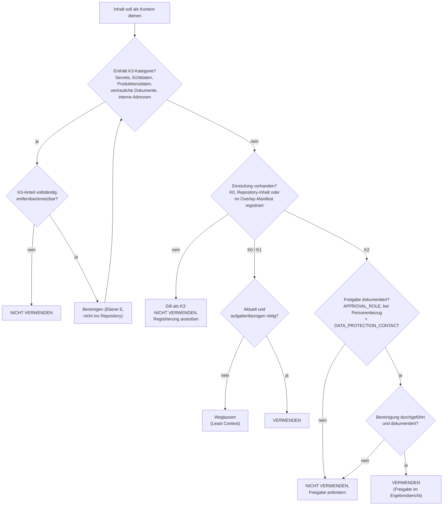

# Entscheidungsbaum 1 – Darf dieser Inhalt als Kontext verwendet werden?

| Attribut | Wert |
|---|---|
| ID | `FW-DT-01` |
| Version | `0.1.0` |
| Status | `entwurf` |
| Owner (Rolle) | `<FRAMEWORK_OWNER>` |
| Anwendung | im Preflight und vor jeder zusätzlichen Kontextbereitstellung; durch die Bearbeiterin oder den Bearbeiter |
| Quelle | `framework/core/02-privacy.md`, `checklists/02-privacy-context.md` |

## Textbeschreibung (normativ)

1. **K3-Prüfung:** Enthält der Inhalt eine der festen K3-Kategorien (Secrets oder Schlüsselmaterial; personenbezogene Echtdaten; Produktionsdaten; nicht freigegebene Kunden- oder Behördendokumente; Sicherheitskonfigurationen mit Schutzwirkung; interne Adressen oder Umgebungskennungen; als vertraulich eingestufte Inhalte; Inhalte anderer Projekte)? → **Nicht verwenden.** Lässt sich der K3-Anteil vollständig entfernen oder ersetzen, wird die bereinigte Fassung neu eingestuft (zurück zu Schritt 1); die bereinigte Fassung wird nicht in das Repository übernommen.
2. **Einstufung vorhanden?** Ist der Inhalt weder Framework/öffentlich (K0) noch Repository-Inhalt oder ein im Overlay-Manifest registriertes Dokument? → Ohne Einstufung gilt K3: **nicht verwenden**, gegebenenfalls Registrierung im Manifest anstoßen.
3. **K0 oder K1:** Framework-Dateien und öffentliche Dokumentation (K0) sowie Repository-Inhalte und im Manifest als K1 registrierte Dokumente → **verwenden**, aber nur aufgabenbezogen (Least Context) und nicht als `veraltet` markiert.
4. **K2:** Im Manifest als K2 registriert oder erkennbar schutzbedürftig (Architekturdetails, Tickets, Logs, Testdaten, Partnerverträge)? → Nur verwenden, wenn (a) eine Kategorie- oder Einzelfreigabe vorliegt (`<APPROVAL_ROLE>`; bei Personenbezug zusätzlich `<DATA_PROTECTION_CONTACT>`), (b) die Bereinigung durchgeführt wurde und (c) Freigabe und Bereinigung dokumentiert sind. Fehlt eine der drei Bedingungen → **nicht verwenden**, Freigabe anfordern.
5. **Mischinhalte:** Enthält der Inhalt Bestandteile mehrerer Klassen, gilt die höchste Klasse für den gesamten Inhalt, bis die höher eingestuften Bestandteile entfernt sind.
6. **Im Zweifel:** restriktivere Klasse wählen (P9) und Einstufung durch `<DATA_PROTECTION_CONTACT>` klären.

## Diagramm

## Hinweise

- Die Klassifizierung nimmt der Mensch vor, nicht Devin; Devin meldet lediglich Funde (S2/S3).
- Wiederkehrende K2-Freigaben derselben Kategorie gehören als Kategoriefreigabe in das Overlay-Manifest, nicht in Einzelabsprachen.
