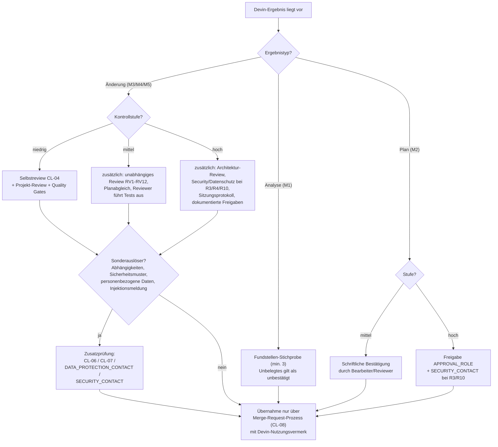

# Entscheidungsbaum 4 – Welche menschliche Prüfung ist erforderlich?

| Attribut | Wert |
|---|---|
| ID | `FW-DT-04` |
| Version | `0.1.0` |
| Status | `entwurf` |
| Owner (Rolle) | `<FRAMEWORK_OWNER>` |
| Anwendung | nach Abschluss einer Devin-Sitzung, vor Übernahme des Ergebnisses |
| Quelle | `framework/core/07-review-rules.md`, `09-risk-model.md`, `checklists/04-review-ai-code.md` |

## Textbeschreibung (normativ)

1. **Immer:** Kein Devin-Ergebnis wird ohne menschliche Prüfung übernommen (P5); keine Einstufung ersetzt sie vollständig.
2. **Reine Analyseergebnisse (M1/M2):** Die Empfängerin oder der Empfänger prüft Fundstellen-Stichproben (mindestens drei) und behandelt unbelegte Aussagen als unbestätigt. Pläne werden bestätigt (mittel) beziehungsweise durch `<APPROVAL_ROLE>` freigegeben (hoch), bevor umgesetzt wird.
3. **Änderungen (M3/M4/M5) nach Kontrollstufe:**
   - **niedrig:** Selbstreview anhand `checklists/04-review-ai-code.md` (vollständiges Lesen des Diffs; mindestens RV1, RV2, RV5, RV9, RV10) plus reguläres Projekt-Review und alle Quality Gates.
   - **mittel:** zusätzlich unabhängiges Review aller Punkte RV1–RV12 durch eine zweite Person, Abgleich mit dem bestätigten Plan, eigenständige Testausführung durch die Reviewerin oder den Reviewer.
   - **hoch:** zusätzlich Architektur-Review (`<ARCHITECT_ROLE>`) und – bei R3/R4/R10 – Security-/Datenschutzprüfung (`<SECURITY_CONTACT>`, `<DATA_PROTECTION_CONTACT>`); Prüfung des Sitzungsprotokolls; Freigaben dokumentiert.
4. **Sonderauslöser unabhängig von der Stufe:** Berührung von Abhängigkeiten → `checklists/07-new-dependency.md`; Sicherheitsmuster im Diff → `checklists/06-security.md`; neue Verarbeitung personenbezogener Daten → `<DATA_PROTECTION_CONTACT>`; gemeldete Injektionsversuche → `<SECURITY_CONTACT>`.
5. **Abschluss:** Übernahme ausschließlich über den bestehenden Review- und Freigabeprozess (`checklists/08-merge-request.md`); Devin-Nutzungsvermerk ist Pflicht.

## Diagramm

## Hinweise

- `fw-review-support` liefert Zulieferung für diese Prüfungen, zählt aber nicht als eine der geforderten menschlichen Prüfungen (V1).
- Reviewerinnen und Reviewer erhalten den Nutzungsvermerk vor Beginn; ohne Vermerk wird das Review nicht begonnen (Prozessbefund).
