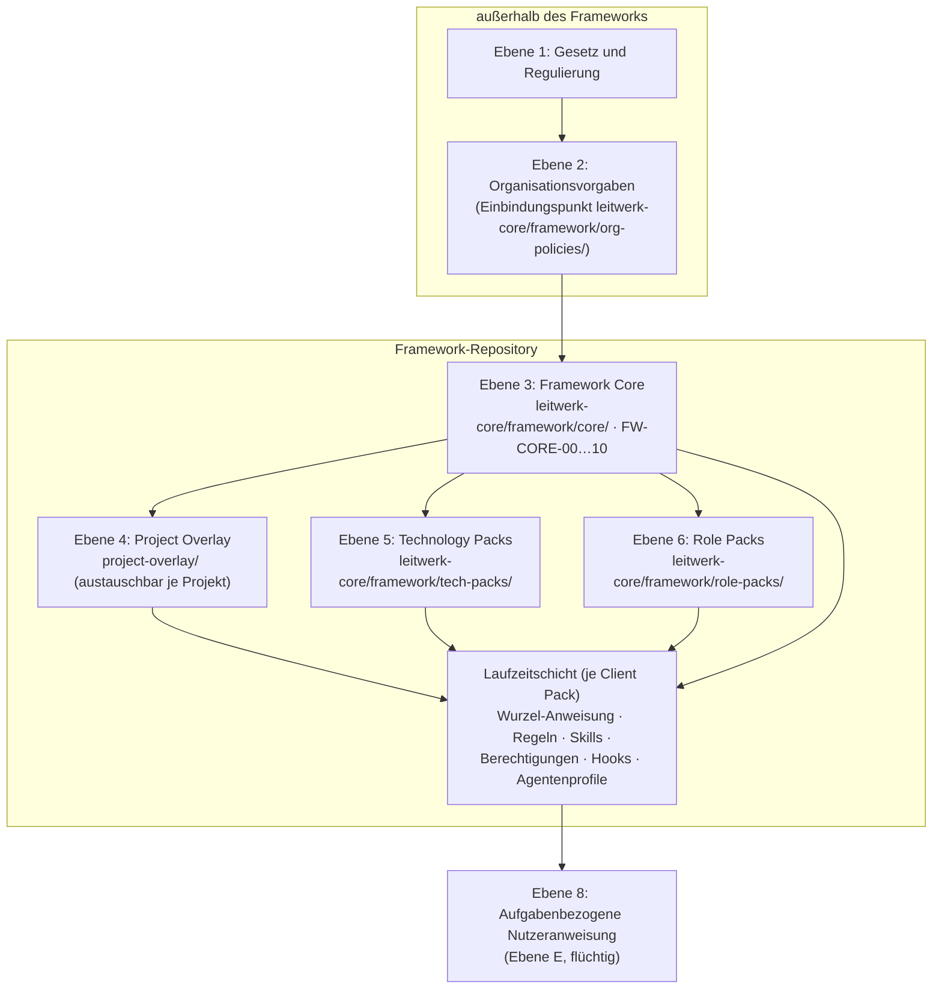

# 7 Framework-Architektur

## 7.1 Überblick

Die Architektur trennt drei Dinge, die in KI-Regelwerken häufig vermischt werden: **was immer gilt** (Kern), **was vom Einsatzkontext abhängt** (Packs und Overlay) und **wie ein konkretes Werkzeug es ausführt** (Laufzeitschicht). Daraus ergeben sich die vier geforderten Ebenen – Framework Core, Role Packs, Technology Packs, Project Overlay – eingebettet zwischen die Organisationsebene darüber und den flüchtigen Aufgabenkontext darunter, sowie quer dazu die Unterscheidung zwischen kanonischer Form (`leitwerk-core/framework/`, werkzeugneutral) und **Laufzeitform**. Wie die Laufzeitform aussieht und wo sie liegt, entscheidet das gewählte Client Pack – die Abbildungsschicht, die Kap. 7a beschreibt.

Textfassung des Diagramms: Gesetz und Organisationsvorgaben stehen über dem Framework und werden nicht kopiert, sondern eingebunden. Der Framework Core speist sowohl die optionalen Packs als auch das Overlay; alle vier Ebenen werden über die Laufzeitschicht wirksam, in der die Nutzeranweisung (Ebene 8) die konkrete Aufgabe formuliert. Skills (Ebene 7) sind Teil der Laufzeitschicht.

Die Laufzeitschicht ist **kein** Bestandteil des Repositorys: Sie entsteht bei der Installation aus dem Kern und sieht je Client Pack anders aus. Die Abbildungsschicht, die das leistet, ist keine weitere Regelebene – die Hierarchie bleibt achtstufig (Kap. 7a.2).

## 7.2 Ebene 3 – Framework Core (projektunabhängig)

Allgemeingültige Regeln in zehn Modulen: FW-CORE-00 Leitprinzipien und Konventionen, 01 Governance-Grundsätze, 02 Kontext- und Datenschutzmodell, 03 Sicherheitsmodell, 04 Qualitätsgrundsätze, 05 Arbeitsmodell (Standardarbeitsablauf und Betriebsmodi), 06 Prompting-Regeln, 07 Review-Regeln, 08 Skill-Standard, 09 Risikoklassifizierung, 10 Fehler- und Eskalationsverfahren. Der Core enthält Platzhalter-Schnittstellen für alles Projektspezifische, aber keine Projektwerte; er ändert sich nur über Framework-Releases.

## 7.3 Ebene 6 – Role Packs (optional, rollenbezogen)

Module je Tätigkeit (Softwareentwicklung als Referenzpack; Softwarearchitektur, Requirements Engineering, Testing und QA, DevOps, Dokumentation, Code Review vorgesehen). Ein Role Pack konkretisiert Arbeitsweise, typische Aufgaben mit Modus- und Stufenzuordnung, rollenspezifische Kontextquellen, Prüfpunkte und gegebenenfalls Skills (`role-<pack>-…`). Es enthält keine Governance-Regeln und keine Projektwerte; Aktivierung erfolgt je Projekt über das Overlay; die Laufzeitfassung `30-*` lädt bei Relevanz, sofern der Client Ladetrigger kennt.

## 7.4 Ebene 5 – Technology Packs (optional, technologiebezogen)

Module je Technologieaspekt (Programmiersprache, Anwendungsframework, Build-System, Testframework, Datenbank, API-Technologie, Frontend, Backend, Container, CI/CD). Inhalt: Konventionen und Idiome, Testkonventionen, typische Fehlerquellen KI-generierten Codes in dieser Technologie, technologiespezifische Sicherheitsmuster, gegebenenfalls Skills (`tech-<pack>-…`). Die Laufzeitfassung `40-*` bindet sich an die Dateimuster der Technologie und lädt genau dann, wenn passende Dateien berührt werden `[DOK]` – vorausgesetzt, der Client kennt an Dateimuster gebundene Regeln. Ein Client ohne diesen Mechanismus braucht einen der Ersatzwege aus seiner Fähigkeitsmatrix. Die Erstfassung liefert bewusst Vorlagen statt eines konkreten Packs; das erste Pack für `<TECH_STACK>` entsteht in Roadmap-AP4.

## 7.5 Ebene 4 – Project Overlay (ausschließlich projektspezifisch)

Die einzige Ebene, die ein Projekt ausfüllt und die beim Projektwechsel getauscht wird: Steckbrief und Freigabestatus, Architektur-Kurzfassung mit kritischen Komponenten, Repository-Struktur, erlaubte und ausgeschlossene Verzeichnisse, Build-/Test-/Prüfbefehle, Quality Gates, Sprachen und Frameworks, Conventions, Branching- und Merge-Modell, Definition of Ready und Done, zulässige Kontexte und Werkzeugfreigaben, ausgeschlossene Daten, Rollen und Freigaben, Eskalationswege, projektspezifische Skills, dokumentierte Ausnahmen sowie das **Dokumenten-Manifest**, über das künftige projektspezifische Dokumente (KI-Governance, Vorgehensmodell, Roadmap, Architekturvorgaben, Coding Guidelines, Definition of Ready/Done, Branching-Strategie, Deployment-, Security- und Qualitätsvorgaben, Rollenbeschreibungen, Glossar) als Kontext eingebunden werden, ohne den Core zu ändern (Kap. 17). Laufzeitfassung: die Overlay-Regel `20-project-overlay.md` (immer geladen, kompakt) plus optionale Overlay-Regeldateien `2N-*`.

## 7.6 Querschnitt: kanonische Ebene und Laufzeitschicht (Tool Independence)

Alle normativen Inhalte liegen werkzeugneutral in `leitwerk-core/framework/` (kanonische Langform). Der KI-Client liest die **Laufzeitfassungen**: die Wurzel-Anweisungsdatei, die Regelablage mit den Kurzfassungen, die Skill-Ablage mit den ausführbaren Verfahren, die Berechtigungsdatei, die Hook-Konfiguration und die Agentenprofile. Welche Datei- und Verzeichnisnamen das je Client sind, führt das Laufzeitglossar (Anhang 31.2); im Fließtext nennt der Kern nur die Begriffe.

Die Laufzeitfassungen verweisen auf die Langform und dürfen ihr nicht widersprechen (Konsistenztest FW-KO-02). Sie werden **erzeugt**, nicht gepflegt: Ihre Quellen liegen einmal im Kern, und die Installation bringt sie in die Form des gewählten Client Packs. Ein Werkzeugwechsel ersetzt damit nicht eine dünne Schicht von Hand, sondern die Abbildung – ein neues Client Pack (P8, Kap. 7a).

## 7.7 Erweiterbarkeit

Neue Rollen → neues Role Pack aus der Vorlage; neue Technologie → neues Technology Pack; neues Projekt → neues Overlay; neue wiederkehrende Aufgabe → neuer Skill nach Standard; neue Organisationsvorgabe → Verweisblatt in Ebene B; neue Werkzeuggeneration → neue Laufzeitschicht. Für jede Erweiterung existieren Vorlage, Namenskonvention, Owner-Modell und Validierung; die Einordnungsfrage beantwortet Entscheidungsbaum 6 (Kap. 23).
