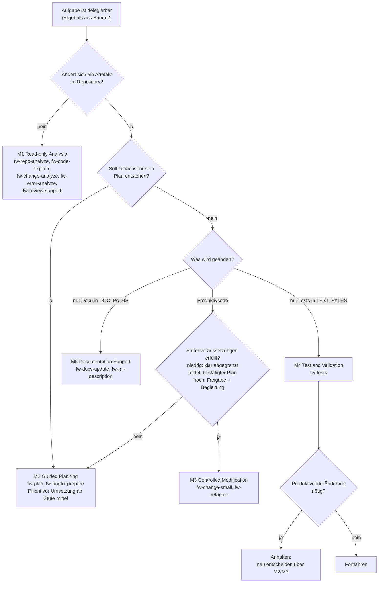

# Entscheidungsbaum 3 – Muss der KI-Client nur analysieren oder darf der KI-Client ändern?

| Attribut | Wert |
|---|---|
| ID | `FW-DT-03` |
| Version | `0.1.2` |
| Status | `pilot` |
| Owner (Rolle) | `<FRAMEWORK_OWNER>` |
| Anwendung | im Preflight nach Baum 2; wählt den Betriebsmodus M1–M5 |
| Quelle | `leitwerk-core/framework/core/05-working-model.md`, `leitwerk-core/framework/core/09-risk-model.md` |

## Textbeschreibung (normativ)

1. **Nur Verstehen oder Befund?** Soll ausschließlich verstanden, erklärt, geprüft oder bewertet werden (kein Artefakt im Repository ändert sich)? → **M1 Read-only Analysis** (Skills `fw-repo-analyze`, `fw-code-explain`, `fw-change-analyze`, `fw-error-analyze`, `fw-review-support`).
2. **Plan gesucht?** Soll ein Vorgehen oder Änderungsplan entstehen, aber noch nichts umgesetzt werden? → **M2 Guided Planning** (`fw-plan`, `fw-bugfix-prepare`). M2 ist Pflichtstation vor jeder Umsetzung ab Kontrollstufe mittel.
3. **Nur Tests?** Sollen ausschließlich Tests erstellt, erweitert oder ausgeführt werden (`<TEST_PATHS>`)? → **M4 Test and Validation** (`fw-tests`). Stellt sich heraus, dass Produktivcode geändert werden müsste, wird angehalten und über M2/M3 neu entschieden.
4. **Nur Dokumentation?** Sollen ausschließlich Dokumente in `<DOC_PATHS>` entstehen oder aktualisiert werden? → **M5 Documentation Support** (`fw-docs-update`, `fw-mr-description`).
5. **Produktivcode ändern?** → **M3 Controlled Modification** (`fw-change-small`, `fw-refactor`) – nur wenn die Stufenvoraussetzungen erfüllt sind: niedrig mit klar abgegrenzter Aufgabe; mittel mit bestätigtem Plan; hoch mit dokumentierter Freigabe und Begleitung. Sind sie nicht erfüllt → zurück zu M1/M2.
6. **Gemischte Aufgaben** werden zerlegt: erst M1/M2, dann je ein Modus je Sitzung (Q1, P7). Ein Moduswechsel innerhalb einer Sitzung erfordert eine ausdrückliche Anweisung und wird im Ergebnisbericht vermerkt.
7. **Ohne Angabe gilt M1** (Wurzel-Anweisungsdatei, Abschnitt 17).

## Diagramm

## Hinweise

- M2 schreibt nur die Plan-Datei außerhalb des Quellcodes; M4 und M5 schreiben nur in ihren Pfaden – alles Weitere ist ein Modusbruch und wird gemeldet (S4).
- Wer unsicher ist, beginnt mit M1: Eine Analyse zu viel kostet Minuten, eine Änderung zu früh kostet ein Review.
