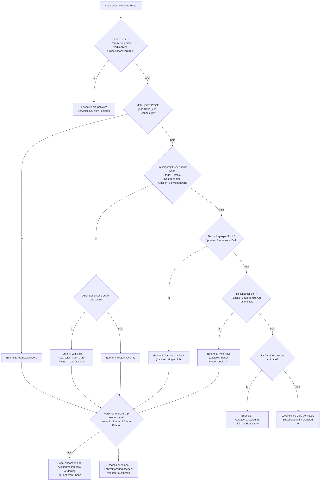

# Entscheidungsbaum 6 – Gehört eine Regel in den Framework Core, ein Role Pack, ein Technology Pack oder das Project Overlay?

| Attribut | Wert |
|---|---|
| ID | `FW-DT-06` |
| Version | `0.1.1` |
| Status | `pilot` |
| Owner (Rolle) | `<FRAMEWORK_OWNER>` |
| Anwendung | bei jeder neuen oder geänderten Regel; durch Autorinnen und Autoren von Regeln, geprüft vom Framework Owner beziehungsweise Overlay Owner |
| Quelle | `leitwerk-core/framework/core/00-principles.md` (P10), `leitwerk-core/governance/PRIORITY_HIERARCHY.md` |

## Textbeschreibung (normativ)

1. **Quelle der Regel:** Stammt die Regel aus Gesetz, Regulierung oder einer verbindlichen Vorgabe der Organisation? → Sie wird nicht in das Framework kopiert, sondern über **Ebene B** (`leitwerk-core/framework/org-policies/`, Verweisblatt) eingebunden; der Core setzt sie höchstens operativ um.
2. **Gilt sie für jedes Projekt, jede Rolle und jede Technologie?** (Governance, Datenschutz, Sicherheit, Qualität, Arbeitsmodell, Skill-Standard) → **Framework Core** (Ebene 3). Merksatz: Würde die Regel in einem beliebigen anderen Projekt unverändert gelten, gehört sie in den Core.
3. **Enthält sie projektspezifische Werte?** (Pfade, Befehle, Komponenten, Rollenbesetzungen, freigegebene Quellen, Schwellenwerte) → **Project Overlay** (Ebene 4). Enthält eine Regel generische Logik **und** projektspezifische Werte, wird sie getrennt: Logik in den Core (mit Platzhalter), Werte in das Overlay.
4. **Ist sie technologiespezifisch?** (gilt für eine Sprache, ein Framework, ein Build-System – unabhängig davon, wer sie anwendet) → **Technology Pack** (Ebene 5), Laufzeitfassung mit `trigger: glob` auf die Dateimuster.
5. **Ist sie rollenspezifisch?** (gilt für eine Tätigkeit – Entwicklung, Review, RE, Testing – unabhängig von der Technologie) → **Role Pack** (Ebene 6).
6. **Ist sie aufgaben- oder sitzungsbezogen?** (gilt nur für eine konkrete Aufgabe) → **Ebene E**: in die Aufgabenanweisung, nicht in das Repository.
7. **Verschärfungsprinzip:** Egal wo die Regel landet – sie darf höhere Ebenen nur konkretisieren oder verschärfen, nie lockern. Eine Lockerung ist nur als dokumentierte Ausnahme (`leitwerk-core/governance/EXCEPTION_PROCESS.md`) oder als Änderung der höheren Ebene selbst möglich.
8. **Zweifelsfall:** Core vor Pack (eine zu allgemeine Regel im Pack wird dupliziert und inkonsistent); Overlay vor Pack bei projektgebundenen Werten; Entscheidung dokumentieren (Decision Log).

## Diagramm

## Hinweise

- **Beispiel (synthetisch):** „Tests laufen mit `<TEST_COMMAND>`" → Logik („Der KI-Client führt nur freigegebene Testbefehle aus") ist Core; der Befehl selbst ist Overlay. „Bei Testframework `<TEST_FRAMEWORK>` keine Feld-Injektion in Testklassen" → Technology Pack. „Ein Reviewer ändert den geprüften Code nicht selbst" → Role Pack Code Review.
- Jede Regelaufnahme zieht die Pflege der Laufzeitfassung in der Regelablage und einen Validatorlauf nach sich; Release über den Framework- beziehungsweise Overlay-Prozess.
