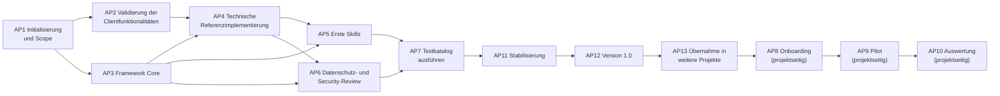

# Implementierungs-Roadmap

| Attribut | Wert |
|---|---|
| ID | `FW-DOC-ROADMAP` |
| Version | `0.2.0` |
| Status | `entwurf` |
| Owner (Rolle) | `<FRAMEWORK_OWNER>` |

> Es werden keine Termine oder Aufwände vorgegeben; die Steuerung erfolgt über Prioritäten (P1 = zuerst) und logische Abhängigkeiten. Rollen sind generisch. Die Erstfassung 0.1.0 dieses Repositorys deckt die inhaltlichen Ergebnisse von AP3–AP5 in Entwurfsqualität bereits ab; die zugehörigen Arbeitspakete bestätigen, validieren und härten sie.

## Stand nach Release 0.43.0 (2026-09-14)

Wird mit jedem Release fortgeschrieben. Er beantwortet die Frage, womit weiterzuarbeiten ist,
ohne dass man dafür den gesamten Änderungsverlauf lesen muss.

### Was 0.43.0 gebracht hat – der Client ist erhoben, und eine Enthaltung war eine Behauptung

**Kandidat 1 und 6 der Übergabe, in einer Sitzung** – beide hingen am selben Manifest.
Erhoben mit **zwölf Läufen am Client** in fünf Umgebungen
(`tests/protocols/2026-09-14-erhebung-devin-werkzeuge.md`, `CR-2026-065`, D-87 bis D-89).
**Das erste Release dieses Projekts, das einen Client misst statt eines Mechanismus.**

| Frage | Ergebnis |
|---|---|
| Führt `devin-desktop` ein Suchwerkzeug? | **Zwei.** `grep` und `find_file_by_name`. Die Erklärung „kein eigenes Suchwerkzeug" war **falsch** – und sie nahm die Suchklasse aus dem Hook-Matcher |
| Was hat das gekostet? | In einer Umgebung mit nur dem Hook: `read` auf `.env` blockiert, **`grep` auf dieselbe Datei liefert das Secret wörtlich**. Das Hook-Skript blockt beides – es wurde nicht gefragt |
| Wie schlimm war es wirklich? | **Wie ausgeliefert war das Secret geschützt** – die Klasse `Read(...)` dieses Clients umfasst die Suche mit. Getragen hat also nur die **editierbare** Schicht, nicht die fail-closed-Schicht |
| Ist der Skillaufruf rückfragepflichtig? (**K-33**) | **Er ist ein eigener Werkzeugaufruf** (`skill`) – und über die Berechtigungsdatei trotzdem nicht erreichbar. Zwei Schreibweisen geprüft, beide wirkungslos, gegen einen greifenden Kontrolllauf. **K-33 geschlossen, K-34 neu** |
| *Nicht gesucht:* Wie wird die Slash-Form ausgeführt? | **Clientseitig expandiert.** Im `user`-Schritt der Mitschrift steht der Inhalt der `SKILL.md`. Eine Werkzeugschranke erreicht diesen Weg gar nicht |
| *Nicht gesucht:* Ist `glob` im Frontmatter falsch? | **Nein – und der erste Entwurf der Behebung war es.** Der Client führt im Frontmatter ein **eigenes** Vokabular; `find_file_by_name` wird dort **verworfen** |

**Die Zahl, die den Befund trägt: zwei.** So viele Suchwerkzeuge führt ein Client, dem das
Framework keines zutraute – und so viele Fundstellen meldet Prüfung 41 gegen den Vorstand.

**Die Regel, die man sich merken sollte:** *Eine Enthaltung, die sich als Behauptung
tarnt, ist gefährlicher als eine offene Lücke – sie nimmt eine Werkzeugklasse aus der
Durchsetzung und begründet es.* **Prüfung 41** verlangt deshalb eine der beiden redlichen
Bauformen: Enthaltung oder Datum mit Fundstelle.

**Die zweite Regel, teurer erkauft:** *Ein gemessener Name ist noch nicht der Name für die
Stelle, an der man ihn einträgt.* Frontmatter-Vokabular und Laufzeitnamen sind **zwei
Namensräume**; bei `claude-code` fallen sie zusammen, bei `devin-desktop` nicht. Gefangen
hat das keine Prüfung, sondern ein Blick des Clients auf die eigene Datei.

### Was 0.43.0 offen lässt

- **Der Skillaufruf ist bei `devin-desktop` nicht kontrollierbar** (**K-34**). Zwei
  Schreibweisen geprüft; ob eine dritte wirkt, ist offen – **ein Fehlen belegt sich nicht
  selbst.**
- **Die Richtungsregel von D-80 gilt für dieses Pack nicht mehr.** Ausgesetzt, nicht
  erfüllt: ein deklarierter blinder Fleck statt einer falschen Zusage.
- **Ein zweites Modell ist auf diesem Konto nicht messbar** (`Upgrade to Pro`). Bietet der
  Client einem anderen Modell einen anderen Werkzeugbestand an, wäre `hook_tools` erneut
  zu prüfen.
- **Prüfung 41 prüft eine Form, nicht eine Tatsache.**
- **Was `allowed-tools` bei diesem Client bewirkt, bleibt unerhoben** – Zeile S3 sagt es
  seit 0.7.0.
- **Bestehende `devin-desktop`-Installationen sind erst nach `install.py --update`
  geschützt.**

### Was 0.42.0 gebracht hat – das Register des Prüfapparats wird nachgezählt

**Der Anlass ist ein Nebenbefund aus dem ersten Migrationslauf dieses Projekts.** Der Pilot
ist von 0.37.0 auf 0.41.0 gehoben worden
(`tests/protocols/2026-09-14-migrationslauf-pilot.md`), und beim Lesen von Prüfung 37 fiel
auf: Der Kopfkommentar des Validators führt die Prüfungen 1 bis 38, während Prüfung 39
läuft. Gegengeprüft (`tests/protocols/2026-09-14-gegenpruefung-pruefregister.md`, elf
Messungen, `CR-2026-064`, D-85 und D-86). **Der Befund bestätigt sich – und die Zählung war
wieder zu klein.**

| Frage | Ergebnis |
|---|---|
| Fehlt ein Registereintrag? | **Es sind fünf falsche Aussagen an drei Trägern**, und Prüfung 39 ist die **jüngste** davon |
| Sind sie falsch geschrieben worden? | **Keine einzige.** Alle fünf waren bei ihrer Einführung richtig und sind stehen geblieben, während ihr Gegenstand weiterwuchs |
| Wie alt sind sie? | Die älteste seit **zwölf** Releases. In **zehn von zwölf** Releases hat sich mindestens eine der drei Zahlen bewegt |
| *Nicht gesucht:* Taugen die Kopfkommentare der Prüfungen als Anker? | **Nein.** Sie tragen drei Formen, und ein Querverweis im Fließtext sieht aus wie ein Kopf. **Der erste Entwurf der Prüfung ist genau daran gefallen** |
| *Nicht gesucht:* Sind alle Nennungen dieser Zahlen falsch? | **Nein – und das entscheidet den Zuschnitt.** Roadmap, `CR-2026-052` und das Protokoll zu 0.32.0 nennen ebenfalls zwölf Grenzfälle und sind **richtig**: Sie beschreiben den Stand von 0.32.0 |

**Die Zahl, die den Befund trägt: acht.** So weit lag `FW-KO-05` daneben – zwölf gegen
zwanzig Grenzfälle, in der Prüfmittelspalte eines Abnahmetests, der auf `offen` steht.
**Wer ihn heute führe, prüfte einen Teil und meldete das Ganze.**

**Die Regel, die man sich merken sollte:** *Wo die Grenze eines Begriffs eindeutig ist,
gehört die Zahl ausgerechnet, nicht gepflegt.* Der Satz steht seit 0.33.0 im Bestand und
galt für jeden Gegenstand außer dem Prüfstand selbst.

**Das Argument, das man sich merken sollte:** `CR-2026-062` hat das Nachziehen des
Kopfkommentars ein Release zuvor eigens zur Ermessensfrage gemacht und beschlossen (E7);
`CR-2026-063` hat es ein Release später nicht getan. **Eine Entscheidung, die nur in einem
Antrag steht, hält bis zum nächsten Antrag.**

**Prüfung 40** hält es fest, in vier Gegenständen: verlorener Anker; das Register lückenlos
und bis zur höchsten genannten Nummer, in **beide** Richtungen; die Sondenmenge an drei
Stellen in einer einzigen, ausgerechneten Schreibweise; die Grenzfallanzahl in `FW-KO-05`.
**Ihr Gegenbeweis ist ein Abzählen:** fünf Fundstellen gegen 0.41.0, eine je Abweichung und
keine weitere – das erste Mal seit 0.34.0, dass ein Gegenbeweis keine Konstruktion ist.

### Was 0.42.0 offen lässt

- **Prüfung 40 zählt Nennungen, nicht Prüfungen.** Wer eine Prüfung baut und ihre Nummer
  nirgends schreibt, wird nicht gefangen – dieselbe Ehrlichkeit wie Gegenstand 2 von
  Prüfung 38, der Deklarationen zählt und nicht Richtigkeit.
- **Sie belegt Vollständigkeit, nicht Richtigkeit.** Ein Registereintrag, der etwas anderes
  beschreibt als seine Prüfung tut, läuft durch. Das bleibt eine Lektüre.
- **`FW-KO-05` bleibt offen.** Berichtigt ist seine Zahl, nicht sein Ergebnis: Ob ein
  KI-Client die zwanzig Grenzfälle so einstuft wie die Tabelle, ist weiterhin ungemessen.
- **Drei Sätze sind in ihrer Schreibweise gebunden** – der Preis des wörtlichen Vergleichs
  (D-86). Die Fehlermeldung nennt dafür die richtige Zeichenkette.
- **Der Abgleich zwischen Overlaytext und Berechtigungsdatei hat eine gemessene Fundstelle
  bekommen.** Am Piloten führte die Berechtigungsdatei `Bash(mvn -B test:*)`, während
  Abschnitt 6 des Overlays `mvn -B test` erklärt. **Prüfung 37 hat es gefangen, weil die
  Abweichung zufällig auch formal auffällig war** – ein gefüllter Schlitz mit einem ganz
  anderen Befehl liefe lautlos durch. Der Kandidat steht damit nicht mehr als Vermutung da.
- **Der Migrationsweg bleibt Handarbeit.** Die zwölf `Skill(fw-…)`-Zeilen sind am Piloten
  von Hand nachgetragen worden. Ob `install.py` das je selbst tun sollte, hängt an D-76 und
  ist nicht entschieden.

### Was 0.41.0 gebracht hat – der Skillaufruf ist ein Werkzeugaufruf

**Der erste Antrag dieses Projekts aus einem externen Befund** – ein Bericht aus einer
Sitzung am Piloten, der Agent habe die Skills nicht verwendet. Gegengeprüft
(`tests/protocols/2026-09-14-gegenpruefung-skillwahl.md`) und gemessen
(`-erhebung-skillaufruf.md`, elf Läufe mit vier Kontroll- und Entlastungsläufen,
`CR-2026-063`, D-81 bis D-84). **Der Befund bestätigt sich – und seine Ursachenanalyse
war falsch.**

| Frage | Ergebnis |
|---|---|
| Erkennt der Agent den passenden Skill nicht? | **In zwei von vier Läufen rief er ihn auf**, ohne dass die Aufgabe ihn nannte. Was ihn aufhielt, war nicht die Erkennung |
| Was hielt ihn auf? | **Die eigene Berechtigungsdatei.** Der Skillaufruf ist ein eigener Werkzeugaufruf und stand in **keinem** Korb; er fiel auf die Rückfrage und im rückfragefreien Betrieb auf die Abweisung |
| *Nicht gesucht:* Was passiert nach der Abweisung? | **Die Sitzung liest die `SKILL.md` als Datei und arbeitet den Ablauf nach.** Die Ausgabe ist von einem gelungenen Lauf nicht zu unterscheiden – und sie trägt die Werkzeugsperre des Skills **nicht** |
| *Nicht gesucht:* Wirkt ein Präfixmuster in der Freigabe? | **Nein, lautlos nicht.** `Skill(fw-*)` weist den Aufruf ab, `Skill(fw-code-explain)` lässt ihn durch |

**Die Regel, die man sich merken sollte:** *Eine Aufforderung ist nur so viel wert wie die
Datei daneben sie zulässt.* Das Framework forderte in Abschnitt 17 die Nutzung der Skills
und machte ihre Befolgung in der Berechtigungsdatei rückfragepflichtig – **ohne das
irgendwo zu sagen**.

**Das Argument, das man sich merken sollte:** Das Projekt wusste es dreimal und hat es nie
aufgeschrieben. Drei Protokolle halten fest, dass ein Lauf verworfen wurde, weil „der
`Skill`-Aufruf scheiterte". **Aus dreimaligem Eigenverschulden ist nie ein Befund über die
ausgelieferte Datei geworden.**

**Die Zahl, die den Befund trägt: zwölf.** So viele wörtliche Regeln braucht es, weil ein
Muster gemessen nichts freigibt – und ein dreizehnter Skill braucht seine dreizehnte.
**Prüfung 39** hält es fest.

### Was 0.41.0 offen lässt

- **Ob der verschärfte Text die Skillwahl verbessert, ist nicht gemessen.** Das wäre ein
  Sitzungstest mit einer Stichprobe, die vier Läufe je Bedingung nicht hergeben.
- **`devin-desktop` ist unerhoben** (**K-33**) – ausgerechnet der Client, an dem der
  externe Bericht entstanden ist. Das Manifest sagt das jetzt ausdrücklich.
- **Prüfung 39 fängt heute nichts.** Ihr Gegenbeweis ist eine **Konstruktion**, kein
  Abzählen – die Lage von Prüfung 37.
- **Die Regel zum abgewiesenen Aufruf ist eine Anweisung ohne Mechanismus.** Kein
  Prüfwerkzeug liest einen Ergebnisbericht; was sie trägt, ist die Prüfpflicht des
  Menschen.
- **Bestehende `claude-code`-Installationen melden zwölf fehlende `allow`-Regeln**, bis
  die Berechtigungsdatei von Hand nachgezogen ist.

### Was 0.40.0 gebracht hat – eine Quelle, ein Vokabular

**Kandidat 1 der Übergabe ist erledigt** – der älteste offene Posten, seit 0.35.0 vertagt.
Gegengeprüft (`tests/protocols/2026-09-13-gegenpruefung-werkzeugabbildung.md`, zwanzig
Messungen mit sieben Kontrollläufen, `CR-2026-062`, D-78 bis D-80). **Der Befund bestätigt
sich – und die vorgeschlagene Behebung war die falsche.**

| Frage | Ergebnis |
|---|---|
| Sind es zwei Listen für dieselbe Sache? | **Es sind vier.** `skill_frontmatter.tool_names`, `agent_frontmatter.tool_names`, `hook_tools`, `permission_tools` – dazu `DENY_VERB_EIMER` in `install.py` als fünfte, unvollständige Fassung der Brücke |
| Sollen sie inhaltlich vereinheitlicht werden? | **Nein.** Die Sperrliste ist bei allen fünf Verbpaaren mindestens so weit wie die Vorabfreigabe – die **zulässige** Richtung. `tool_names` zu heben wäre eine Ausweitung, `hook_tools` zu kürzen eine Lücke in einer Sperre |
| *Nicht gesucht:* Was passiert bei einem unbekannten Verb? | **Drei der vier Abbildungen brechen ab. Die vierte reichte es wörtlich durch** – und sie kommt zweimal vor |
| *Nicht gesucht:* Und in `permissions.deny`? | **Lautlos gar nichts.** `deny: [glob, grep]` erzeugte keine Sperre, Validator 0 Fehler – und die Nichtabbildung war nirgends deklariert |

**Die Messung, auf die es ankommt:** Mit geleerten `tool_names`-Blöcken läuft die
Installation durch und liefert `fw-reviewer` mit `tools: read, grep, glob` aus – drei Namen,
die dieser Client nicht führt. **Damit stellt die Abbildung stillschweigend genau den Fall
her, den Zeile A1 desselben Packs als nicht gemessen ausweist** („ein Profil, dessen
`tools`-Liste sich zu keinem Werkzeug auflöst").

**Die Zahl, die den Befund trägt: vierzehn.** So oft nennen die ausgelieferten Quellen
`grep` und `glob` in `allowed-tools` – die **meistgenannten** Verben des Vokabulars, und
genau die beiden, die die Sperrabbildung nicht kannte.

**Vereinheitlicht wird die Brücke, nicht der Inhalt** (D-78, D-80): `clientmap`
führt `FRONTMATTER_VERBEN` und `VERB_BRUECKE` an einer Stelle,
`frontmatter_werkzeuge()` ist der einzige Weg von einem Verb zu Werkzeugnamen, und ein Pack,
das ein Verb nicht abbildet, erklärt das in `tool_names_unmapped` – die Bauform von
`hook_tools_absent` (D-47) und `agent_start_tools_absent` (D-70). **Prüfung 38** hält
Deklaration, Richtung und die Verben der Quellen fest. Der Kopfkommentar des Validators
listet jetzt 32 bis 38 (Kandidat 4).

**Offen und ausdrücklich so ausgewiesen:** Die erzeugten Dateien ändern sich **nicht**, Byte
für Byte – deshalb fängt Prüfung 38 bei den beiden Packs heute nichts, und Gegenstand 3 ist
eine **Verankerung** wie Prüfung 35 und 36. Der Gegenbeweis hat **zwei** Zuschnitte: wie
ausgeliefert eine Fundstelle (der verlorene Anker), mit neutralisiertem Anker zehn – und das
sind Deklarationslücken, keine Fehlfunktionen. Ob `Grep, Glob` in `disallowed-tools`
wirklich wirken, ist **nicht gemessen**.

> **Der Sondenlauf hat einen Fehler dieser Umsetzung gefangen.** Prüfung 33 hielt einen
> Anker auf `DENY_VERB_EIMER` in `install.py`; dieses Release hat die Konstante nach
> `clientmap.VERB_BRUECKE` verschoben. **Der Validatorlauf gegen das Repositorium blieb
> dabei 0/0** – Prüfung 33 hängt an `skill_deny_field`, und die lokale Testinstallation ist
> `devin-desktop`; sie läuft dort **gar nicht**. Das ist **Befund B02, an der eigenen
> Änderung ein zweites Mal eingetreten**, und die Lehre daraus ist: **Ein grüner Repo-Lauf
> ersetzt den Sondenlauf nicht.** Nachgezogen sind der Anker **und** die eigene Verbtabelle
> der Prüfung – sie führte `write` und `search` und kannte `grep` und `glob` nicht, teilte
> also genau die Lücke, die sie hätte fangen sollen.

> **Ein Widerspruch bleibt stehen, und zwar mit Absicht.** `devin-desktop` erklärt unter
> `hook_tools_absent`, dieser Client führe kein eigenes Suchwerkzeug – und jede installierte
> Skilldatei trägt `grep` und `glob` als Werkzeugnamen. **Beides kann nicht stimmen.** Welche
> Seite falsch ist, entscheidet eine Erhebung an diesem Client; eine Behebung wäre eine
> Vermutung. Er steht jetzt in der `_tool_names_unmapped_note` des Manifests.

### Was 0.39.0 gebracht hat – die Berechtigungsdatei wird nachgezählt

**Zwei Framework-Lücken hat der Pilot sichtbar gemacht, und sie sind zusammen der dritte
Ablehnungsgrund von `CR-OTP-G-001`** („Es gibt keine geprüfte Änderungsschicht für diese
Datei"). Beide sind gegengeprüft
(`tests/protocols/2026-09-13-gegenpruefung-berechtigungsdatei.md`, zwölf Messungen an einer
frischen Installation, davon zwei Gegenproben) – **und beide sind erheblich größer als der
Befund, der sie ausgelöst hat.**

| Befund | Wie er hieß | Was gemessen dabei herauskam |
|---|---|---|
| Der `ask`-Korb wird von nichts geprüft | Kandidat 2 | **Der ganze Rest der Datei wird von nichts geprüft.** 13 von 65 Regeln kannte der Validator; **41 der 54 deny-Regeln** ließen sich löschen, ohne dass ein Lauf etwas meldete |
| Ein Overlay kann keinen zusätzlichen Befehl freigeben | Kandidat 1 | **Bestätigt – und drei Texte behaupteten das Gegenteil**, darunter die Tabelle, an der ein Overlay Owner arbeitet |

**Die Zahl, die den Befund trägt: dreizehn von fünfundsechzig.** Das war der geprüfte Anteil.
Gemessen liefen acht Eingriffe ohne eine einzige Meldung durch – eine ergänzte `ask`-Zeile
(genau die, die `CR-OTP-G-001` wollte), eine ergänzte `allow`-Zeile, eine gelöschte
Nicht-Kernregel, **alle 41** auf einmal, eine verengte Regel (`Bash(kubectl:*)` →
`Bash(kubectl delete:*)`, `kubectl apply` liefe wieder), ein geleerter `ask`-Korb und ein
Befehlsschlitz, der mit dem Präfixzeichen gefüllt ist. **Der letzte Fall steht am Piloten**:
`Bash(mvn -B test:*)` statt `Bash(mvn -B test)`.

**Prüfung 37 ist das Verschärfungsprinzip, mechanisch angewandt** (D-77), in zwei Sätzen:
Fehlt eine erzeugte Regel, ist es ein Fehler – in jedem Korb. Steht eine Regel zu viel,
entscheidet der Korb: in `deny` zulässig, in `ask` und `allow` ein Fehler.

**Die Ermessensfrage ist gegen die Erweiterung entschieden** (D-76). Der Grund ist nicht
Prinzipienstrenge, sondern Mechanik: Die Berechtigungsdatei steht in `shared_seed` und wird
nach der Erstinstallation **nie wieder geschrieben**; eine Erweiterungsquelle, die nur beim
Installieren gelesen würde, wäre eine Zusage, die beim ersten Releasewechsel bricht. **Und
der Kanal für weitere Befehle existiert ohnehin** – Abschnitt 6 des Overlays bindet den
KI-Client über das Arbeitsmodell und die Wurzel-Anweisungsdatei. Diese beiden Sätze waren
die ganze Zeit richtig formuliert; falsch war allein die Behauptung, der Befehl stehe
danach in der Berechtigungsdatei.

> **Der dritte Text ist der schwerste, und er ist nicht gesucht worden.**
> `framework/core/03-security.md` erlaubte dem Overlay in seiner **normativen**
> Berechtigungstabelle, die Stufe eines Projektbefehls auf `allow` zu setzen – **drei Zeilen
> über dem Satz, dass Änderungen an der Regelmenge ausschließlich über einen Änderungsantrag
> laufen (V10).** Das ist dieselbe Bauform wie B11, zwei Zeilen tiefer, mit 0.32.0 behoben –
> und die Zeile darüber ist stehen geblieben.

**Ein Entlastungsbefund gehört dazu:** Die MCP-Zeile derselben Tabelle sieht aus wie derselbe
Fehler („ask; Freigaben je Server im Overlay") und ist in Ordnung – die Freigabe läuft über
`<MCP_FILE>` und lässt die Stufe unverändert. **Wer den Befund behebt, darf sie nicht
mitnehmen.**

**Offen und ausdrücklich so ausgewiesen:** Prüfung 37 fängt gegen den unmittelbaren Vorstand
nichts, weil die erzeugte Datei per Konstruktion zu sich selbst passt – **ihr Gegenbeweis ist
eine Konstruktion und kein Abzählen**, anders als bei Prüfung 36. Der Präfixteil wirkt bei
`devin-desktop` nicht (dort sind Befehlsverbote wörtlich). Sie prüft die Form, nicht den Sinn.
Ein Projekt, das eine `allow`-Regel absichtlich streicht, bekommt jetzt einen Fehler für eine
Verschärfung – gewollt, aber ein Preis. Und **der Pilot bekommt beim nächsten Heben einen
Fehler**; das ist der Zweck der Prüfung und kein Nebenschaden.

### Was 0.38.0 gebracht hat – der stumme Bruch wird laut

**Zwei Punkte standen seit mehreren Releases im Repositorium und waren nicht umgesetzt.**
Beide sind gegengeprüft (`tests/protocols/2026-09-13-gegenpruefung-stumme-brueche.md`,
drei Messungen an Kopien), beide bestätigen sich – **und die Gegenprüfung findet einen
dritten, den keiner von beiden nennt.**

| Befund | Seit | Ergebnis |
|---|---|---|
| Soll eine Gegenprobe ihre Summen **ableiten**? | 0.34.0, **viermal in Folge** aufgetreten | **Nein** (D-74). Eine abgeleitete Summe rechnet nach derselben Regel wie die Prüfung und belegt deshalb weniger |
| Die **Zellen der Decision-Log-Tabellen** zählt nichts | 0.35.0, zweimal bestätigt | **Prüfung 36** (D-75). Gegen 0.34.0 vier Fundstellen, heute keine |
| *Nicht gesucht:* Prüfung 30 zählt einen **maskierten** Strich als Spaltentrenner | – | **Behoben.** Sie beanstandete einen GFM-korrekten Text |

**Der eigentliche Befund ist nicht die Ermessensfrage, sondern das, was sie verdeckt
hat.** `baumhash` belegt bei *n* Ersetzungen „mindestens eine hat gegriffen", nie „alle".
Gemessen: Auf einem Baum mit einem zwanzigsten Grenzfall traf die erste Ersetzung der
Gegenprobe 30 nicht, die zweite schon – und die Gegenprobe fiel mit *„21 Grenzfallzeilen,
der Steckbrief nennt 20"*. **Wer das liest, sucht den Fehler in `EDGE_CASES.md`. Dort ist
keiner.**

> **Die Trennung, die vier Releases lang gefehlt hat:** *Woher nimmt die Gegenprobe ihre
> Zielsumme?* ist Ermessen. *Was passiert, wenn ein Suchtext nicht mehr trifft?* ist
> keines. Der zweite Punkt ist unabhängig vom ersten zu beheben – und ist er behoben,
> verliert der erste den größten Teil seines Drucks.

**Die Summen bleiben deshalb wörtlich verankert, und der Preis bleibt:** Jede neue
Matrixzeile bricht sie weiterhin. Neu ist, dass der Bruch eine Zeile Diagnose kostet
statt einer Fehlersuche im Repositorium.

**Prüfung 36 fängt heute nichts** – dieselbe Lage wie bei Prüfung 35, und sie ist mit
derselben Ehrlichkeit begründet. **Der Unterschied ist erheblich:** Prüfung 35 fand auch
im Vorstand nichts, weil ihr Gegenstand dort nicht existiert; Prüfung 36 hätte gegen
0.34.0 vier Fundstellen gemeldet. **Ihr Gegenbeweis ist ein Abzählen, keine
Konstruktion.** D-29 stand fünfundzwanzig Releases lang zerrissen und wurde von jedem
Validatorlauf gesehen.

**Offen und ausdrücklich so ausgewiesen:** Der Wächter deckt den Suchtext, nicht die
Absicht – eine Ersetzung, die trifft und das Falsche tut, findet er nicht. Prüfung 36
prüft die Anzahl, nicht den Inhalt. Und drei der vier umgestellten Zerlegungsstellen
ändern ihr Verhalten heute nicht; der Umbau ist dort Vorsorge.

### Was 0.37.0 gebracht hat – die drei Lücken aus 0.36.0 sind geschlossen

**`CR-2026-058` hat drei Punkte ausdrücklich als nicht gemessen ausgewiesen.** Sie sind es
jetzt – sieben Läufe, davon drei Kontrollläufe
(`tests/protocols/2026-09-13-erhebung-unteragent-tiefe.md`, D-72 und D-73). **Alle drei fallen
zugunsten der Durchsetzung aus.**

| Frage | Ergebnis |
|---|---|
| Profil erlaubt ein Werkzeug, Skill sperrt es – wer gewinnt? | **Der Skill.** Die restriktivere Liste gewinnt; eine Erlaubnis holt ein entferntes Werkzeug nicht zurück |
| Gilt die Sperre im Hintergrund? | **Ja.** `run_in_background: true` im Rekorder belegt |
| Reicht sie zwei Ebenen tief? | **Ja, mindestens.** Drei sind nicht gemessen |

**Dazu ein vierter Befund, nicht gesucht:** Ein Profil mit `tools`-Liste hat **kein
Startwerkzeug** und kann sich nicht über eine zweite, weniger beschränkte Ebene erweitern.
**Ohne ihn wäre die Zusage A1 aushebelbar** – und sie hängt an einer stillen Annahme, nämlich
dass die Abbildung das Werkzeug nicht kennt. **Prüfung 35** hält das fest; sie fängt heute
nichts und ist als Verankerung begründet, nicht als Behebung.

**Eine Beobachtung, die nicht ins Framework gehört, aber jeder Nutzerin begegnet:** Der Client
meldet die Sperre als „Write is disabled for this **session**, in subagents as well as here".
**Die zweite Hälfte trifft zu, die erste überzeichnet** – gemessen ist der Turn (D-64). Die
Zeile S3 nennt die Abweichung, weil man die Meldung sieht und das Protokoll nicht.

**Was die Regel zu Hintergrund-Subagenten angeht, ist die Lage jetzt genauer:** Sie bleibt
normativ, weil „nur im Hintergrund" nach D-66 nicht ausdrückbar ist. **Aber sie steht nicht so
schutzlos da, wie das klingt** – was ein Skill sperrt, ist auch im Hintergrund gesperrt. Ein
Hintergrund-Unteragent ist kein Weg, ein entferntes Werkzeug zurückzubekommen; er ist ein Weg,
unbeaufsichtigt zu arbeiten, und **das** untersagt die Regel.

**Offen und ausdrücklich so ausgewiesen:** drei Ebenen und tiefer; der **umgekehrte**
Widerspruch (Profil sperrt, Skill erlaubt) – nach dem Ergebnis vorhersagbar, aber eine
Vorhersage ist keine Messung; und ob ein **blockierender** Hook auch auf der zweiten Ebene
stoppt. `devin-desktop` bleibt unerhoben.

### Was 0.36.0 gebracht hat – der Unteragent ist erhoben, und er ist kein Umgehungsweg

**Drei Fragen an denselben Mechanismus, alle drei länger benannt als beantwortet.** Die erste
stand dreimal im Repositorium – im Protokoll zu `CR-2026-057`, hier, und in der Übergabe:
„Ob die Entfernung auch für einen Unteragenten gilt, den der Skill startet, ist nicht
gemessen. **Für M1 wäre genau das die nächste Frage.**" Sie ist es jetzt, zusammen mit zwei
weiteren, die beim Aufbau derselben Messumgebung nichts extra kosteten.

Zwölf Läufe, davon **sechs Kontroll- und Entlastungsläufe**
(`tests/protocols/2026-09-13-erhebung-unteragent.md`). **Alle drei Befunde fallen zugunsten
der Durchsetzung aus** – das Release holt Belege nach und schließt eine Deklarationslücke, es
behebt keine Fehlfunktion.

- **Die Skill-Sperre reicht in den Unteragenten** (D-67). Ein Unteragent mit einem Profil
  **ohne** eigenes `tools`-Feld hatte `Write` und `Edit` nicht im Vorrat; der Kontrolllauf
  mit demselben Skill ohne das Feld schrieb. **Grenze 2 aus D-64 reicht allerdings mit:** Mit
  gesperrtem `Write, Edit` schrieb der Unteragent über `Bash`. Die Sperre reicht also eine
  Ebene tiefer – dort aber genau so weit wie oben.
- **Zeile A1 stand seit 0.7.0 auf `[TECHNISCH]` mit reinem `[DOK]`-Beleg** (D-68). Jetzt
  gemessen, und der Mechanismus ist derselbe wie bei S3: **eine Entfernung aus dem
  Werkzeugvorrat, keine Verweigerung** – `permission_denials` blieb leer. Der Teilsatz zum
  Startabbruch bei leerer Werkzeugliste ist nicht gemessen und bleibt ausdrücklich `[DOK]`.
- **Der Schutz-Hook erfasst den Unteragenten und blockiert ihn** (D-69) – **auch mit dem
  benannten Matcher, den `clientmap.py` erzeugt**. Der Rekorder allein hätte nur belegt, dass
  der Hook *aufgerufen* wird; das ist nicht dasselbe wie *entscheidet*, und genau diese
  Unterscheidung fehlt hier für 0.30.0 an anderer Stelle noch.
- **Das Startwerkzeug stand in keiner Werkzeugliste eines Manifests** (D-70). Neues Feld
  `agent_start_tools` mit Prüfung 34, Bauform wie `hook_tools_absent` nach D-47. Gemessen ist
  auch, dass **beide Schreibweisen** (`Agent`, `Task`) in der Sperre wirken – kein stiller
  Ausfall wie bei den Argumentmustern. Die Kanäle nennen es allerdings verschieden: Der
  Hook-Umschlag führt `Agent`, `permission_denials` führt `Task`.
- **„Keine Hintergrund-Subagenten für M3" ist technisch nicht abbildbar** und weist das jetzt
  aus. Sperrbar ist nur das Startwerkzeug **ganz**; „nur im Hintergrund" ist ein Argument.

**Die B06-Berichtigung hat sich zum ersten Mal bewährt.** Der Umschlag des Unteragenten führt
mit `agent_id` und `agent_type` zwei Felder, die kein aufgezeichnetes Schema kannte. Ein Hook,
der wie bis 0.33.0 alle Zeichenketten des Ereignisses durchsucht, hätte sie mitgeprüft; seit
0.34.0 wird ausschließlich `tool_input` geprüft. **Eine additive Erweiterung des Clients
erreicht die Entscheidung nicht mehr** – das war der Zweck, und dies ist der erste Fall.

**Nebenbefund beim Nachzählen, nicht gesucht:** Prüfung 31 rechnet die Summen **im Pack** seit
0.33.0 nach – dieselben Zahlen standen daneben ein zweites Mal, ungerechnet, und waren
gedriftet. `clients/README.md` führte für `claude-code` „25 von 29", **während das Pack selbst
einen Absatz darüber trägt, dass genau diese Zahl mit 0.33.0 auf 22 von 31 berichtigt wurde.**
Insgesamt **sieben überholte Angaben** (D-71); die `[TECHNISCH]`-Zahl wird künftig auch dort
nachgerechnet, die VERIFY-Zahl entfällt an der zweiten Stelle, weil ihre Grenze zur Hälfte
Ermessen ist.

**Und eine methodische Lehre, die über dieses Release hinausgeht.** In Lauf V-M griff der
Unteragent von sich aus zu `PowerShell` – einem Werkzeug, das in dieser Umgebung ohnehin nicht
schreiben kann. Der Lauf sah aus wie „die Sperre schließt auch den Shell-Weg". Lauf V-E zeigt
den `Bash`-Weg offen, Lauf V-PK dieselbe Verweigerung **ohne jede Sperre**. **Wer V-M allein
ausgewertet hätte, hätte einen Positivbefund geschrieben, den zwei Läufe desselben Tages
widerlegen.** Die Sonde muss das Werkzeug vorschreiben – sonst misst man die Wahl des Agenten
mit, und die ist kein Mechanismus. Verwandt mit der Lehre aus B06, aber nicht dieselbe: Dort
war die **Eingabe** falsch, hier der **Weg**, und den hat nicht die Prüfung gewählt, sondern
ihr Gegenstand.

**Offen und ausdrücklich so ausgewiesen:** Hintergrund-Unteragenten und zwei Ebenen tief sind
**nicht gemessen**; das Zusammenspiel von Profilfeld und Skill-Sperre ebenso wenig; und es gab
**keinen Lauf mit dem Schutz-Hook des Frameworks in einer vollständigen Installation** –
gemessen ist ein synthetischer Sperr-Hook in der erzeugten Form. `devin-desktop` bleibt
unerhoben, und die leere Liste sagt das jetzt ausdrücklich.

### Was 0.35.0 gebracht hat – eine Zusage, die zurückkommt

**S3 stand seit 0.31.0 auf `[NICHT ABBILDBAR]`** – zu Recht, denn `allowed-tools` ist
gemessen keine Beschränkung (B01). `disallowed-tools` nannte die Dokumentation daneben,
erhoben war es nicht, und D-50 hat es deshalb ausdrücklich **nicht** zugesagt. **Das war
die richtige Entscheidung bei dem Belegstand, und sie ist jetzt überholt.**

- **Gemessen am 2026-09-13**, neun Läufe mit Kontrolllauf, Positivkontrolle und
  Rekorder-Hook: Ein Skill mit `disallowed-tools: Write, Edit` **konnte nicht schreiben –
  obwohl `Write` in der `allow`-Liste stand.** Es schlägt eine ausdrückliche Freigabe und
  ist damit genau das, was `allowed-tools` nicht ist. **S3 steht auf `[TECHNISCH]`** (D-64).
- **Drei Grenzen, alle gemessen, alle benannt.** Die Sperre gilt nur für den
  **aufrufenden Turn**; sie ist **aufzählend** – mit gesperrtem `Write, Edit` schrieb der
  Skill über `Bash`; und sie kennt **keine Argumentmuster**.
- **Der dritte Fund ist der schwerste und wieder die Bauform dieses Projekts:** Ein
  Eintrag mit Klammer wirkt **lautlos gar nicht** – keine Verweigerung, keine Meldung. Wer
  `Bash(git push:*)` schreibt, hat **gar keine** Schranke (D-66). Betroffen sind fünf
  Quellskills, ungleich: drei ohne jede Schranke, zwei mit einer teilweisen.
- **M1 trägt die Turngrenze jetzt im Arbeitsmodell.** Ein „nur lesender" Skill ist nur
  *während seines Turns* nur lesend – **keine Betriebsart**.
- **Prüfung 33 misst die erzeugte Fassung, nicht die Quelle**, und läuft gegen eine
  frische `claude-code`-Installation. Beides ist Lehre aus früheren Befunden: aus **B01**,
  wo die Quelle mehr sagte als die Installation hielt, und aus **B02**, wo eine Prüfung
  einen Client gar nicht sah – die Testinstallation im Repositorium ist `devin-desktop`
  und führt die Abbildung nicht.

**Nebenbefunde, beim Anfassen gefunden:** `skill_frontmatter.tool_names` und `hook_tools`
sind **zwei Listen für dieselbe Sache** und auseinandergelaufen – `tool_names.edit` führt
kein `NotebookEdit`. Für eine Vorabfreigabe harmlos, **für eine Sperre eine Lücke**; die
neue Abbildung nimmt deshalb `hook_tools`, die Vereinheitlichung ist vertagt.
**Erledigt mit 0.40.0** (`CR-2026-062`, D-78 bis D-80) – und die Gegenprüfung hat den
Befund umgestellt: Es sind **vier** Listen, die genannte Abweichung geht in die
**zulässige** Richtung, und vereinheitlicht wird die Brücke statt des Inhalts.
 Und **vier
Zeilen des Decision Logs waren zerrissen** – drei mit fünf Zellen statt sechs (mit 0.34.0
entstanden), eine mit acht (ein unmaskiertes `||` in einem Codespan). Gezählt hat das
bisher nichts.

**Offen und ausdrücklich so ausgewiesen:** `devin-desktop` ist **unerhoben**; das
Agentenprofil (`tools`/`disallowedTools`) ebenfalls; ob die Sperre auch für einen
Unteragenten gilt, den ein Skill startet, ist **nicht gemessen** – **für M1 wäre das die
nächste Frage**.

### Was 0.34.0 gebracht hat – Paket 6 hat begonnen, und der Befund dreht die Richtung um

**B06 war der letzte der zwölf Reviewbefunde.** Er bestätigt sich in allen vier Teilen, und in
jedem einzelnen war die Zählung des Berichts zu klein. Dazu ein Befund der **Gegenrichtung**,
den das Review nicht nennt und der schwerer wiegt als alles, was es nennt.

**Beide Symptome haben dieselbe Ursache**, und sie stand als Absicht im Kopfkommentar: „bewusst
schema-agnostisch – es durchsucht alle Zeichenketten". Weil der Hook kein Ereignis prüfte, nahm
er jede JSON-Struktur an. Weil er alle Zeichenketten durchsuchte, prüfte er auch Felder, die
nicht zur Operation gehören.

- **Der Hook blockierte bei `claude-code` jeden Schreibzugriff** (D-62). Dieser Client führt in
  jedem Ereignis `transcript_path`, und der liegt unter `~/.claude/projects/` – im Strukturmuster
  der Laufzeitschicht. Damit blockierte jedes `Edit`, `Write` und `NotebookEdit`, **unabhängig
  vom Ziel**. Am Client nachgemessen: ohne Regeltexte blockiert der Hook eine harmlose
  Schreibprobe, im Kontrolllauf ohne Hook entsteht die Datei. `cwd` ist derselbe Fall, wenn die
  Sitzung im Kernverzeichnis startet. **Es ist kein Feld, es ist eine Gattung** – deshalb keine
  Ausnahmeliste, sondern die Prüfung der Operation statt des Umschlags.
- **Warum es niemandem auffiel, ist die eigentliche Lehre.** Prüfung 16 ruft den Hook mit selbst
  gebauter Eingabe auf, **ohne Umschlag**, und konnte den Fehler nicht sehen. Die
  AP2-Aufzeichnung belegt das Schema, hat den Schutz-Hook aber nie ausgeführt – sie stammt von
  einem anderen Hook, der nichts entscheidet. Und der Pilot hat auf seinem Branch nie geschrieben.
  **Eine Messung mit selbst gebauter Eingabe ist keine Messung mit der Eingabe des Clients.**
- **`--fail-closed` fing genau einen Fall ab: den Syntaxfehler** (D-61). Leere Eingabe, Weißraum,
  `[]`, `null`, eine Zeichenkette, eine Zahl – **sechs Formen, das Review nennt zwei.** Der Hook
  kennt jetzt „unprüfbar" als eigenen Ausgang: nicht „nichts gefunden", sondern „nicht gesucht".
- **Der Rückfall für die unbekannte Operation war die einzige Stelle ohne Kernschutz.** Der
  Kommentar daneben nahm ausdrücklich für sich in Anspruch, „die strengere Liste" zu sein.
  Genau der Befundtyp dieses Projekts, diesmal in einem Kommentar.
- **Sieben von neun Musterfamilien waren schreibungssensitiv, zwei nicht** (D-63). Das ist der
  Beleg, dass es keine Entscheidung war: Wäre es POSIX-Semantik, stünden die zwei nicht da.
- **Fünf bzw. sechs Pfadvarianten trafen dieselbe Datei und wurden verschieden entschieden** –
  Großschreibung, 8.3-Kurzname, Junction, Punkt und Leerzeichen am Ende, `::$DATA`. **Jede vorab
  mit `os.path.samefile` belegt.** Kurzname, Anhänge und Datenstrom nennt das Review nicht.
- **Abschnitt 5 beider Packs behauptete seit 0.25.0 fail-open**, während Zeile H2 derselben
  Dokumente fail-closed führte. **Neun Releases, drei Aussagen, zwei Packs** – die
  Zusammenfassung widersprach ihrer eigenen Tabelle, diesmal mit umgekehrtem Vorzeichen: Der
  Fließtext sagte **weniger** zu, als der Mechanismus leistet.

**Prüfung 32 misst jetzt mit dem vollständigen Umschlag beider aufgezeichneter Schemata.** Sechs
Sonden und eine Gegenprobe. **Gegen den Vorstand meldet sie zuerst ihren eigenen Anker** – der
alte Hook kennt die drei Stufen nicht, und dann misst sie nicht weiter, statt leise zu
bestehen. Neutralisiert man den Ankertest, damit sie durchmisst, sind es **17 Fundstellen**:
zehn Eingabeformen, vier bei `claude-code`, drei bei `devin-desktop`. **Der erste Entwurf dieses
Abschnitts nannte 15** – gefunden hat es der Wirkungsnachweis, nicht die Prüfung. Zwei ihrer
Fälle treffen je genau einen Mechanismus – bei der naheliegenden Schreibvariante decken
Auflösung und `re.I` einander zu, und eine Sonde könnte den Ausfall eines der beiden nicht
zeigen.

**Offen geblieben und ausdrücklich so ausgewiesen:** Die **Zeitlücke** zwischen Prüfung und
Zugriff bleibt – ein Hook kann eine zwischenzeitlich umgebogene Verknüpfung nicht ausschließen;
Zeile H4 nennt es. Der **Shell-Schreibweg** bleibt offen (D-30, D-47), und damit bleibt **K-32
offen**: Der Selbstanwendungsweg über die Shell wird hier nicht geschlossen. Symbolische
Verknüpfungen unter Linux und macOS sind **nicht gemessen**. Und **Prüfung 31 erreicht keine
Prosazahl** – zwei überholte Angaben in den Fachmatrizen sind bei dieser Arbeit von Hand
gefunden worden, nicht von ihr.

### Was 0.33.0 gebracht hat – Paket 5 ist abgeschlossen

**Zwei Abläufe, die einander im Weg standen.** B08 und B11 sind die letzten Befunde vor der
technischen Härtung. Beide gegengeprüft, beide bestätigt – und in beiden Fällen hat die
Gegenprüfung **mehr gefunden als der Bericht**.

- **Die Aktivierung verlangte, was sie herstellen sollte** (B08, D-57). Der Leitfaden fuhr
  `--strict-overlay` in Schritt 7 und setzte den Status erst in Schritt 9 auf `aktiv`; die
  Checkliste trug denselben Lauf als MUSS und galt „vor dem Setzen auf aktiv". **Der
  dokumentierte Ablauf war nicht ohne Regelbruch begehbar.** Neu ist `--check-overlay-ready`,
  die Prüfung eines Kandidaten; `--strict-overlay` bleibt unverändert die des aktiven Zustands.
- **Der Name der gesuchten Prüfung stand schon da.** Leitfaden und Docstring nannten den Lauf
  „Prüfung der Aktivierungsreife", die Umsetzung verlangte den fertigen Zustand. **Es fehlte
  kein Begriff, es fehlte die Prüfung dazu** – das hat den Zuschnitt des Antrags verschoben.
- **Der Status-Hook trug drei Defekte, nicht zwei** (B08, D-58). Der dritte stand nicht im
  Bericht und ist der schwerste: Er verglich als **Präfix**, sodass `aktivierung-ausstehend` als
  aktiv galt – **wörtlich derselbe Defekt, den D-44 im Validator behoben hat.** Die Lehre war in
  einer Funktion gezogen und nicht zur Nachbarin getragen, wie bei D-49. Seit 0.33.0 tragen
  beide Werkzeuge **eine** Auswertung (`tests/scripts/overlay_status.py`), und ein Widerspruch
  wird als `widerspruechlich` gemeldet statt als `inaktiv`.
- **Die Domain-Ausnahme ist zurückgezogen** (B11, D-59). Fünf Stellen im Kern versprachen
  „Ausnahmen je Domain im Overlay" – und **die Widerlegung stand fünf Zeilen unter der Zusage**:
  `deny` gewinnt immer, dasselbe Argument, das der nächste Absatz für das Kernverzeichnis
  ausbuchstabiert. Der Weg zu externem Abruf ist **Ersatz statt Zusatz**: die Verbotsregel per
  Änderungsantrag ersetzen, nicht ergänzen.
- **Bei einem Pack war die Zusage nicht ausdrückbar**, und **keine Fähigkeitsmatrix führte eine
  Zeile dazu.** `permission_tools_bare` verwirft das Muster; die erzeugte Datei trägt `WebFetch`
  und `WebSearch` ohne Argument – das ganze Werkzeug. Dasselbe Muster wie B01: Das Verwerfen war
  deklariert und richtig, unbenannt blieb die **Folge**. Zeile **B10** sagt es jetzt je Pack.
- **Der Validator entschied dieselbe Absicht je Pack verschieden.** `Fetch(domain:…)` lief
  durch, `WebFetch(domain:…)` fiel – eine Nebenwirkung fest verdrahteter Werkzeugnamen, derselbe
  Fehlertyp wie B02 und B10. Das Verbot kommt jetzt aus dem Manifest.
- **Die Zusammenfassung der Durchsetzungstiefe überzeichnete sie** (D-60). Sie führte „25 von
  29" technische Zeilen, gezählt sind **20 von 30**: S3 stand seit 0.31.0 auf `[NICHT
  ABBILDBAR]`, ohne dass die Summen nachzogen, und vier Zeilen mit Kanalgrenze zählten als
  technisch, obwohl D-47 sie je Kanal ausweist. **Der Satz „alle sechs Kernzusagen sind
  technisch abgebildet" war seit 0.30.0 zu weit gefasst.** Es ist der **dritte** Drift dieser
  Summen – deshalb rechnet **Prüfung 31** sie jetzt aus.

**97 Sonden und Gegenproben bestehen gegen 0.33.0 in beiden Kodierungsumgebungen. Der neue
Prüfsatz meldet gegen 0.32.0 sechs Fundstellen** – fünf davon Prüfung 31 in den
unveränderten Packs, die sechste Prüfung 30, weil die Grenzfalltabelle des Vorstands die
neue Entscheidung noch nicht kennt
(`tests/protocols/2026-09-13-wirkungsnachweise-0.33.0.md`,
`tests/protocols/2026-09-13-B08-B11-gegenpruefung.md`).

**Eine Sonde hat die eigene Umsetzung gefangen.** Beim Umbau auf die gemeinsame Auswertung
verlor die Fehlermeldung von `--strict-overlay` den **Rohwert** des Status und nannte nur noch
die Auswertung. Die Sonde zu D-44 fiel sofort – sie sucht wörtlich nach
`aktivierung-ausstehend`, dem Wert, der den Befund damals ausgelöst hat. **Ohne sie wäre die
Meldung stiller geworden**, und niemand hätte es gemerkt.

**Offen geblieben und ausdrücklich so ausgewiesen:** Kein Domain-Profil – das Zwei-Profil-Modell
gehört nach Paket 6, wo die Netz- und Isolationsarbeit liegt, und es ist ohne echte
Netzwerkisolation nicht messbar. Abrufverb und Websuche bleiben zusammengelegt; für eine
Websuche gibt es überhaupt kein Domain-Ziel. Der Abgleich des gesamten Inhalts zwischen
Quell-Overlay und Laufzeitfassung bleibt offen (`CR-2026-044` E4) – geprüft wird der **Status**
an allen Stellen, nicht jedes Feld. Und Prüfung 31 prüft die Arithmetik, nicht die Einstufung.

### Was 0.32.0 gebracht hat – Paket 4 ist abgeschlossen

**Beide Befunde des Pakets sind entschieden und umgesetzt.** Es waren die einzigen, die das
Review ausdrücklich nicht entschieden hat – zu Recht, denn es sind fachliche Festlegungen. Die
Entscheidungen stehen in `CR-2026-052` Abschnitt 6 und `CR-2026-053` Abschnitt 6; **die
Gegenprüfung davor hat fünf eigene Feststellungen ergeben**, und zwei verschieben den Befund.

- **Die K3-Kategorien sind unbedingt** (B09, D-52). Drei Texte gaben drei Antworten, und die
  Prioritätshierarchie erklärte K3 gleichzeitig für ebenenfest. **Es war keine Pattsituation:**
  Acht weitere Stellen führten die Liste bereits ohne Bedingung – die Bedingung stand an einer
  einzigen, der kanonischen Langform. Sie entfällt; der offene Weg ist die bereinigte Ableitung,
  die die Wurzel-Anweisungsdatei ohnehin verlangt.
- **Die Kurzform war zwei Kategorien zu kurz.** Abschnitt 2.1 führt acht, die
  Wurzel-Anweisungsdatei nannte sechs – es fehlten Sicherheitskonfigurationen mit Schutzwirkung
  und Inhalte anderer Projekte oder Mandanten. **In genau der Fassung, die in jede Sitzung lädt.**
  Das hat das Review nicht gefunden, und **Prüfung 29** hätte es gefunden, bevor jemand hinsah.
- **V6 erfasst den Betrieb, nicht die Anwendungslogik** (B09, D-53). Der Widerspruch war nur
  teilweise einer: Die Kontrollstufentabelle desselben Moduls sieht Controlled Modification bei
  Stufe hoch ausdrücklich vor, R3 und R10 stufen sicherheitsrelevante Codeänderungen dorthin ein.
  Die beiden Sätze redeten über zwei Gegenstände, und keiner sagte es. Kriterium jetzt: Wirkt die
  Änderung über Build, Review und Quality Gates, oder **ist** die geänderte Datei die Berechtigung
  eines laufenden Systems? **Sicherheitskonfiguration als Code gehört zum Betrieb.**
- **Die Parallelitätsregel war nicht erfüllbar** (B09, D-54). R12 stufte jede Parallelsitzung als
  hoch ein, das Arbeitsmodell erlaubte sie nur bei Kontrollstufe niedrig – und die Kontrollstufe
  ist der höchste Treffer über alle dreizehn Faktoren. **Die Schnittmenge war leer**, derselbe
  zirkuläre Befundtyp wie B08. R12 unterscheidet jetzt nach Schreibziel und Aufsicht; erweiterte
  Permission-Modi bleiben hoch, weil das gemessen ist (D-35). **Der Vorschlag des Reviews hätte den
  Widerspruch nicht aufgelöst** – er lässt R12 unangetastet, und damit machte ein rein lesender
  Subagent jede Analyse zu einer Aufgabe der Stufe hoch.
- **Ein Schreibschutz ist kein Leseverbot** (B07, D-55). Beide technischen Schichten trennen
  Vertraulichkeit und Integrität seit D-30 korrekt – falsch war allein der Text. **Und er wirkt
  zurück:** `<EXCLUDED_PATHS>` ist der Platzhalter der `read`-Verweigerung. Ein Projekt, das die
  Vorlage wörtlich ausfüllt, sperrt den Lesezugriff auf seine eigenen Regeldateien. Die
  Strukturpfade stehen jetzt in `<READ_ONLY_PATHS>`, und `<CORE_DIR>/` steht in der Verbotsliste
  der Wurzel-Anweisungsdatei – dort fehlte es, obwohl die Berechtigungsdatei den Pfad seit D-22
  sperrt.
- **Das Quellrepositorium ist ein eigener Einsatzkontext** (B07, D-56) –
  `governance/FRAMEWORK_DEV_PROFILE.md`. Als Dokument, nicht als Schalter: Der Schreibschutz auf
  `<CORE_DIR>/**` bleibt. Was das Profil ausdrücklich benennt, ist die Lage, auf der die
  Selbstanwendung heute beruht – der Shell-Kanal, den der Hook nicht erfasst (B04). **Ein
  abschwächender Schalter wäre in jeder Installation ausgeliefert** und damit genau die Bauform,
  aus der in diesem Projekt die Befunde entstehen.
- **Zwölf Grenzfälle** in `tests/EDGE_CASES.md`, je mit Entscheidung, Betriebsmodus,
  Kontrollstufe, Rollen und Fundstelle – das Abnahmekriterium des Reviews, prüffähig gemacht.
  Geprüft auf Vollständigkeit von **Prüfung 30**, auf Auslegung von `FW-KO-05` in einer Sitzung.

**72 Sonden und Gegenproben bestehen gegen 0.32.0 in beiden Kodierungsumgebungen. Der neue
Prüfsatz meldet gegen 0.31.0 acht Fundstellen – und das sind genau die Befunde dieses Releases**
(`tests/protocols/2026-09-13-wirkungsnachweise-0.32.0.md`,
`tests/protocols/2026-09-13-B07-B09-gegenpruefung.md`).

**Offen geblieben und ausdrücklich so ausgewiesen:** Für die V6-Abgrenzung und für R12 gibt es
keine maschinelle Prüfung – ein Skript beurteilt keine Einstufung; dort trägt die Grenzfalltabelle
und `FW-KO-05`, und dieser Test steht auf `offen`. Die Selbstanwendung im Quellrepositorium bleibt
unvollständig und stützt sich auf eine gemessene Lücke; schließt Paket 6 sie, braucht die
Entwicklung dieses Frameworks einen ausdrücklich entschiedenen Weg (**K-32**). Und
`<READ_ONLY_PATHS>` wird nicht in die Berechtigungsdatei abgebildet – die Kategorie ist textuell,
der Schreibschutz der Strukturpfade kommt weiterhin aus den festen `write`-deny-Regeln.

### Was 0.31.0 gebracht hat – Paket 3 ist abgeschlossen

**Alle vier Befunde des Pakets sind erledigt.** Die Aussagen des Frameworks stimmen jetzt mit
dem überein, was gemessen ist – das war der Zweck des Pakets.

- **Ein zusagentragendes Frontmatter-Feld verschwindet nicht mehr beim Rendern** (B01, D-50).
  Zwölf Quellskills führen `permissions: {deny: [edit, exec]}`; das Manifest von `claude-code`
  verwarf das Feld. **Das Verwerfen war deklariert und für sich genommen richtig** – der Client
  kennt das Feld für Skills nicht (K-18). Unbenannt blieb die **Folge**: dass damit eine Zusage
  verschwand. Genau so verfiel `triggers` bis `AP2-CC-01` – nur bekam es danach eine Abbildung
  und `permissions` keine. Seit 0.31.0 bricht die Installation ab, wenn der Ersatz fehlt, und
  **Prüfung 27** findet denselben Fehler im Repositorium.
- **S3 ist in beiden Packs berichtigt:** `[NICHT ABBILDBAR]` bei `claude-code` mit benanntem
  Ersatz – der **globalen** Berechtigungsschicht, die ausdrücklich als **schwächer** ausgewiesen
  ist –, `[TEXTUELL]` bei `devin-desktop`, wo das Durchreichen der Felder belegt ist und ihre
  Wirkung nicht.
- **Die Quellenkarte führt nicht mehr an einen leeren Ordner** (B12, D-51). `git ls-files`
  findet unter `clients/*/root-template/` **zwei** Dateien, je eine README – die `README.md`
  nannte das Verzeichnis als Quelle der Wahrheit für Kernänderungen.
- **Die Update-Tabelle verspricht keine Hook-Aktualisierung mehr, die nicht stattfindet.** Die
  Hook-Konfiguration steht bei beiden Packs in der Berechtigungsdatei, und die gehört dem
  Projekt. **Eine Hook-Änderung eines Releases ist von Hand nachzutragen** – der erste Fall ist
  0.30.0 mit den Suchwerkzeugen, und der erste Betroffene ist der Pilot.
- **Kapitel 29 des Hauptdokuments trägt einen datierten Vorspann.** Es sagte weiterhin, kein
  Mechanismus sei je in einer Installation ausgeführt worden und der Schutz-Hook laufe
  fail-open. Der Bestandstext bleibt unverändert – ein Zeitdokument, das man nachträglich
  glättet, ist keines mehr.

**60 Sonden und Gegenproben bestehen gegen 0.31.0 in beiden Kodierungsumgebungen**
(`tests/protocols/2026-09-12-wirkungsnachweise-0.31.0.md`).

**Offen geblieben und ausdrücklich so ausgewiesen:** `disallowed-tools` ist nicht erhoben und
wird deshalb nicht zugesagt; die Wirkung der Skill-`permissions` bei `devin-desktop` ebenso.
Veränderliche Statusangaben stehen weiterhin an mehreren Stellen (`CR-2026-051` E3), und der
Rückstand einer eingebetteten Hook-Konfiguration wird beschrieben, nicht geprüft – das setzt den
Abgleich zwischen Quell-Overlay und Laufzeitfassung voraus (`CR-2026-044` E4).

### Was 0.30.0 gebracht hat

**Vier Zusagen versprachen mehr, als die Mechanismen leisten – und eine Suche erreichte den
Schutz-Hook gar nicht.**

Zwei Befunde des externen Reviews, beide gegengeprüft und **gemessen statt gelesen**: vierzehn
Läufe gegen den ausgelieferten Hook, davon drei Positivkontrollen, keine Abweichung vom Bericht
(`tests/protocols/2026-09-12-B04-B05-gegenpruefung.md`).

- **Die Zusagen B3, B4, B5 und B8 nennen ihre Reichweite je Zugriffskanal** – direktes Lesen,
  direktes Schreiben, Suche, Shell, Unterprozess. `[TECHNISCH]` gilt nur noch dort, wo es
  gemessen ist; für Shell und Unterprozess tragen B4, B5 und B8 **`[TEXTUELL]`**. Die bereits
  gemessenen Sperren sind ausdrücklich anerkannt, nicht nur die Lücken benannt (D-47).
- **Der Suchkanal ist geschlossen** – über den Schutz-Hook, nicht über die Berechtigungsdatei.
  Er war auf **beiden** Schichten unbewacht, und eine Regel trägt dort nicht: Dieser Client
  wertet für `Grep` und `Glob` keine Pfadregeln aus (`AP2-CC-02`). **Damit ist D-30 auch für
  das Suchwerkzeug eingelöst** – acht Releases nach der Entscheidung und zwei Werkzeuge nach
  `AP2-DD-11`.
- **Der Hook begründete seine Lücke mit einer Sperre, die es nicht gibt.** Sein Kommentar nannte
  die deny-Regel der Berechtigungsdatei als Träger des Shell-Schreibwegs; diese führt für `exec`
  21 Verweigerungen, sämtlich Befehlsverbote, und keine einzige Pfadregel. **Zwei Schichten, die
  aufeinander zeigen, und keine trägt** – der bekannte Befundtyp in neuer Bauform.
- **Alle fünf Betriebsmodi nennen ihre Umsetzung unter derselben Überschrift**, mit Belegklasse
  je Mechanismus (D-48). Die Pfadgrenze von M4 und M5 gilt **normativ**: Der Hook kennt den
  Modus nicht und entschied innerhalb und außerhalb des Scopes gleich. **M3 hatte die richtige
  Form bereits** – die vier übrigen sind darauf nachgezogen, nicht umgekehrt.
- **Prüfung 26** bewacht die neue Deklaration `hook_tools_absent`: Ein Client ohne Suchwerkzeug
  darf das erklären, aber nicht dadurch eine Werkzeugklasse aus der Durchsetzung nehmen.
- **Das Abnahmetor hing an der Umgebung, aus der es gestartet wurde** (D-49). Mit
  `PYTHONIOENCODING=utf-8` – also genau nach dem eigenen Arbeitswissen – wurde der Sondenlauf
  rot, ohne die Variable grün. Die Lehre war seit 0.27.0 gezogen, aber nur in der
  Nachbarfunktion. **Die Abnahme verlangt den Lauf künftig in beiden Umgebungen.**

**55 Sonden und Gegenproben bestehen gegen 0.30.0 in beiden Umgebungen; die vier neuen fallen
gegen 0.29.0** (`tests/protocols/2026-09-12-wirkungsnachweise-0.30.0.md`).

**Offen geblieben und ausdrücklich so ausgewiesen:** Für Shell und Unterprozess gibt es keine
technische Pfaddurchsetzung – sie braucht eine Isolationsschicht des Betriebssystems, deren
Reichweite auf dieser Plattform unerhoben ist (`CR-2026-047` E5). Die Modusgrenze von M4/M5
bleibt Modellverhalten, bis B06 die Pfadauswertung liefert (`CR-2026-048` E1). Und belegt ist
die **Erzeugung** der Hook-Konfiguration mit den Suchwerkzeugen, nicht ihr **Auslösen** – das
gehört in den nächsten AP2-Lauf.

### Was 0.5.0 bis 0.26.0 gebracht haben

| Thema | Ergebnis | Beleg |
|---|---|---|
| Release-Definition | 1.0.0 heißt „technisch validiert und übertragbar", fünf prüfbare Kriterien; Pilot und Onboarding sind projektseitig | D-11, `CR-2026-001` |
| Querverweisprüfung | `FW-KO-04` umgesetzt und bestanden – der erste Testfall des Katalogs überhaupt | `tests/protocols/2026-09-10-FW-KO-04.md` |
| Client Packs | Abbildungsschicht mit Fähigkeitsmatrix; zwei Packs: `devin-desktop`, `claude-code` | D-12 bis D-14 |
| Kern neutralisiert | 61 von 63 Client-Bindungen ersetzt; Begriffe statt Pfade, Glossar als Abbildung | D-15, `docs/RUNTIME_GLOSSARY.md` |
| Keine Doppelpflege | Skills, Wurzel-Anweisung, Core-Regeltexte, Agentenprofil, Overlay-Vorlage liegen einmal im Kern | D-16, D-17 |
| Berechtigungen und Hooks | letzte Doppelpflege beseitigt, als **Semantikabbildung** statt Formtransformation; drei Zusicherungen werden erzwungen statt zugesagt | D-18, `CR-2026-008`, `clientmap.py` |
| Name | Das Framework heißt **Leitwerk**, das Kernverzeichnis `leitwerk-core/`; der Name folgt damit dem Inhalt | D-19, `CR-2026-009` |
| Client Pack minimal | Vier Dateien statt achtzig; `seed_paths` leer, die gesamte Saat kommt aus dem Kern | D-20, `CR-2026-010` |
| Hauptdokument | Baut aus einem frischen Auscheckstand; Laufzeitdateien aus einer Referenzinstallation mit Herkunftsangabe; Abbildungsschicht eingearbeitet | D-21, `CR-2026-011` |
| Schreibschutz | Das **gesamte** Kernverzeichnis ist geschützt, nicht nur `framework/**`; der zweite Testfall des Katalogs ist bestanden | D-22, `CR-2026-012`, `tests/protocols/2026-09-10-FW-ZA-05.md` |
| Übernahme belegt | Übungsrepository von 0.4.0 auf 0.10.0 gehoben – sechs Releases in einem Schritt, ein Handgriff von Hand; Kriterium 5 von D-11 technisch belegt | `FW-RE-02`, `tests/protocols/2026-09-10-FW-RE-02.md` |
| Prüfungen, die prüfen | Vier Blindstellen des Validators behoben; ein Testfall gilt erst mit Wirksamkeitsnachweis als bestanden | D-23, `CR-2026-013`, `tests/protocols/2026-09-10-FW-KO-01.md` |
| Kurzform trägt | Sieben Abweichungen zwischen geladener Kurzform und kanonischer Langform behoben; Laufzeitschicht ohne Client-Bindung | D-24, `CR-2026-014`, `tests/protocols/2026-09-10-FW-KO-02.md` |
| Versionskette sagt etwas | Versionsfelder werden auf **Stimmigkeit** geprüft, nicht nur auf Anwesenheit; 13 Skills, 10 Checklisten und 13 Prompts nach zwölf Releases erstmals angehoben; der dritte Review-Testfall ist bestanden | D-25, `CR-2026-015`, `tests/protocols/2026-09-10-FW-VN-01-wiederholung.md` |
| AP2 begonnen | Das Pack `claude-code` erstmals gegen eine reale Installation gefahren: neun Befunde, drei schwer. Eine Kernzusage verfiel beim Rendern, 18 Regeln waren wirkungslos, die vorgeschriebene Pruefung war nie gelaufen | D-26, `CR-2026-016`, `tests/protocols/2026-09-10-AP2-claude-code.md` |
| Ladebedingungen abgebildet | `.claude/rules/` mit `paths:` bildet R2 und R3 ab; die vier Einstufungen auf `[NICHT ABBILDBAR]` entfielen. Eine aktivierte Role-Pack-Regel wurde bei diesem Client nie geladen. **Seit 2026-09-12 steht S5 wieder dort** – gemessen, keine Kernzusage, mit Ersatz (`CR-2026-041`, D-41, D-42) | D-27, `CR-2026-017`, AP2-Protokoll Nachtrag 2 |
| Belegkette vollständig | Die Quellenliste des Hauptdokuments kannte nur einen der beiden Clients; jede Matrixzeile nennt jetzt ihre Fundstelle | `CR-2026-018`, Anhang 31.4 |
| Betriebsmodi werkzeugneutral | Der Kern beschrieb bei vier Betriebsmodi, was ein bestimmter Client kann; das gehört in dessen Fähigkeitsmatrix | `CR-2026-025`, `clients/devin-desktop/CLIENT_PACK.md` A2/M4/M5 |
| AP2 `devin-desktop` | Das Pack erstmals gegen eine Installation gefahren: 17 Befunde, zwei schwer. Die Hook-Datei wurde nie gelesen, und ein lesendes Werkzeug erreichte den Schutz-Hook bei **keinem** Pack | D-32, D-33, `CR-2026-029`, `CR-2026-030`, `tests/protocols/2026-09-11-AP2-devin-desktop.md` |
| Schutz-Hook fail-closed | Der Hook liess eine Eingabe, die er nicht lesen kann, durch – begruendet mit einem Schema, das fuer `claude-code` seit fuenf Releases bestaetigt ist. Der Vorbehalt steht jetzt im Pack, nicht im Skript | `CR-2026-026`, D-31, `tests/protocols/2026-09-11-CR-2026-026-fail-closed.md` |
| Letzte Client-Bindungen | Ein Dateiname, ein Platzhalter und acht Markerstellen banden den Kern weiter an ein Produkt; Prüfung 14 erfasst jetzt auch Platzhalter | `CR-2026-024`, `tests/protocols/2026-09-10-CR-2026-024-clientbindungen.md` |
| Shell-Lesesperre | Für Shell-Befehle bestand keine Lesesperre: Die Abbildung erreichte den Matcher, nicht die Prüfung im Hook – bei einem Pack, das keine Installation hat | `CR-2026-023`, D-30, `tests/protocols/2026-09-10-CR-2026-023-shell-lesesperre.md` |
| Versionsfelder geprüft | Prüfung 13 sagte „jedes Versionsfeld“ zu und prüfte die Artefakte nie; gefunden, während 62 davon von Hand gehoben wurden | `CR-2026-022`, `tests/protocols/2026-09-10-CR-2026-022-artefaktversionen.md` |
| Hooks laufen wirklich | Beide Hooks liefen unter Windows nicht – `python3` war dort ein Alias ohne Interpreter, H2 galt damit nicht. Der Interpreter wird jetzt an seiner Wirkung geprüft | `CR-2026-021`, D-29, `tests/protocols/2026-09-10-CR-2026-021-hook-interpreter.md` |
| Kern ohne Akteursnamen | Der Kern nannte einen Client als Handelnden – 248 Nennungen in 78 Dateien, das Dreifache der ausgewiesenen Zahl; Prüfung 14 setzt es jetzt durch | `CR-2026-020`, D-28, `tests/protocols/2026-09-10-CR-2026-020-akteursbezeichnung.md` |
| Strukturentscheidungen aktuell | Acht der zehn Records von 2026-09-01 beschrieben einen Stand von vor sechzehn Releases; vier nannten Client-Pfade in den Entscheidungen, die den werkzeugneutralen Kern anordnen | `CR-2026-019`, `governance/DECISION_LOG.md` |
| Quellen außerhalb des Projekts | Die Hierarchie kannte eine Quelle nicht, die in **jedem** Projekt mitlädt – auch in einem ohne jeden Regeltext. Regel 2.6 erklärt sie für ebenenlos; jedes Pack gibt Auskunft, und wo der Client eine Importsteuerung kennt, wird abgeschaltet statt nur ausgewiesen | D-34, D-37, `CR-2026-031`, `CR-2026-038`, `tests/protocols/2026-09-11-erhebungen-K21-K26.md` |
| `[TECHNISCH]` ist bedingt | Die Klasse bezeichnet Unabhängigkeit vom **Modellverhalten**, nicht vom **Betriebsmodus**. Im untersagten Modus griff die Verweigerungsregel nicht, der Schutz-Hook griff – erste und zweite Linie fallen unter verschiedenen Bedingungen | D-35, `CR-2026-033` |
| Regelablage enthält Regeln | Die erklärende README der Regelablage wurde vom Client als Regel geführt – bei einem Pack sogar unbedingt geladen, samt Belegvorbehalten. Ihr Inhalt steht jetzt eine Ebene höher | D-36, `CR-2026-035` |
| Was gilt, steht im Fließtext | Der normative Satz im Kopfkommentar der Wurzel-Anweisungsdatei erreichte die Sitzung seit der Erstfassung nicht – gemessen, nicht vermutet | D-38, `CR-2026-039`, ERH-01 |
| Nachweise mit Positivkontrolle | Ein Abwesenheitsnachweis zählt nur mit belegtem Lauf; ein Exit-Code genügt nicht. Die Regel bewährte sich am Tag ihrer Entscheidung | D-23 fortgeschrieben, `CR-2026-034`, Testkatalog Nr. 7 |
| Sonden als Skript | Der Wirksamkeitsnachweis nach D-23 ist wiederholbar statt beschrieben: elf Sonden, acht Gegenproben, auf einer Kopie | `tests/scripts/probe-pruefungen.py`, `tests/protocols/2026-09-11-wirkungsnachweise-0.26.0.md` |

Mit 0.10.0 schützen die Schreibverbote nicht mehr nur die Regeltexte, sondern auch die fünf
Skripte, die die Schutzzusagen durchsetzen – `install.py`, `clientmap.py`, den Validator und
die beiden Hook-Skripte. Vorher konnte ein KI-Client die Datei ändern, die seine eigenen
Regeln erzeugt, und die Prüfung abschalten, die das bemerkt hätte. Die Migration bestehender
Installationen kostet zwei Zeilen und wird vom Validator erzwungen, nicht bloß angekündigt.

Mit 0.26.0 sind elf entschiedene Anträge in einem Zug umgesetzt – und der Befundtyp des
Projekts hat die Seite gewechselt.

Bis hierher galt: *eine Prüfung oder Zusage, die mehr verspricht, als sie leistet.* Sie stand
fast immer im Framework, und sie ließ sich beheben. Am 11.09. kamen drei dazu, die im **Client**
stehen – und zwei davon lassen sich nicht beheben, sondern nur ausweisen:

- **Ein Regelregister, das mehr zeigt, als lädt.** Mit abgeschalteter Importsteuerung führt das
  Kommando die Quelle unverändert auf, obwohl ihr Inhalt nicht mehr im Kontext steht. Wer die
  Wirkung prüfen will, muss den Kontext messen, nicht das Register lesen.
- **Eine Pfadauskunft, die ihre größte Quelle verschweigt.** 67 von 81 Skills stammen aus einer
  Ablage, die das zugehörige Kommando nicht nennt.
- **Eine Importsteuerung, die jede Arbeitsstation still aufheben kann.** In beide Richtungen
  gemessen: Die Benutzerkonfiguration hat Vorrang vor der projektseitigen. Dieselbe Einstellung,
  die als Schranke vorgeschlagen war, ist zugleich der Beleg, dass sie keine sein kann.

**Die Maßnahme bleibt trotzdem richtig.** Ein Standard, der ohne Zutun gilt, ist besser als
keiner; wirksam ist er dort, wo die Benutzerkonfiguration schweigt, und das ist der Normalfall.
Was er nicht ist, steht jetzt in der Zeile: `[TEXTUELL]`, nicht `[TECHNISCH]`. Dieselbe
Unterscheidung trifft B9, dessen VERIFY-Marker mit diesem Release aufgelöst ist – **zum
Schlechteren**: Der Client verhindert eine Lockerung nicht.

**Die Hierarchie kannte den Kanal nicht, über den das läuft.** Ein Regeltext aus dem
Benutzerprofil lädt in jedem Projekt mit, auch in einem ohne einen einzigen Regeltext. Regel 2.6
erklärt eine solche Quelle für **ebenenlos** – einschränken jederzeit, erweitern nie. Sie führt
keine neunte Ebene ein: Das gäbe einer Quelle Rang, die das Framework weder sieht noch
kontrolliert.

**Drei Prüfungen tragen ihre Grenze jetzt im Kopfkommentar**, vorab benannt statt später
gefunden. Prüfung 19 belegt die Anwesenheit der Quellenauskunft, nicht ihre Richtigkeit;
Prüfung 20 die Übereinstimmung von Tabelle und Manifest, nicht deren Richtigkeit; Prüfung 22 die
Abbildung der Importsteuerung, nicht ihre Wirkung. Das ist derselbe Befundtyp, gegen den dieses
Projekt seine Sonden gebaut hat – hier bewusst eingegangen und benannt.

**Eine der neuen Prüfungen war zunächst still.** Prüfung 20 las die Client-Spalten des
Platzhalterregisters nie und lief grün, weil sie keine einzige Zeile ansah. Gefunden hat es die
Sonde – die fünfte stille Prüfung in sieben Releases, und wieder in derselben Sitzung, in der
sie entstand. Genau dafür ist D-23 da. Neu ist, dass der Nachweis selbst ein **Skript** ist:
elf Sonden, acht Gegenproben, wiederholbar auf einer Kopie statt aus einem Protokoll nachgebaut.

Mit 0.25.0 ist AP2 fuer das zweite Client Pack gefahren - und hat zwei Zusagen widerlegt, die
seit der ersten Fassung als technisch durchgesetzt galten.

**Die Hook-Datei wurde nie gelesen.** Das Pack legte seine Hook-Konfiguration dorthin, wo die
Herstellerdokumentation den Projektort nennt. Aus dieser Datei fuehrte der Client keinen einzigen
Hook aus; dieselbe Konfiguration in der Berechtigungsdatei loeste sofort aus. H1, H2 und H3 waren
damit wirkungslos. **Belegt war die Dokumentation, nicht das Verhalten** - derselbe Befundtyp wie
`AP2-CC-13`, und der Grund, warum D-23 auf Wirkungsnachweisen besteht.

**Ein lesendes Werkzeug erreichte den Schutz-Hook bei keinem Pack.** D-30 hatte einen Tag zuvor
entschieden, dass Secret-Pfade auch gegen lesende Werkzeuge gelten. Eingeloest war das nie. In der
Sitzung sichtbar geworden, als der Hook `cat .env` blockierte und der Agent daraufhin schrieb, er
koenne die Datei stattdessen mit dem Lesewerkzeug oeffnen - und es tat. **Pruefung 16 konnte es
nicht finden: Sie sondiert die Verben, die das Manifest fuehrt, und misst die Abbildung damit an
sich selbst.**

Das ist der Unterschied zwischen einer Entscheidung und ihrer Einloesung. D-30 stand im Decision
Log, der Code stand daneben, und keine Pruefung verglich beide.

Mit 0.24.0 laeuft der Schutz-Hook fail-closed – dort, wo das Eingabeschema belegt ist.

Sein Kopfkommentar nannte seit 0.1.0 eine Bedingung: fail-closed, sobald das Schema gegen eine
Zielinstallation bestaetigt ist. Fuer `claude-code` ist sie seit 0.19.0 und WN-5 erfuellt, fuer
`devin-desktop` nicht. **Ein gemeinsamer Standard waere in beide Richtungen falsch gewesen** –
fail-open verschenkt eine belegte Sperre, fail-closed behauptet eine ungepruefte und blockierte
bei abweichendem Schema jeden Werkzeugaufruf. Der Vorbehalt ist deshalb nicht aufgehoben, sondern
in das Pack verlagert, dessen Client er beschreibt.

**Der Schalter steht im Kommando, nicht in `env`.** Das Pack empfahl bis dahin die
Umgebungsvariable – das haette die Sperre an eine zweite Clientzusage gehaengt, die fuer kein
Pack belegt und vom Validator nicht pruefbar ist. Dieselbe Art unbelegter Annahme trug
`AP2-CC-13` acht Releases lang.

Mit 0.23.0 beschreibt der Kern bei den Betriebsmodi nur noch, **was durchzusetzen ist** – nicht,
womit ein bestimmter Client es tut. Vier Modustabellen führten eine Zeile „Umsetzung beim
KI-Client“, die den Plan-Modus eines Produkts, ein Subagentenprofil mit Namen und einen Pfad
unter `~/.devin/plans/` nannte. Das war keine Bezeichnungsfrage: Der Kern sagte dort, **was ein
bestimmter Client kann**.

Die Zeile heißt jetzt „Durchsetzung“ und nennt die Kernbegriffe – Werkzeugbeschränkung des
Skills, `deny: edit, exec`, Schreibrecht allein auf die Plan-Datei. Wo ein Client einen eigenen
Weg kennt, verweist sie auf die Fähigkeitsmatrix seines Packs. Die drei clientgebundenen
Angaben stehen jetzt dort, wo sie hingehören: als A2, M4 und M5 im Pack `devin-desktop`.

Damit ist der dritte und letzte Restpunkt aus `CR-2026-020` abgearbeitet.

Mit 0.22.0 sind die letzten Client-Bindungen des Kerns gelöst – und die Prüfung, die sie hätte
finden müssen, sieht jetzt auch dorthin, wo sie standen.

Drei Punkte, die 0.18.0 ausgewiesen hatte: der Dateiname `decision-trees/02-may-devin-do-task.md`
(jetzt `02-may-ai-do-task.md`, fünf Verweise nachgezogen), der Marker
`VERIFY AGAINST CURRENT <name> DOCUMENTATION` und die Registereinträge. **Es waren mehr Stellen
als ausgewiesen:** Die Roadmap nannte fünf, tatsächlich waren es acht in Markdown-Dateien und
zwei weitere in den Kernskripten – die hatte die manuelle Zählung übersehen, weil sie nur `*.md`
durchsucht hatte. Gefunden hat sie die neue Prüfung.

**Warum Prüfung 14 sie nicht fand:** Sie sucht den kapitalisierten Clientnamen; ein Platzhalter
schreibt ihn groß. Die clientgebundene Markerform stand acht Releases im Kern,
während die clientneutrale Form daneben im Register geführt wurde. Prüfung 14 erfasst jetzt
zusätzlich Platzhalter, die einen Clientnamen tragen – das Register selbst ausgenommen, denn es
nennt Platzhalter, es verwendet sie nicht.

Mit 0.21.0 greift die Lesesperre auch für Shell-Befehle. Zwei Ursachen hoben sie zusammen auf.

**„AP2-CC-16“ (neu, Schwere hoch): Die Abbildung erreichte den Matcher, nicht die Prüfung.**
Das Manifest bildet `exec` auf `Bash` ab – daraus entsteht der Matcher, der Hook wird also
aufgerufen. Er verglich intern aber gegen die generischen Verbnamen. Ergebnis: Ein `Bash`-Befehl
auf `.env` lief durch, derselbe Zugriff als `Write` wurde blockiert. **Bei `devin-desktop` heißt
das Verb `exec` und die Prüfung griff – der Verlust war clientspezifisch** und bestand seit acht
Releases. Genau die Lage, gegen die D-26 gerichtet ist; neu ist die Ebene: Abgebildet wurde die
erzeugte Konfiguration, nicht das Skript, das die Zusage durchsetzt.

Dazu `AP2-CC-15`: Die Pfadmuster verlangen vor dem Pfad einen Zeilenanfang oder ein Trennzeichen
und hätten `cat .env` auch mit richtigem Werkzeugnamen nicht getroffen.

Seit D-30 liest der Hook die Werkzeugnamen aus den Manifesten **aller** Packs, tokenisiert
Shell-Befehle und trennt seine Pfadlisten nach Schutzziel – Secret-Pfade sind vertraulich und
gelten auch für lesende Werkzeuge, Strukturpfade sind integritätsgeschützt und gelten nur für
schreibende. Ohne die Trennung hätte die Erweiterung ein `git diff` auf einen Kernpfad blockiert.

Prüfung 16 setzt es **durch Aufruf** durch, nicht durch Listenvergleich: Genau eine
Vergleichsprüfung ist an diesem Befund vorbeigekommen. Sie war in ihrer ersten Fassung selbst
wirkungslos, weil sie nur das installierte Pack las – **die dritte stille Prüfung in vier
Releases**, jedes Mal aus einem anderen Grund, jedes Mal durch den Wirksamkeitsnachweis gefunden.

Mit 0.20.0 prüft Prüfung 13, was ihr Kopfkommentar zusagt. Er nannte seit 0.13.0
„Versionsfelder in der Form `MAJOR.MINOR.PATCH`“; tatsächlich deckte die Prüfung die
Overlay-Version, `VERSION` und die Steckbriefangabe ab – **die Versionsfelder der rund sechzig
Kernartefakte nicht**. Ein Feld `0.1` oder `abc` lief mit 0 Fehlern durch.

Der Zeitpunkt des Fundes ist der eigentliche Punkt: Er fiel bei einer Regressionsprobe an,
**während 0.18.0 62 Versionsfelder von Hand hob** – ohne dass irgendetwas das Ergebnis geprüft
hätte. Derselbe Befundtyp wie `FW-KO-01` und `AP2-CC-13`: eine Prüfung, die mehr zusagt, als sie
leistet. Das ist inzwischen das häufigste Muster im Fehlerbild dieses Frameworks – und in drei
aufeinanderfolgenden Releases war es der Wirksamkeitsnachweis nach D-23, der es gefunden hat.

Nicht geprüft wird weiterhin, ob eine Version sich **bewegt**, wenn sich das Artefakt ändert –
der tragende Befund aus `FW-VN-01`. Das braucht die Versionsgeschichte, nicht die Datei, und
bleibt beim Release-Prozess.

Mit 0.19.0 laufen die Hooks wirklich. `clientmap.py` verdrahtete den Interpreter fest als
`python3`; auf einem Windows-System ohne installiertes `python3` ist dieser Name der
Microsoft-Store-Alias, der keinen Interpreter startet und mit Exit-Code 49 endet. **Damit lief
keiner der beiden Hooks**: Die Overlay-Statusmeldung erreichte die Sitzung nie, und die
Secret-Prüfung lief nicht – **Zusage H2 der Fähigkeitsmatrix galt unter Windows nicht**.

Der Hook selbst war die ganze Zeit fehlerfrei. Geprüft worden war nur die **Anwesenheit** der
Konfiguration, nie ihre **Wirkung**; genau daran ist der Alias vorbeigekommen. Seit D-29 wird der
Interpreter ermittelt statt angenommen – der Kandidat muss eine Sonde ausgeben –, und Prüfung 15
meldet als **Fehler**, wenn der eingetragene Interpreter auf der Maschine nicht läuft.

Die Behebung ist in Sitzungen belegt: `exit=49 outcome=error` vorher, `exit=0 outcome=success`
nachher; die Statusmeldung wird ausgeliefert und wirkt nachweislich auf das Verhalten; und **H2
ist technisch belegt** – mit entfernten Regeln, ohne Wurzel-Anweisungsdatei und ohne
Statusmeldung blockierte der Schutz-Hook einen `Write`-Aufruf mit Secret-Muster. Im
AP2-Protokoll stand H2 bis dahin als **widerlegt**.

Mit 0.18.0 nennt der Kern keinen Client mehr als Handelnden. D-02 ordnet einen
werkzeugneutralen Kern an; D-15 und D-19 haben ihn eingelöst, soweit es **Pfade** betraf – 63
Client-Bindungen und 994 Pfadnennungen. Die **Akteursbezeichnung** lag außerhalb dieses Umfangs.
Der Kern schrieb deshalb nicht vor, was ein KI-Client tun MUSS, sondern was ein namentlich
genannter Client tut: in
normativen Sätzen, in Rollenspalten, in der Delegationsverbotsliste, in den Abbruchbedingungen.

**Die Zählung, die den Punkt offen hielt, war selbst zu klein.** Diese Roadmap führte ihn seit
0.13.0 mit „76 Nennungen in elf Modulen“ – gezählt allein in `framework/core/`. Die
Kerndefinition des Glossars ist weiter; danach waren es **248 Nennungen in 78 Dateien**, dazu
die Quellen des Hauptdokuments und vier Skripte. Der größte Einzelposten war
`templates/project-overlay/OVERLAY.md` mit 19 Nennungen – die Vorlage, die **jedes aufnehmende
Projekt** ausfüllt und den Produktnamen damit in jede Übernahme weiterreichte.

Seit D-28 steht im Kern der Begriff „der KI-Client“; der Produktname bleibt, wo ein Produkt
gemeint ist. **Prüfung 14 setzt es durch** und leitet die Namen aus den Pack-Kennungen ab, nicht
aus einer gepflegten Liste – ein künftiges Client Pack bringt seinen Namen selbst mit. Drei
Sonden belegen sie, vier Grenzproben ziehen die Linie zum Produktnamen.

Zwei Dinge sind dabei angefallen, die ohne die Prüfung nicht sichtbar geworden wären: ein
**Folgefehler im Code** – `validate-output.py` suchte einen Abschnittstitel, den es nicht mehr
gibt – und der Umstand, dass **Prüfung 14 zuerst wirkungslos war**: Im ersten Einbau fehlten die
Wortgrenzen im Suchmuster, sie meldete null Treffer bei 27 vorhandenen und lief grün.
Aufgefallen ist es allein durch den Wirksamkeitsnachweis nach D-23.

Mit 0.17.0 sagen die Strukturentscheidungen, was gilt. D-01 bis D-10 datieren sämtlich auf den
2026-09-01; zwischen ihnen und heute liegen sechzehn Releases und die Records D-11 bis D-27.
**Acht der zehn waren überholt oder unvollständig**, fortgeschrieben war genau einer (D-02).

Vier nannten Pfade und Produktnamen eines einzelnen Clients – darunter ausgerechnet die
Entscheidungen, die den werkzeugneutralen Kern anordnen. D-15 und D-19 haben 63 Client-Bindungen
und 994 Pfadnennungen ersetzt; das Decision Log lag außerhalb dieses Umfangs. Vier weitere waren
richtig, aber unvollständig: Sie kannten die Mechanismen nicht, die ihre Zusage später von einer
Behauptung zu einer geprüften Eigenschaft gemacht haben.

Der Wortlaut von 2026-09-01 bleibt stehen, die Fortschreibung steht daneben – der Unterschied ist
selbst die Aussage.

Mit 0.16.0 nennt die Belegkette, worauf sie sich stützt. Anhang 31.4 des Hauptdokuments sagt
über sich selbst, er belege die `[DOK]`-Aussagen des Frameworks – und führte 17 Quellen, sämtlich
von `docs.devin.ai`, während das Pack `claude-code` seit 0.14.0 ein Dutzend `[DOK]`-Aussagen gegen
`code.claude.com` trägt. **Für einen der beiden Clients löste der Anhang seine eigene Zusage nicht
ein.** `FW-AK-01`, dessen Prüfgegenstand genau diese Liste ist, hätte den fehlenden Teil nicht
prüfen können, weil er nicht da war – derselbe Befundtyp wie `AP2-CC-09`: eine Zusage, die niemand
gegen ihren eigenen Gegenstand gehalten hat.

Die Liste ist jetzt je Client Pack geführt, mit eigenem Recherchestand, und jede Zeile der
Fähigkeitsmatrix nennt die Seite, auf die sie sich stützt. Drei Einstufungen sind dabei genauer
belegt worden (H2, A1, S4), und eine offene Teilfrage kam dazu: **AP2-CC-12** – ein
Subagentenprofil kennt ein eigenes Feld `permissionMode`, das den Wert `bypassPermissions`
annimmt; ob die Sperre aus M2 auch dort greift, sagt keine der fünf abgerufenen Seiten.

Mit 0.15.0 verliert auch eine **Ladebedingung** keine Zusage mehr. Das Pack `claude-code`
führte R2 („Regeldateien mit Ladebedingungen") und R3 („Regeln an Dateimuster bindbar –
Grundlage der Technology Packs") als `[NICHT ABBILDBAR]`, begründet mit „`@pfad`-Importe werden
immer geladen". Richtig für Importe, falsch für den Client: `.claude/rules/*.md` mit
`paths:`-Frontmatter bindet eine Regel an Glob-Muster, und **eine Regeldatei ohne `paths` lädt
unbedingt – ohne Import**.

An derselben Fehlannahme hing mehr als zwei Matrixzeilen. **Eine aktivierte Role-Pack-Regel
wurde bei diesem Client nie geladen** (AP2-CC-10): `install.py` band nur die vier Core-Regeln
ein, alles Übrige lag in der Regelablage und wirkte nicht – genau der stille Fehlerfall, den das
Client Pack selbst beschrieben hatte, eingetreten am framework-eigenen Mechanismus. Dieselben
Dateien liefen zudem nie durch die Formtransformation, ebenso wenig die Regelvorlagen.

Seit D-27 wird jeder Ladetrigger der Kernquelle auf die Bedingungssprache des Zielclients
abgebildet – `glob` auf `paths`, `always_on` und `model_decision` auf unbedingtes Laden – und ein
Ladetrigger ohne Eintrag lässt die Installation scheitern, und zwar vollständig statt mitten im
Schreiben. Umgekehrt gilt die Grenze der neuen Fähigkeit: **Eine Kernregel darf keine
Ladebedingung tragen**, sonst wäre die Bindung an Dateimuster eine Lockerung. Sechs Sonden
belegen die neuen Prüfungen, vier Gegenproben zeigen, dass keine bestehende verdrängt wurde.

Nebenbefund mit eigener Nummer: **`claudeMdExcludes` kann Regeldateien nutzerlokal vom Laden
ausnehmen** (AP2-CC-11) – eine Lockerung und damit eine Lücke in B9, die vor 0.15.0 größer war
als danach und nur bisher niemandem aufgefallen ist. Sie ist ausgewiesen, nicht geschlossen.

Mit 0.14.0 verliert eine Abbildung keine Zusage mehr. `AP2` fuer das Pack `claude-code` - der
erste Durchlauf ueberhaupt, acht Releases nach seiner Einfuehrung - ergab neun Befunde, drei
davon schwer, und alle drei mit derselben Ursache: **Das Pack war nie gegen eine reale
Installation gefahren worden**, obwohl der Client die ganze Zeit erreichbar war.

Der schwerste: Die Semantikabbildung verwarf `triggers` ersatzlos, weil der Client das Feld nicht
kennt. Damit verfiel die Zusage S4 - schreibende Skills nur benutzergetriggert - genau bei der
Installation, waehrend der Validator sie in der Quelle weiter erzwang. **Das Modell konnte
`fw-change-small` selbst waehlen, einen Skill mit `Edit`, `Write` und `Bash`.** Der Client hat ein
Feld dafuer: `disable-model-invocation`.

Der zweite: 18 Regeln der erzeugten Berechtigungsdatei werden vom Client angenommen, nie
konsultiert und beim Sitzungsstart als Warnung gemeldet - vier davon forderte
`_core_rules_integrity` sogar ein. Der dritte erklaert die ersten beiden: Die in Abschnitt 7 des
Packs vorgeschriebene Pruefung - installieren, dann validieren - meldete zwoelf Fehler und war
deshalb nie gelaufen; sie haette den ersten Befund ausserdem gar nicht sehen koennen, weil sie
die kommagetrennte Werkzeugliste der installierten Fassung zeichenweise las.

Seit D-26 gilt: Kann der Zielclient eine Aussage der Quelle nicht in derselben Form tragen, wird
sie abgebildet oder die Installation scheitert. Umgekehrt wird eine Regel, die der Client nicht
auswertet, gar nicht erst erzeugt.

Mit 0.13.0 sagt die Nachweiskette wieder etwas aus. `FW-VN-01` ergab neun Befunde; der
tragende war keine fehlende Angabe, sondern eine, die sich nie bewegt: **Alle 13 Skills standen
unverändert auf `0.1.0`, obwohl alle 13 `SKILL.md` geändert worden waren** – 126 Zeilen in 0.5.0
und 0.7.0. Wirksam wurde das im Nutzungsvermerk des Merge Requests: Die Kurzform für
Kontrollstufe niedrig nannte weder Framework- noch Overlay-Version, ihre einzige Versionsangabe
waren die Skills. Bei Kontrollstufe niedrig enthielt ein Merge Request damit keine
Versionsangabe, die sich je geändert hatte – formal vollständig, inhaltlich leer.

Fünf Sonden blieben sämtlich unbemerkt, drei Gegenproben wurden gemeldet: Der Validator prüfte
die **Anwesenheit** von Versionsfeldern und niemals ihren **Inhalt**. Prüfung 13 vergleicht
jetzt die drei Ablageorte der Overlay-Version miteinander, die Steckbriefangabe gegen
`leitwerk-core/VERSION` und jedes Versionsfeld gegen `MAJOR.MINOR.PATCH`. Seit D-25 nennen nur
noch die Artefakte eine kompatible Framework-Version, die vom Kern abweichen können – Overlay
und Client Pack; für alles, was byte-gleich im Release liegt, ist `VERSION` im selben
Verzeichnis die Angabe.

Mit 0.12.0 sagt die geladene Kurzform dasselbe wie die kanonische Langform. Der Abgleich
`FW-KO-02` ergab sieben Abweichungen; die schwerste war keine widersprüchliche Regel, sondern
eine fehlende: **Vier der zwölf Delegationsverbote kamen in keiner geladenen Datei vor.** Die
Langform steht nicht im Kontext einer Sitzung – eine Regel, die nur dort steht, wirkt nicht.
Seit D-24 wird die Richtung jeder Auflösung einzeln begründet, statt pauschal die Langform
gewinnen zu lassen.

Mit 0.11.0 prüfen die Prüfungen, was sie zu prüfen behaupten. `FW-KO-01` war grün – und ließ
sechs von 22 gezielt eingebrachten Defekten durch. Vier davon waren echte Blindstellen: Die
Prüfung auf vier Backticks hatte unter Windows nie ausgelöst, die Quellen des Hauptdokuments
waren von der Inhaltsprüfung ausgenommen, ein Overlay konnte sich über seinen eigenen Status
widersprechen, und derselbe Schutz war im Hook strenger als im Validator. Seit D-23 gilt ein
Testfall erst als bestanden, wenn neben dem grünen Lauf ein Wirksamkeitsnachweis vorliegt.

Nach 0.10.0 ist das Übungsrepository von 0.4.0 auf den damaligen Stand gehoben – als
Aktualisierung, nicht als Neuinstallation, und damit über sechs Releases hinweg. Der einzige
Handgriff war der im CHANGELOG angekündigte: zwei Zeilen in der Berechtigungsdatei, vom
Validator zuvor mit genau zwei Fehlern eingefordert. Kriterium 5 von D-11 ist damit
technisch belegt; organisatorisch bleibt es offen, weil das Übungsrepository keinen
Organisationsbezug hat.

Mit 0.9.0 ist das Hauptdokument wieder ein Lieferbestandteil: Es baut aus einem frischen
Auscheckstand, weist bei jeder Laufzeitdatei aus, aus welchem Client Pack sie stammt, und
kennt die Abbildungsschicht. Vorher gelang der Bau nur, wenn zufällig eine Installation im
Arbeitsverzeichnis lag.

Mit 0.8.0 enthält ein Client Pack nur noch, was zwei Clients tatsächlich unterscheidet: die
Pfadabbildung, die Semantikabbildung, die Fähigkeitsmatrix und zwei erklärende READMEs. Jede
Doppelpflege im Kern ist beseitigt.

Mit 0.7.0 ist der letzte P3-Punkt der Liste erledigt: Der Name folgt dem Inhalt. Die
Umbenennung war seit 0.5.0 vorgesehen und wurde bewusst zurückgestellt, bis `FW-KO-04` sie
absichern konnte – die Prüfung meldete gegen beide Installationen null Fehler.

Mit 0.6.0 ist das Verschärfungsprinzip
an der Stelle, an der die Kernzusagen B1 bis B6 hängen, eine geprüfte Eigenschaft: Eine Regel,
die ein Client nicht abbilden kann, lässt die Installation scheitern, statt stillschweigend zu
entfallen – und der Validator gleicht die installierte Berechtigungsdatei gegen die Kernquelle
ab, nicht nur gegen sich selbst.

### Nächste Schritte, nach Priorität

**P1 – AP2: Mechanismen validieren. Begonnen.**

**Client Pack `claude-code`: alle zehn Prüfmarker abgearbeitet** (Clientversion 2.1.267,
`tests/protocols/2026-09-10-AP2-claude-code.md`). Neun Befunde, davon drei schwer. Der Client
war die ganze Zeit erreichbar – das Framework wird in einer Claude-Code-Sitzung entwickelt;
das Pack trug trotzdem seit acht Releases `Geprüfte Clientversion: <TBD>`.

Das Befundmuster ist bemerkenswert: **Sechs von neun Befunden lauten, das Pack habe
unterschätzt, was der Client leistet.** Kein einziger lautet, es habe eine Fähigkeit
behauptet, die fehlt.

**Sechs Befunde sind behoben** – drei mit 0.14.0 (`CR-2026-016`, D-26), drei mit 0.15.0
(`CR-2026-017`, D-27). Je einer kam bei der Behebung dazu und erklaert die anderen:

- **AP2-CC-01:** Die Semantikabbildung verwarf `triggers` ersatzlos. Die Zusage S4 verfiel damit
  bei der Installation, obwohl der Client mit `disable-model-invocation` ein Feld dafuer hat.
  Jetzt abgebildet; 9 von 12 Skills tragen die Sperre.
- **AP2-CC-02:** 18 wirkungslose Regeln je Installation, vier davon von `_core_rules_integrity`
  eingefordert. Pfadregeln werden nur noch fuer `Read` und `Edit` erzeugt; die Berechtigungsdatei
  schrumpft von 83 auf 65 Regeln.
- **AP2-CC-09:** Die in Abschnitt 7 des Packs vorgeschriebene Pruefung - installieren, dann
  validieren - meldete zwoelf Fehler und war deshalb nie gelaufen. Sie haette AP2-CC-01 ausserdem
  nicht sehen koennen, weil sie die kommagetrennte Werkzeugliste zeichenweise las. Beide Befehle
  laufen jetzt nacheinander mit 0 Fehlern.

- **AP2-CC-03:** R2 und R3 standen auf `[NICHT ABBILDBAR]`, obwohl der Client Regeldateien mit
  Ladebedingungen kennt. Die Regelablage liegt jetzt in `.claude/rules/`, die Ladetrigger werden
  abgebildet, ein Technology Pack laedt ueber `paths:`.
- **AP2-CC-10:** Eine aktivierte Role-Pack-Regel wurde nie geladen und lief nie durch die
  Formtransformation. Beides behoben; eine Regeldatei wirkt jetzt ohne Import.
- **AP2-CC-11:** `claudeMdExcludes` kann Regeldateien nutzerlokal vom Laden ausnehmen – eine
  Luecke in B9. **Ausgewiesen, nicht geschlossen**; ob verwaltete Einstellungen eine
  Gegenmassnahme hergeben, haengt an den Enterprise-Markern.

Zehn Sonden nach D-23 belegen die neuen Pruefungen (vier zu 0.14.0, sechs zu 0.15.0), alle
gemeldet; die vier Gegenproben zu 0.15.0 zeigen, dass keine bestehende Pruefung verdraengt wurde.

**Die vier Einstufungen auf `[NICHT ABBILDBAR]` entfielen** – 4 vor AP2, danach 0. Alle vier
waren Unterschaetzungen des Clients.

**Fortgeschrieben am 2026-09-12 (`CR-2026-041`, D-41):** Der Satz galt bis zur Erhebung von S5.
Seither steht **eine** Einstufung dort – gemessen und nicht unterschaetzt, keine Kernzusage,
mit benanntem Ersatz (`install.py --list-skills`). D-27 wird dadurch nicht aufgehoben: Die
Entscheidung war richtig, der Satz beschrieb einen **Stand**, keinen Beschluss.

**Erledigt bei `claude-code`: die Wirkungsnachweise** (`tests/protocols/2026-09-10-AP2-claude-code-wirkungsnachweise.md`).
Fünf Nachweise in Sitzungen, die **in** der Testinstallation starten: keine Startwarnung über
wirkungslose Regeln (WN-1), eine Regel ohne `paths` steht im Kontext (WN-2), eine Regel mit
`paths` lädt erst nach dem Lesen einer passenden Datei (WN-3), die Regeln wirken auf das
Verhalten (WN-4), und die Lesesperre greift **technisch** – belegt in einer Umgebung ohne
Regeltexte, in der nichts als Anweisung wirken kann (WN-5). Damit ist D-27 nicht mehr nur
dokumentiert, sondern beobachtet.

**Erledigt – AP2-CC-13: Die Hooks laufen (0.19.0).** `CR-2026-021`, D-29. Der Interpreter wird
an seiner Wirkung geprüft statt angenommen; Prüfung 15 setzt es als Fehler durch. In Sitzungen
belegt, einschließlich **H2**, das im AP2-Protokoll bis dahin als widerlegt stand.

**P2 – AP2-CC-14: `allow`-Regeln wirken erst nach dem Vertrauensdialog.** Die sechs
`allow`-Regeln der ausgelieferten Berechtigungsdatei werden ignoriert, solange der Workspace
nicht bestätigt ist. Eine Verschärfung, kein Bruch von B9 – aber die Berechtigungsdatei wirkt
nach der Installation nicht so, wie sie geschrieben ist, und der Weg zur Behebung liegt
außerhalb des Repositorys.

**Erledigt – AP2-CC-15: Die Lesesperre gilt auch für Shell-Lesebefehle (0.21.0).**
`CR-2026-023`, D-30. Behoben zusammen mit dem schwereren `AP2-CC-16`; das AP2-Protokoll führt
den Befund seit 0.21.0 als behoben.

**Bis 0.23.0 stand er hier weiter als offen** – mit einer Begründung, die auf den Schutz-Hook
verwies, „der nach AP2-CC-13 unter Windows nicht läuft", während zehn Zeilen höher AP2-CC-13
als mit 0.19.0 erledigt geführt wurde. Zwei Releases lang widersprach der Steuerungsabschnitt
dem Protokoll, auf das er sich stützt, und zwar in der Datei, aus der man liest, womit
weiterzuarbeiten ist. **Derselbe Befundtyp, den dieses Framework verfolgt** – eine Aussage, die
ihren Gegenstand überlebt hat –, diesmal in der Roadmap selbst. Gefunden beim Abgleich der
offenen Punkte mit den Protokollen, nicht von einer Prüfung: Ob ein Befund, den ein Protokoll
als behoben führt, hier noch als offen steht, prüft nichts.

**Offen als Gegenzeichnung:** Nachtrag 2 des AP2-Protokolls ist **vorgelegt, nicht abgezeichnet**.
Die Prüfmethode `review` verlangt eine zweite Rolle; drei Auflösungen mit Ermessensspielraum (E1
bis E3) liegen `<FRAMEWORK_OWNER>` zur Einzelentscheidung vor.

**Offen bei `devin-desktop`:** alle zwölf Prüfmarker. Sie brauchen eine Installation vom KI-Client
Desktop; nichts aus dem `claude-code`-Protokoll überträgt sich darauf.

**Offen übergreifend:** die verbindliche Zielversion je Client. Das Protokoll hält fest, gegen
welche Version geprüft wurde (2.1.267); *freigegeben für* eine Version ist das Pack damit
nicht – das ist eine Festlegung des `<FRAMEWORK_OWNER>`.

**Erledigt – der Schutz-Hook läuft fail-closed, wo das Schema belegt ist (0.24.0).**
`CR-2026-026`, D-31. Nicht für beide Packs: Bei `claude-code` ist das Eingabeschema gegen eine
Installation bestätigt, bei `devin-desktop` steht V3 offen – ein gemeinsamer Standard hätte
entweder eine belegte Sperre verschenkt oder eine ungeprüfte behauptet. Der Schalter steht im
Aufrufkommando statt in `env`: Das bis dahin im Pack empfohlene `FW_HOOK_FAIL_CLOSED` hätte die
Sperre an eine zweite, für kein Pack belegte Clientzusage gehängt. Prüfung 17 hält beide Packs
an ihrer Zusage fest. **Offen bleibt `devin-desktop`** – mit dem Abschluss von AP2 für dieses
Pack ist `hook_fail_closed` dort auf `true` zu setzen.

**P2 – Testkatalog ausführen.** 30 von 37 Testfällen stehen auf `offen`, keiner auf
`fehlgeschlagen`. Kriterium 2 von D-11. Die skriptbaren Testfälle sind abgearbeitet und alle
drei bisher ausführbaren Review-Testfälle dazu: `FW-KO-01`, `FW-KO-02`, `FW-KO-04`, `FW-DS-03`,
`FW-ZA-05`, `FW-RE-02` und `FW-VN-01` sind bestanden und protokolliert.

`FW-KO-02` ist durchgeführt, seine sieben Befunde sind behoben und die Gegenzeichnung durch
`<FRAMEWORK_OWNER>` liegt vor – damit `bestanden`.

`FW-VN-01` (Versionskette) ist `bestanden`. Der Lauf ergab neun Befunde, fünf davon durch Sonden
belegt (`tests/protocols/2026-09-10-FW-VN-01.md`); sie sind mit `CR-2026-015` behoben, der
Wiederholungslauf meldet alle fünf Sonden
(`tests/protocols/2026-09-10-FW-VN-01-wiederholung.md`), und die Gegenzeichnung liegt vor. Die
beiden Ermessensentscheidungen wurden einzeln vorgelegt und entschieden: E1 – Abschnitt 1.2 des
Release-Prozesses einschränken statt in 35 Artefakten einlösen; E2 – Skill-Versionen anheben und
die daraus folgende Testpflicht bis AP2 offen tragen. Der Vorlauf behält seinen Ergebnisstatus
`fehlgeschlagen`; er hält fest, was der Testfall vorgefunden hat.

**Folgearbeit aus der Versionsanhebung (P2).** `08-skill-conventions.md` Abschnitt 7 verlangt
bei jeder Versionsänderung die erneute Ausführung der Testfälle in `TESTS.md` je Skill. Durch
die Anhebung auf `0.1.1` betrifft das alle 13 Skills. Die Testfälle sind sämtlich `sitzung` und
hängen damit an AP2; die Pflicht bleibt bis dahin offen. Das war der ausdrücklich vorgelegte
Preis der Entscheidung E2: Eine offene Testpflicht ist in AP2 sichtbar, eine nichtssagende
Versionsangabe nicht.

Ohne reale Installation bleibt `FW-AK-01` (`[DOK]`-Aussagen gegen die aktuelle
Herstellerdokumentation – braucht Zugang zu dieser Dokumentation). Alles Übrige sind
Sitzungstests und hängt an AP2.

**Erledigt – Übungsrepository auf 0.13.0.** `install.py --update` hat 39 Core-Dateien erneuert
und die 20 Projektdateien unangetastet gelassen; die Berechtigungsdatei war nicht betroffen.
**Prüfung 13 hat beim ersten Lauf gegen den neuen Kern genau einen Fehler gemeldet** – die
Steckbriefangabe stand noch auf `0.12.x` – und damit im ersten Praxisfall geleistet, wofür sie
gebaut wurde.

Der Fund dieser Aktualisierung liegt aber außerhalb dessen, was der Validator sehen kann: Die
Merge-Request-Vorlage des Projekts trug im Beispielblock die **festen** Werte
`Framework-Version: 0.2.0 · Overlay-Version: 0.1.0` und war damit über elf Releases hinweg
falsch – in genau der Datei, aus der die Nachweiskette in jeden Merge Request übernommen wird.
Derselbe Befund wie `FW-VN-01` im Framework, projektseitig und außerhalb der Reichweite jeder
Prüfung, weil die Vorlage dem Projekt gehört. `ADOPTION_GUIDE` Schritt 3 empfiehlt jetzt
Platzhalter statt Werte; die Vorlage des Übungsrepositorys ist entsprechend umgestellt.

**Zu erwägen (P3):** ob der Validator eine im Overlay registrierte Merge-Request-Vorlage
(`<MR_TEMPLATE_PATH>`) auf feste Versionswerte prüfen soll. Dagegen spricht, dass die Vorlage
Ebene 4 ist und das Framework ihr Format nicht vorschreibt; dafür spricht D-25 – ein von Hand
gepflegter Wert ohne Prüfung veraltet.

**P2 – Strukturentscheidungen bestätigen.** D-01 bis D-10 tragen weiterhin den Status
`entschieden (Vorschlag)`; Kriterium 4 von D-11 verlangt, dass kein Decision Record mehr so steht.

Die **Vorbedingung** ist mit 0.17.0 erledigt: Alle zehn beschreiben jetzt den geltenden Stand
(`CR-2026-019`). Offen ist die Entscheidung selbst, und sie liegt je Record vor – sieben ohne
erkennbaren Einwand, drei mit einem benannten:

- **D-05** (Berechtigungsmodi): AP2-CC-12 ist offen – ob die Sperre gegen den Modus ohne
  Rückfragen auch für das Feld `permissionMode` eines Subagentenprofils gilt, ist nicht
  dokumentiert.
- **D-07** (Kontextklassen): K-20 – Art und Ort der Codebasis-Indexierung – ist bei
  `devin-desktop` unbelegt; das Datenschutzmodell setzt eine Aussage darüber voraus. Bei
  `claude-code` ist die Abwesenheit belegt (X2).
- **D-10** (Erweiterungsmodule): K-04 – Nutzungsumfang Cloud/CLI – ist offen und liegt außerhalb
  des Frameworks.

Bei allen dreien ist sowohl eine Bestätigung als auch eine ausdrückliche Zurückstellung mit
Bedingung vertretbar; entschieden ist keine von beiden.

**Erledigt – die Akteursbezeichnung ist aus dem Kern gelöst (0.18.0).** Nicht 76 Nennungen in
elf Modulen, wie hier bis 0.17.0 stand, sondern **248 in 78 Dateien**: Die Zahl war allein aus
`framework/core/` erhoben, während die Kerndefinition des Glossars zehn Verzeichnisse umfasst.
Gelöst mit `CR-2026-020` und D-28, durchgesetzt von Prüfung 14. **Alle drei damals ausgewiesenen
Restpunkte sind abgearbeitet** – zwei mit 0.22.0, der dritte mit 0.23.0 (`CR-2026-025`).

**Erledigt – Prüfung 13 prüft die Versionsfelder der Kernartefakte (0.20.0).**
`CR-2026-022`. Drei Sonden, zwei Grenzproben, zwei Regressionsproben. Offen bleibt die Frage,
ob sich eine Version bewegt, wenn sich das Artefakt ändert – sie braucht die Versionsgeschichte
und bleibt beim Release-Prozess.

**Erledigt – elf entschiedene Anträge sind umgesetzt (0.26.0).** `CR-2026-027`, `-028`, `-031` bis `-039`; D-34 bis D-38 tragen statt `Umsetzung offen` nun `umgesetzt mit 0.26.0`. **Offen bleibt daraus:**

- ~~**K-28**~~ – **erhoben am 2026-09-12** (`tests/protocols/2026-09-12-erhebungen-K28-S5-B9-bypass.md`): **nein**, `devin-desktop` reicht HTML-Kommentare wörtlich in den Regelblock durch. `ERH-01` betrifft damit einen Client, nicht beide; die Maßnahme aus `CR-2026-039` bleibt richtig, ihre Begründung im Kern ist an vier Stellen zu eng gefasst (`CR-2026-040`).
- ~~**Bypass-Lauf für `claude-code`**~~ – **gefahren am 2026-09-12** (ebenda, Abschnitt 2.4; Auflage E5 zu `CR-2026-033` erfüllt), drei Läufe mit Kontrolllauf, im Protokoll als Testnachweis ausgewiesen. Ergebnis: **Beide Linien halten**, wo sie beim anderen Pack nacheinander fallen.
- ~~**S5 bei `claude-code`**~~ und ~~**Vorrang der nutzerglobalen Konfiguration**~~ – **beide erhoben am 2026-09-12** (ebenda, Abschnitte 2.2 und 2.3). Fremde Skill-Ablagen: keine. Aufzählbarkeit samt Herkunft: **nicht eingelöst**, die Zeile steht jetzt auf `[NICHT ABBILDBAR]` – die Rechtsfolge daraus liegt als `CR-2026-041` vor (K-29). B9: **bestätigt und gemessen**, entgegengesetzt zum anderen Pack.
- **H3 ist unbeobachtet.** Der Nachweis braucht eine Sitzung mit Aufzeichnung. Solange er fehlt, bleibt die Meldung der Quellen beim Sitzungsstart zurückgestellt (`CR-2026-031` E5) – eine zweite Zusage auf einem unbelegten Mechanismus ist genau die Konstruktion, die `AP2-DD-10` acht Releases lang trug. **Der Aufzeichnungs-Hook für `claude-code` ist am 2026-09-12 gebaut und gelaufen**; das Eingabeschema ist damit gemessen (ERH-14), H3 selbst aber weiterhin nicht.
- **Einmalige Durchsicht der Altprotokolle** auf ungedeckte Abwesenheitsnachweise (`CR-2026-034` E4) – als Review, nicht als Testfall. **Zweites Kriterium seit dem 2026-09-12:** ein Abwesenheitsnachweis, der auf einem Suchwerkzeug beruht, ist für Punktdateien keiner (ERH-12, `CR-2026-042`).
- **Gegenzeichnung sämtlicher Protokolle** durch `<FRAMEWORK_OWNER>`. **Die Zahl stand hier bei „sechs" und war wieder zu klein** – am 2026-09-12 gegen das Verzeichnis nachgezählt statt fortgeschrieben, wie schon bei `CR-2026-020` (76 statt 248) und `CR-2026-024` (fünf statt zehn): **zwölf** Protokolle haben einen Gegenzeichnungsabschnitt mit offenem `<TBD>`, drei sind gegengezeichnet. **Fünf haben überhaupt keinen Abschnitt** – `FW-DS-03`, `FW-KO-01`, `FW-KO-04`, `FW-RE-02`, `FW-ZA-05`; sie können nicht gegengezeichnet werden, ohne dass zuvor jemand den Abschnitt anlegt. `tests/protocols/README.md` führt die Gegenzeichnung nicht unter den Pflichtangaben; ob sie eine sein soll, ist zu entscheiden.

**Aus den Erhebungen vom 2026-09-12** – drei Anträge, **alle drei entschieden und mit 0.27.0 umgesetzt** (D-40 bis D-43):

- ~~**`CR-2026-040`**~~ – **erledigt** (D-40). Der Kern schrieb ERH-01 als Aussage über alle Clients; K-28 widerlegt sie für das zweite Pack. Betrifft den Kopfkommentar der Wurzel-Anweisungsdatei und drei Textstellen des Validators; **Prüfung 23 bleibt unverändert**, es ändert sich kein Prüfergebnis.
- ~~**`CR-2026-041`**~~ – **erledigt** (D-41, D-42). S5 steht bei `claude-code` auf `[NICHT ABBILDBAR]`. `clients/README.md` Abschnitt 4 knüpft daran eine Sperre der Inbetriebnahme, deren Begriff „Kernzusage" nirgends definiert ist (K-29). Damit steht zugleich **wieder eine Einstufung auf `[NICHT ABBILDBAR]`** – der Satz zu D-27 weiter oben beschreibt einen Stand, der seit dem 2026-09-12 nicht mehr gilt.
- ~~**`CR-2026-042`**~~ – **erledigt** (D-43). Ein Abwesenheitsnachweis über das Suchwerkzeug ist für Punktdateien keiner. Nummer 7 des Testkatalogs verlangt jetzt eine **Anwesenheitsprobe desselben Gegenstandstyps**.

  **Derselbe Fehler ist am selben Tag eine Ebene tiefer aufgetreten:** Eine Sonde des Wirkungsnachweises setzte ihren Defekt nicht mehr, weil `CR-2026-040` ihren Suchtext geändert hatte – sie meldete „die Prüfung meldet nicht", und richtig gewesen wäre „die Sonde präpariert nicht". `probe-pruefungen.py` bildet seit 0.27.0 vor und nach der Präparation einen Fingerabdruck des Baums und meldet `[nichts praepariert]`, statt die Prüfung zu beschuldigen. Das wirkt für alle Sonden, auch für künftige.

### Unabhängiges Review vom 2026-09-12

Ein externes Review hat zwölf Befunde **B01 bis B12** vorgelegt, fünf davon P1, mit Lösungswegen
je Befund. **Es ist kein Antrag und keine Entscheidung** – die Befunde durchlaufen den regulären
Prozess.

Der Bericht selbst liegt **außerhalb des Repositoriums**, neben dem Auscheckstand, mit einer
eigenen README. Zwei Gründe: Er ist Eingangsmaterial eines Fremdprozesses – was davon gilt, steht
nach der Übernahme hier. Und sein Prüfprotokoll enthält den synthetischen Kontakt, mit dem das
Review **B03** nachgewiesen hat; der Validator meldet ihn als Fehler und **gibt ihn dabei im
Klartext aus**, also genau das, was B03 beanstandet. Im Repositorium ließe das jeden
Validatorlauf rot werden – und über `probe-pruefungen.py` jede Gegenprobe mit ihm.

Elf der zwölf sind gegengeprüft – vier am Tag des Eingangs, **B04 und B05 am selben Tag nachgezogen**, **B07 und B09 sowie B08 und B11 am 2026-09-13**:

| Befund | Prüfung dieser Sitzung |
|---|---|
| **B01** – `allowed-tools` ist keine Werkzeugbeschränkung – **erledigt mit 0.31.0** | **Gemessen und bestätigt**, damit über den Belegstand des Reviews hinaus (dort aus der Herstellerdokumentation abgeleitet): `tests/protocols/2026-09-12-B01-allowed-tools.md`. **S3 ist widerlegt.** Dazu ein zweiter, eigenständiger Befund: `install.py` verwirft das Feld `permissions` der Quellskills **still** – neun Skills tragen dort `deny: [edit, exec]`, die installierte Fassung trägt nichts davon. Dasselbe Muster wie `AP2-CC-01`, ein Feld weiter |
| **B02** – `--strict-overlay` prüft fest verdrahtete Pfade **eines** Clients | **Im Code bestätigt:** `check_strict_overlay(root)` liest `.devin/rules/…` und bekommt das erkannte Manifest nicht übergeben. Für das zweite Pack prüft die Aktivierungsprüfung damit nichts |
| **B03** – Der Inhaltsvalidator gibt gefundene sensible Werte aus | **Im Code bestätigt und unbeabsichtigt vorgeführt:** Der Validatorlauf dieser Sitzung schrieb den synthetischen Kontakt aus dem Prüfprotokoll des Reviews in das Terminal. Der Befund demonstriert sich an seinem eigenen Bericht |
| **B10** – `--update` ohne `--client` fällt auf das Standardpack zurück | **Im Code bestätigt:** `--client` trägt einen Vorgabewert, der Leitfaden empfiehlt den Aufruf ohne das Argument |
| **B04** – Die Reichweite der Datei- und Netzwerksperren ist weiter beschrieben, als sie reicht | **Gemessen und bestätigt**, damit über den Belegstand des Reviews hinaus: `tests/protocols/2026-09-12-B04-B05-gegenpruefung.md`, vierzehn Läufe mit drei Positivkontrollen, **keine Abweichung**. Für Shell, Unterprozess und Suche gilt keine der Zusagen B3, B4, B5, B8 technisch. **Drei eigene Feststellungen dazu:** Der Hook begründet seine Lücke mit einer deny-Regel, die die Berechtigungsdatei für `exec` nicht enthält (21 Verweigerungen, sämtlich Befehlsverbote, keine einzige Pfadregel); der Suchkanal ist nicht bloß unbewacht, sondern derzeit **nicht bewachbar** – eine `search`-Verweigerung bricht die Abbildung bei beiden Packs ab, weil `permission_tools.search` leer ist, was **D-30 berührt**; und der `permissions_note` des Packs `claude-code` beschreibt eine `search`-Abbildung, die das Manifest nicht mehr trägt |
| **B05** – Die technischen M4/M5-Pfadgrenzen fehlen im ausgelieferten Hook | **Gemessen und bestätigt** (ebenda). Der Hook entscheidet **gleich**, ob innerhalb oder außerhalb des zugesagten Scopes geschrieben wird, und liest ein mitgeführtes `mode`-Feld nicht. **Eigene Feststellung:** Es sind nicht zwei Modi, sondern **drei von fünf** – M1 nennt denselben Mechanismus, den `install.py` still verwirft (B01), M2 nennt eine Wirkung statt eines Mechanismus, und M3, der Modus mit Zugriff auf Produktivcode, nennt seine Umsetzung als einziger nach Belegklassen – **er ist das Vorbild, nicht der Ausreißer**; die vier übrigen sind darauf nachgezogen |
| **B09** – Mehrere normative Regeln widersprechen sich – **erledigt mit 0.32.0** | **Im Text gegengeprüft und in einem Punkt verschärft** (`tests/protocols/2026-09-13-B07-B09-gegenpruefung.md`): alle drei Konflikte bestätigt. **Zwei eigene Feststellungen:** Es war keine Pattsituation – acht weitere Stellen führten die K3-Liste bereits ohne Bedingung, die Bedingung stand an einer einzigen. Und die Kurzform war **zwei Kategorien zu kurz**, in der Fassung, die in jede Sitzung lädt. **Die Parallelitätsregel war nicht erfüllbar:** R12 hoch gegen Kontrollstufe niedrig bei "höchster Treffer" – leere Schnittmenge, derselbe zirkuläre Befundtyp wie B08. Berichtigt: drei von vier Zeilenangaben zur Wurzel-Anweisungsdatei stimmen nicht |
| **B07** – Arbeitsregeln blockieren benötigte Regelquellen – **erledigt mit 0.32.0** | **Im Code und im Text gegengeprüft und erheblich verschärft** (ebenda). Beide technischen Schichten trennen Vertraulichkeit und Integrität seit D-30 korrekt; falsch war allein der Text. **Eigene Feststellung: Der Textfehler wirkt zurück** – `<EXCLUDED_PATHS>` ist der Platzhalter der `read`-Verweigerung, ein Projekt erzeugt damit eine Lesesperre auf seine eigenen Regeldateien. **Nebenbefund:** `<CORE_DIR>/**` war in der Berechtigungsdatei schreibgesperrt, aber nicht in der Verbotsliste der Wurzel-Anweisungsdatei – der Mechanismus schützte mehr, als der Text sagte. Und der Satz zur Overlay-Vorbedingung stand in **fünf** Skills, nicht in einem |
| **B08** – Aktivierung verlangt bereits Aktivität – **erledigt mit 0.33.0** | **Im Code gegengeprüft und um einen Defekt erweitert** (`tests/protocols/2026-09-13-B08-B11-gegenpruefung.md`): Die Zirkularität ist dreifach verankert – Leitfaden Schritt 7 gegen Schritt 9, die Checkliste mit „Wann" und ihrem MUSS-Punkt, die Overlay-Vorlage mit beidem. **Zwei eigene Feststellungen:** Der Name der fehlenden Prüfung stand längst in Leitfaden und Docstring („Aktivierungsreife"), während die Umsetzung den fertigen Zustand verlangte. Und der Status-Hook trug **drei** Defekte statt zwei – der dritte, ein Präfixvergleich, ist wörtlich derselbe, den D-44 im Validator behoben hat |
| **B11** – Domain-Ausnahmen liegen nicht über dem globalen Deny – **erledigt mit 0.33.0** | **Im Code und an einer frischen Installation gegengeprüft** (ebenda). **Drei eigene Feststellungen:** Die Widerlegung stand **fünf Zeilen unter der Zusage** – „`deny` gewinnt immer", und drei Zeilen weiter dasselbe Argument für das Kernverzeichnis. Die Zusage stand an **fünf** Stellen und hatte **keine Zeile in einer Fähigkeitsmatrix** – dieselbe Bauform wie der Suchkanal aus 0.30.0. Und bei `claude-code` ist sie **nicht ausdrückbar**: `permission_tools_bare` verwirft das Muster, die erzeugte Datei trägt die ganzen Werkzeuge. Dazu entschied der Validator dieselbe Absicht je Pack verschieden |
| **B06** – Eingabeschema und Pfadauswertung des Hooks – **erledigt mit 0.34.0** | **In vier Messreihen gegengeprüft und um den Befund der Gegenrichtung erweitert** (`tests/protocols/2026-09-13-B06-gegenpruefung.md`): 41 synthetische Eingaben, die 20 aufgezeichneten Hook-Eingaben beider Packs, Pfadvarianten am echten Dateisystem mit `os.path.samefile` als Vorprüfung, und zwei Clientsitzungen mit Kontrolllauf. **In jedem Teil war die Zählung des Berichts zu klein:** sechs Nicht-Ereignisformen statt zwei, sieben schreibungssensitive Musterfamilien statt einer, fünf bzw. sechs Pfadvarianten statt zweier Bauformen. **Sieben eigene Feststellungen**, davon zwei, die den Zuschnitt geändert haben: Der Hook **blockierte bei `claude-code` jeden Schreibzugriff**, weil `transcript_path` als Prüfmaterial mitlief – das Review beschreibt B06 durchgehend als „lässt durch"; und der Rückfall für die unbekannte Operation war die einzige Stelle ohne Kernschutz, während der Kommentar daneben ihn zur strengeren erklärte. **Die fünf Zeilenangaben des Berichts treffen in 0.33.0 keine der gemeinten Stellen** |

**Alle zwölf sind gegengeprüft und erledigt.** Offen bleibt allein der Rest von B04/B05 – die technische Durchsetzung für Shell und Unterprozess, die eine Isolationsschicht des Betriebssystems braucht und unerhoben ist.

**Aus der Gegenprüfung von B04/B05 sind drei Anträge hervorgegangen, alle drei entschieden
und mit 0.30.0 umgesetzt:** `CR-2026-047` (Zusagen je Zugriffskanal, D-47), `CR-2026-048` (die
Betriebsmodi nennen eine Durchsetzung, die es nicht gibt, D-48) und `CR-2026-049` (der
Sondenlauf hing von der Kodierung der aufrufenden Umgebung ab, D-49). **Die tragende Frage ist
entschieden:** Zugesagt wird je Kanal, was gemessen ist; der Suchkanal wird geschlossen, Shell
und Unterprozess werden ehrlich ausgewiesen statt technisch behauptet.

#### Arbeitsplan für alle zwölf Befunde

Die Reihenfolge folgt der Empfehlung des Reviews, weicht aber in drei Punkten ab; die Abweichungen
sind jeweils begründet. Jeder Schritt braucht seinen Antrag. **Paket 1 ist entschieden und umgesetzt** (`CR-2026-043`, D-39, Release 0.26.1); die übrigen fünf Pakete sind es nicht.

| Paket | Befunde | Warum hier | Voraussetzung |
|---|---|---|---|
| **1 – Zuerst, weil billig und weil es bei jedem Lauf leckt** – **erledigt mit 0.26.1** | **B03** | Der Validator schrieb gefundene E-Mail-Adressen, IP-Adressen, Hostnamen und Sperrbegriffe im Klartext in seine Ausgabe. **Jeder Prüflauf konnte damit genau die Angaben verbreiten, die er finden soll** – in eine Sitzung, ein Protokoll, ein Terminal. Prüfung 6 meldet jetzt Pfad, Zeile, Spalte und eine neutrale Kennung; dasselbe gilt für zwei Fehlerpfade, die fremden Inhalt weitertrugen. **Nachgewiesen:** sieben Sonden, die gegen 0.26.0 fallen und gegen 0.26.1 bestehen (`CR-2026-043`, D-39, `leitwerk-core/tests/protocols/2026-09-12-wirkungsnachweise-0.26.1.md`). **Offen geblieben:** der Mermaid-Fehlerpfad ist geändert, aber unbelegt – der externe Renderer fehlt in der Umgebung | keine |
| **2 – Vor einem dritten Client Pack** – **erledigt mit 0.28.0** | **B02**, B10 | **B02 verdreifacht seinen Schaden mit jedem Pack:** Die Aktivierungsprüfung liest fest verdrahtete Pfade **eines** Clients und bekommt das erkannte Manifest nicht übergeben. B10 ist derselbe Fehlertyp im Installer – `--update` ohne `--client` fiel auf das Standardpack zurück und legte in einem fremden Projekt eine zweite Laufzeitschicht an. **Beide gemessen und behoben** (`CR-2026-044`, `CR-2026-045`, D-44, D-45): Die Aktivierungsprüfung bekommt das Manifest, die Installation erkennt das installierte Pack. Dazu zwei Befunde aus derselben Messung – der Overlay-Status wurde als Präfix geprüft, und ein fehlender sicherheitsrelevanter Abschnitt galt als unauffällig. **Offen geblieben:** der Abgleich zwischen Quell-Overlay und Laufzeitfassung (`CR-2026-044` E4) | keine; beide sind lokale Korrekturen |
| **3 – Aussagen an den Belegstand angleichen** – **vollständig erledigt** (B03 0.26.1, B02/B10 0.28.0, B04/B05 0.30.0, B01/B12 0.31.0) | ~~**B01**~~, ~~B04~~, ~~B05~~, ~~B12~~ | Vier Zusagen versprechen mehr, als die Mechanismen leisten. **B01 ist gemessen** und sofort umsetzbar. B04 (Reichweite der Datei- und Netzwerksperren je Zugriffskanal) und B05 (M4/M5-Pfadgrenzen) sind **Textkorrekturen mit anschließender offener Frage** – der ehrliche Ausweis ist billig, die technische Durchsetzung nicht. B12 ist reine Dokumentationspflege | B01: keine. B04/B05: die Entscheidung, welche Kanäle überhaupt zugesagt werden |
| **4 – Regelkonflikte, die nur der Mensch entscheiden kann** – **erledigt mit 0.32.0** (`CR-2026-052`, `CR-2026-053`, D-52 bis D-56) | ~~**B09**~~, ~~B07~~ | B09 sind drei Widersprüche zwischen Wurzel-Anweisung, Langform und Hierarchie (K3-Einstufung, Sicherheitskonfiguration, Parallelität). **Das Review entscheidet sie ausdrücklich nicht** – zu Recht, es sind fachliche Festlegungen. B07 hängt daran: Der Einstieg in ein frisches Repositorium verlangt Rechte, die das inaktive Overlay nicht erteilt | **Entscheidung des `<FRAMEWORK_OWNER>`** – am 2026-09-13 getroffen, alle elf Ermessensfragen wie vorgelegt |
| **5 – Abläufe** – **erledigt mit 0.33.0** (`CR-2026-054`, `CR-2026-055`, D-57 bis D-60) | ~~**B08**~~, ~~B11~~ | B08: Die Aktivierung verlangt eine Prüfung, die bereits Aktivität voraussetzt – zirkulär. B11: Das generelle Fetch-Verbot und die zugesagten Domain-Ausnahmen schließen einander aus, weil `deny` vor `allow` geht | B02 (gemeinsame Statusauswertung) – **erfüllt seit 0.28.0**; die Auswertung liegt seit 0.33.0 in einem gemeinsamen Modul |
| **6 – Technische Härtung** – **B06 erledigt mit 0.34.0** (`CR-2026-056`, D-61 bis D-63) | ~~**B06**~~, dann offene Teile von B04/B05 | B06 (Eingabeschema und Pfadidentität des Hooks) ist die Grundlage für jede echte Pfaddurchsetzung. **Bewusst zuletzt:** Die Härtung eines Hooks, der die falsche Zusage trägt, verbessert nichts – erst muss die Zusage stimmen (Paket 3). **Die Gegenprüfung hat die Reihenfolge nachträglich gerechtfertigt und zugleich ihren Preis gezeigt:** Der Hook trug seit 0.7.0 eine Fehlblockade, die das Pack `claude-code` für jeden Schreibzugriff sperrte. Sie stand nicht im Bericht. **Offen bleiben** die Isolationsschicht, das Sitzungsobjekt für M4/M5, `disallowed-tools`, K-32 und das Domain-Profil | Pakete 3 und 4 |

**Drei Abweichungen von der Reihenfolge des Reviews, jeweils mit Grund:**

1. **B03 zuerst statt in Paket A.** Es ist die einzige Stelle, an der ein Schutzlauf selbst Schaden
   anrichten kann, und die Korrektur ist klein. Diese Sitzung hat es unbeabsichtigt vorgeführt.
2. **B02 vor jedem neuen Client Pack**, nicht nur „im nächsten Konsistenzdurchlauf". Der Grund ist
   das geplante Pack `openai-codex` (siehe unten).
3. **B06 zuletzt statt in Paket D-Mitte.** Ein gehärteter Hook, der eine Zusage stützt, die so
   nicht gilt, ist genau der Befundtyp dieses Projekts – nur mit mehr Code.

**Was der Arbeitsplan nicht enthält:** Die acht ungeprüften Befunde sind **nach Belegstand des
Reviews** eingeordnet, nicht nach eigener Messung. Bei B01 hat die Gegenprüfung den Befund
bestätigt und den Belegtyp gehoben; bei den übrigen steht das aus. **Vor der Umsetzung gehört
jeder Befund gegengeprüft** – das ist D-23, und es gilt auch für einen Befund von außen.

> **Das Review nennt einen Punkt, den dieses Projekt selbst erlebt:** Die Prüfung eines frischen
> Auscheckstands verlangt Rechte, die das inaktive Overlay nicht erteilt (B07). Das Review musste
> dafür den Auftrag als Berechtigung behandeln und weist es aus. Eine Sitzung dieses Projekts
> steht bei jeder Selbstanwendung vor derselben Lage.

### Mehrere Repositorien unter einem Arbeitsbereich

**Gemessen am 2026-09-12** (`tests/protocols/2026-09-12-mehrprojekt-arbeitsbereich.md`, fünf Läufe
mit Kontrollen). Eine Installation **über** mehreren Repositorien trägt – **aber nur, wenn die
Sitzung in der Wurzel startet.** Der Startort ist die einzige entscheidende Variable:

| Aufbau | Textuelle Schicht | Technische Schicht |
|---|---|---|
| Installation in der Wurzel, **Sitzung in der Wurzel** | wirkt | **wirkt**, über beliebig viele Repositorien, ohne Zutun |
| Installation in der Wurzel, **Sitzung im Repositorium** | wirkt | **fällt still aus** – Berechtigungen und Hooks beide |

`--add-dir` wird dafür **nicht** gebraucht: Ein Verzeichnis unterhalb des Sitzungsverzeichnisses
ist ohnehin erreichbar. Der Schalter ist für Verzeichnisse **außerhalb** gedacht.

**Der Mehrprojektaufbau braucht damit keine Sonderbehandlung im Framework – er braucht eine
Bedingung, die bisher nirgends steht.** Ein Projekt, das sie nicht kennt, tut das Naheliegende: Es
öffnet das Repositorium, an dem es arbeitet. Genau dann fällt der Schutz aus, ohne dass etwas
meldet: Der Agent sieht seine Regeln vollständig und verhält sich regelkonform.

Folgen, noch nicht als Antrag gefasst:

- **Die wichtigste Stelle ist die Vorbemerkung des B-Blocks.** Dort steht bereits, unter welcher
  Bedingung `[TECHNISCH]` gilt (Betriebsmodus, D-35). **Der Startort der Sitzung ist die zweite
  solche Bedingung** und gehört daneben – in beide Packs.
- Der Ausfüllhinweis in `templates/project-overlay/OVERLAY.md` Abschnitt 3 stellt „je Repository
  ein Overlay **oder** ein Abschnitt je Repository" als gleichwertig dar. Zu berichtigen: Ein
  gemeinsames Overlay trägt, das Sitzungsverzeichnis entscheidet.
- `docs/ADOPTION_GUIDE.md` braucht den Mehrprojektfall als eigenen, gemessenen Abschnitt.
- **Offen: Kann etwas den falschen Startort melden?** Der meldende Hook läuft in diesem Fall
  gerade nicht – er ist Teil dessen, was ausfällt. Eine Meldung müsste aus einer Quelle kommen,
  die auch dann lädt, also aus der Regelablage.

### Geplant: Client Pack `openai-codex`

Ein drittes Client Pack ist vorgesehen (Projektentscheidung vom 2026-09-12); ein Ziel-Release ist
noch nicht festgelegt. **Vor der Aufnahme sind die Voraussetzungen zu klären, nicht danach:**

- **Die Reihenfolge steht in `clients/README.md` Abschnitt 5** – neun Schritte, davon vier
  Erhebungen. Ein Pack entsteht nicht durch Kopieren der Vorlage, sondern durch Messen.
- **Der teuerste Teil ist AP2**, der Lauf gegen eine reale Installation. Bei `claude-code` kamen
  dabei neun Befunde heraus, bei `devin-desktop` siebzehn – jeweils in einer Sitzung. Mit
  demselben Aufwand ist zu rechnen.
- **Zwei Fragen entscheiden die Eignung vorab.** Kennt der Client (1) eine durchsetzende
  Berechtigungsschicht mit Verweigerungsvorrang und (2) einen Hook-Mechanismus vor dem
  Werkzeugaufruf? Fehlt eines von beiden, steht der gesamte B- oder H-Block auf
  `[NICHT ABBILDBAR]` – und nach `clients/README.md` Abschnitt 4 braucht ein solches Pack die
  Freigabe durch `<SECURITY_CONTACT>` – **sofern eine Kernzusage betroffen ist.** Seit D-41 ist der Begriff definiert: B-Block mit `Kern = ja` und `_core_rules_integrity`. Ein fehlender Hook-Mechanismus trifft den H-Block und damit **keine** Kernzusage; eine fehlende Berechtigungsschicht trifft B1 bis B6 und damit **alle sechs**. Für das geplante Pack heißt das: Frage (1) ist die sperrende, Frage (2) nicht – sie verlangt den benannten Ersatz.
- **Der Kern ist vorbereitet, die Prüfungen sind es nicht überall.** B02 zeigt, dass die
  Aktivierungsprüfung Pfade **eines** Clients fest verdrahtet. Ein drittes Pack verdreifacht den
  Schaden dieses Befunds; **B02 gehört vor das Pack**, nicht danach.
- **Die Erhebungen des 2026-09-11/12 sind für das neue Pack zu wiederholen, nicht zu übernehmen.**
  Drei Fragen sind bei den beiden vorhandenen Packs **entgegengesetzt** ausgefallen – fremde
  Skill-Ablagen (S5 gegen `AP2-DD-16`), Vorrang der Benutzerkonfiguration (B9 gegen ERH-11) und
  das Verhalten im untersagten Modus. Eine Übertragung wäre genau der Fehler, den `CR-2026-040`
  gerade behebt.

**P3 – Word-Fassung erzeugen.** `build-docx.py` folgt dem Markdown und braucht keine
Anpassung, wurde seit dem Umbau des Hauptdokuments aber nicht ausgeführt; `pandoc` und `mmdc`
fehlten in der Umgebung. Vor der nächsten Auslieferung einmal bauen.

**P3 – Modulstatus heben.** Alle Module stehen auf `entwurf`; Kriterium 3 von D-11.

### Bewusst offen gelassen

- **Neun Pfadnennungen der Laufzeitschicht eines Clients im Kern**, gemeldet als Warnung von
  Prüfung 12. Zwei stehen in AP2 dieses Dokuments – das Arbeitspaket validiert die Mechanismen
  *eines* Clients und nennt sie deshalb konkret. Die übrigen sieben stehen in den Quellen des
  Hauptdokuments (`build/doc/15-referenzstruktur.md`, `build/doc/31-anhaenge.md`) und sind
  **nicht** geprüft worden: `assemble.py` löst Laufzeit-Platzhalter je Client auf, diese Stellen
  könnten also neutral sein. Bis 0.23.0 stand hier „zwei“ – dieselbe zu kleine Zählung wie bei
  `CR-2026-020` (76 statt 248) und `CR-2026-024` (fünf statt zehn). Mit 0.26.0 ist eine Nennung
  entfallen, weil die README der Regelablage nicht mehr existiert; die Zahl ist gegen den
  Validator nachgezählt, nicht fortgeschrieben. Ein eigener Vorgang.
- `PyYAML` ist für den Betrieb nicht vorausgesetzt, für einen Nachweis schon: Ohne das Modul
  prüft der Validator Frontmatter und Overlay-Manifest eingeschränkt und sagt das seit 0.11.0
  als Warnung. Der Testkatalog führt es als Voraussetzung der Skripttests.
- Ein Client Pack fügt eine Verschachtelungsebene hinzu; unter Windows bleiben bei `MAX_PATH`
  rund 149 Zeichen für den Projektpfad.
- Bei `claude-code` liegen die Hooks in der Berechtigungsdatei und damit in der Saat. Eine
  Änderung an den Hooks des Kerns erreicht ein bestehendes Projekt dieses Packs nicht über
  `install.py --update`; sie ist beim Release-Wechsel von Hand nachzuziehen. Eine automatische
  Teilzusammenführung in eine Datei, die dem Projekt gehört, wäre die schlechtere Lösung.
- Die Importmechanik der Wurzel-Anweisung (`root_instruction_imports`, Marke `RUNTIME_IMPORTS`)
  ist seit 0.15.0 von **keinem** ausgelieferten Client Pack mehr benutzt: Beide laden ihre
  Regelablage selbst. Sie bleibt manifestgesteuert für ein künftiges Pack erhalten und ist damit
  unerprobter Kerncode. Die Gegenposition steht in `CR-2026-016` – dort wurde Vorhalten „für den
  Fall" ausdrücklich verworfen; der Unterschied ist, dass eine wirkungslose Berechtigungsregel
  eine Wirkung behauptet, während dieser Zweig gar nichts behauptet.
- `claudeMdExcludes` kann bei `claude-code` Regeldateien nutzerlokal vom Laden ausnehmen und ist
  damit eine Lockerung, die B9 ausschließt (AP2-CC-11). Technisch verhindert wird sie nicht; nur
  eine über verwaltete Einstellungen ausgelieferte Anweisungsdatei ist geschützt.
- Ein Shell-Befehl, der in den Kern schreibt, wird vom Schutz-Hook nicht erfasst; dort trägt
  allein die `deny`-Liste der Berechtigungsdatei. Das gilt für jedes Pfadverbot gleichermaßen
  und ist kein Sonderfall des Kernverzeichnisses.

## Abhängigkeitsübersicht

Textfassung der Abhängigkeiten: AP2 und AP3 folgen auf AP1 und laufen parallel; AP4 benötigt AP2 und AP3; AP5 benötigt AP3 und AP4; AP6 benötigt AP3 und AP4 (Review der realen Konfiguration); AP7 benötigt AP5 und AP6; AP11 folgt AP7; AP12 folgt AP11; AP13 folgt AP12; AP8 benötigt AP13; AP9 folgt AP8; AP10 folgt AP9.

> **Zuordnung seit CR-2026-001 (D-11):** AP1–AP7, AP11 und AP12 liegen beim Framework Owner und führen zum Release 1.0.0. AP8 (Onboarding), AP9 (Pilot) und AP10 (Auswertung) sind **projektseitige** Arbeitspakete der aufnehmenden Organisation und setzen eine erfolgte Übernahme (AP13) voraus. Sie sind ausdrücklich **keine** Vorbedingung für 1.0.0 – ein Release 1.0.0 erklärt nicht, dass das Framework im Realbetrieb erprobt wurde.

## Arbeitspakete

### AP1 – Initialisierung und Scope (Priorität P1)

| Feld | Inhalt |
|---|---|
| Ziel | Getragener Auftrag: Geltungsbereich, Rollenbesetzung, organisatorische Voraussetzungen geklärt |
| Aktivitäten | Klärungstabelle und Decision Log durchgehen (K-01…K-20); Rollen zuordnen (Framework Owner, Overlay Owner, Kontakte); Planstufe und Team-Einstellungen erheben; Datenschutz- und Vertragsprüfung beauftragen; Feedback- und Ablagekanäle festlegen |
| Eingaben | dieses Framework 0.1.0; Organisationsrichtlinien; Vertragsunterlagen |
| Ergebnisse | besetzte Rollen (außerhalb des Repos); beauftragte Prüfungen; gepflegtes Decision Log; Scope-Notiz |
| Abhängigkeiten | keine |
| Verantwortliche Rolle | Projektleitung mit `<FRAMEWORK_OWNER>` |
| Abnahmekriterien | alle „offen"-Punkte der Klärungstabelle haben Owner und Weg; K-05/K-06 beauftragt |
| Risiken | Prüfungen verzögern alles Nachfolgende → früh starten, Rest parallelisieren |
| Offene Entscheidungen | `<TBD: Planstufe>`, `<TBD: Vertragsprüfung>`, `<TBD: Nutzungsumfang Cloud/CLI>` |

### AP2 – Validierung der Clientfunktionalitäten (P1)

> Dieses Arbeitspaket ist bewusst clientspezifisch: Es validiert die Mechanismen **eines** KI-Clients. Für jedes weitere Client Pack ist es mit der Fähigkeitsmatrix des jeweiligen Packs zu wiederholen (`leitwerk-core/clients/README.md`).

| Feld | Inhalt |
|---|---|
| Ziel | Alle `[DOK]`/`[EMPF]`-Mechanismen und alle `<VERIFY AGAINST CURRENT CLIENT DOCUMENTATION>`-Marker in einer realen Installation bestätigt oder korrigiert |
| Aktivitäten | Testinstallation (Zielversion notieren); prüfen: AGENTS.md-Laden, `.devin/rules`-Trigger, Zeichenlimits, Skill-Discovery (`.devin/skills/` und `.agents/skills/`), `/skill`-Aufruf, `config.json`-Schema und Muster-Semantik, Session-Grant-Stufen, Hook-Schema (stdin-Felder, Blockierung) und danach `FW_HOOK_FAIL_CLOSED=1` als Standard setzen, Subagent-Profile, Plan-Modus-Dateien, MCP-Konfigurationsdateien, Sandbox-Verhalten je Betriebssystem, Enterprise-Einstellungen; Belegstatus-Tabelle und betroffene Dateien aktualisieren |
| Eingaben | Referenzimplementierung 0.1.0; offizielle Dokumentation; Quellenliste des Hauptdokuments |
| Ergebnisse | Validierungsprotokoll je Mechanismus (FW-AK-02-Format); aktualisierte Marker; CRs für Abweichungen |
| Abhängigkeiten | AP1 (Zugang, Planstufe) |
| Verantwortliche Rolle | DevOps Engineer oder Entwickler mit `<FRAMEWORK_OWNER>` |
| Abnahmekriterien | kein unbestätigter `[DOK]`-Eintrag mehr; VERIFY-Liste leer oder in CRs überführt |
| Risiken | Produktstand ändert sich während der Einführung → Changelog-Beobachtung ab sofort (RELEASE_PROCESS 6) |
| Offene Entscheidungen | `<TBD: verbindliche Zielversion von Devin Desktop>` |

### AP3 – Framework Core (P1)

| Feld | Inhalt |
|---|---|
| Ziel | Core-Module fachlich abgenommen (Status je Modul von `entwurf` auf `pilot`) |
| Aktivitäten | Review aller `leitwerk-core/framework/core/`-Module und der Prioritätshierarchie durch die benannten Rollen; Einarbeitung von Organisationsvorgaben (Ebene B, Klassifizierungs-Mapping); Beschluss offener Strukturentscheidungen (D-01…D-10 bestätigen) |
| Eingaben | Erstfassung 0.1.0; Organisationsrichtlinien; Ergebnis K-06 |
| Ergebnisse | abgenommene Core-Module; gefülltes `org-policies/`-Mapping; aktualisiertes Decision Log |
| Abhängigkeiten | AP1 |
| Verantwortliche Rolle | `<FRAMEWORK_OWNER>` mit `<SECURITY_CONTACT>`, `<DATA_PROTECTION_CONTACT>`, `<ARCHITECT_ROLE>` |
| Abnahmekriterien | jedes Modul reviewt (Nachweis); keine offenen Widerspruchsbefunde; Hierarchie bestätigt |
| Risiken | Übersteuerung durch Einzelmeinungen → Änderungsanträge statt Ad-hoc-Edits |
| Offene Entscheidungen | Bestätigung der 8-stufigen Hierarchie (K-08) |

### AP4 – Technische Referenzimplementierung (P1)

| Feld | Inhalt |
|---|---|
| Ziel | Laufzeitschicht in einer realen Umgebung lauffähig und mit dem Overlay des Erstprojekts befüllt |
| Aktivitäten | Overlay ausfüllen (alle Abschnitte, `20-project-overlay.md`); `config.json` mit realen Pfaden und Befehlen; Hooks nach AP2-Schema härten (fail-closed); erstes Technology Pack für `<TECH_STACK>` erstellen; Übungsrepository erzeugen |
| Eingaben | AP2-Protokoll; AP3-Core; Projektangaben |
| Ergebnisse | aktivierbares Overlay (Status noch inaktiv); Technology Pack v0.1; Übungsrepository |
| Abhängigkeiten | AP2, AP3 |
| Verantwortliche Rolle | Overlay Owner (`<APPROVAL_ROLE>`) mit DevOps Engineer |
| Abnahmekriterien | `validate-framework.py --strict-overlay` fehlerfrei bis auf den Status; Hook-Selbsttests grün |
| Risiken | Zu großzügige Pfad-/Befehlsfreigaben aus Bequemlichkeit → Security-Review in AP6 prüft gezielt |
| Offene Entscheidungen | `<TBD: Schwellenwert CHANGE_SIZE_THRESHOLD>`, `<TBD: kritische Komponenten>` |

### AP5 – Erste Skills (P2)

| Feld | Inhalt |
|---|---|
| Ziel | Referenz-Skills auf dem Übungsrepository erprobt; Status `pilot` |
| Aktivitäten | Skill-Testfälle (`SK-*-P/N`) ausführen; Formulierungen nachschärfen; Skill-Versionen und CHANGELOGs pflegen; gegebenenfalls erste `prj-*`-Skills nach Standard |
| Eingaben | AP4-Umgebung; Skill-Erstfassungen |
| Ergebnisse | Testprotokolle; Skills im Status `pilot`; CR-Liste für Auffälligkeiten |
| Abhängigkeiten | AP3, AP4 |
| Verantwortliche Rolle | Modul-Owner Skills (bis Benennung: `<FRAMEWORK_OWNER>`) mit zwei Entwicklern |
| Abnahmekriterien | alle P0- und N0-Tests je Skill bestanden oder mit CR adressiert |
| Risiken | Skills zu lang für stabiles Verhalten → kürzen, Beispiele in EXAMPLES.md belassen |
| Offene Entscheidungen | Benennung der Modul-Owner |

### AP6 – Datenschutz- und Security-Review (P1)

| Feld | Inhalt |
|---|---|
| Ziel | Formale Freigabe des Frameworks und der Erstprojekt-Konfiguration durch Datenschutz und Informationssicherheit |
| Aktivitäten | Review von FW-CORE-02/03, Kontextklassen-Mapping, `config.json`, Hooks, MCP-Haltung, Vorfallprozess; Abgleich mit K-06-Ergebnis; Auflagen dokumentieren |
| Eingaben | AP3-Module; AP4-Konfiguration; Vertragsprüfung |
| Ergebnisse | Freigabevermerk mit Auflagen; CRs; Einträge in `org-policies/` |
| Abhängigkeiten | AP3, AP4 |
| Verantwortliche Rolle | `<SECURITY_CONTACT>` und `<DATA_PROTECTION_CONTACT>` |
| Abnahmekriterien | schriftliche Freigabe liegt vor; Auflagen als CRs oder Overlay-Einträge umgesetzt beziehungsweise terminiert |
| Risiken | Freigabe unter Vorbehalt wird als Vollfreigabe gelesen → Auflagen in Overlay Abschnitt 1 sichtbar führen |
| Offene Entscheidungen | `<TBD: Auflagen>` |

### AP7 – Testkatalog (P2)

| Feld | Inhalt |
|---|---|
| Ziel | Vollständiger Testkatalog-Lauf bestanden; Framework-Qualität nachgewiesen |
| Aktivitäten | Alle Klassen (KO, PO, NE, DS, PI, SC, FI, ZA, RE, VN, AK) ausführen; Protokoll ablegen; Fehlschläge als CRs; Wiederholungslauf |
| Eingaben | AP5-Skills; AP6-Auflagen; AP4-Umgebung |
| Ergebnisse | Testprotokoll; bereinigte Befunde; belastbarer Stand für das Onboarding |
| Abhängigkeiten | AP5, AP6 |
| Verantwortliche Rolle | Tester/QA mit `<FRAMEWORK_OWNER>` |
| Abnahmekriterien | alle Basistests bestanden; keine offenen Fehlschläge ohne CR |
| Risiken | Sitzungs-Tests nicht reproduzierbar dokumentiert → Testblätter mit Version/Modell/Datum führen |
| Offene Entscheidungen | `<TBD: Ablage der Testprotokolle>` |

### AP8 – Onboarding (P3, projektseitig)

| Feld | Inhalt |
|---|---|
| Ziel | Erste Nutzergruppe befähigt und freigegeben; Onboarding-Material praxisbewährt |
| Aktivitäten | Mentorinnen und Mentoren briefen; Übungsrepository mit Ködern scharf schalten; Durchläufe nach GUIDE/CL-09; Material-Feedback einarbeiten |
| Eingaben | AP7-Stand; Onboarding-Paket |
| Ergebnisse | freigegebene Erstnutzer; Onboarding-Protokolle; Material-CRs |
| Abhängigkeiten | AP13 (Übernahme in ein Projekt); nicht Vorbedingung für AP12 |
| Verantwortliche Rolle | Mentorinnen und Mentoren mit `<FRAMEWORK_OWNER>` |
| Abnahmekriterien | alle Pilotteilnehmer mit dokumentierter Freigabe (COMPLETION_CRITERIA) |
| Risiken | Onboarding als Formalie behandelt → Köderübungen sind bestehenspflichtig |
| Offene Entscheidungen | keine |

### AP9 – Pilot (P3, projektseitig)

| Feld | Inhalt |
|---|---|
| Ziel | Realbetrieb in der Pilotgruppe gemäß `leitwerk-core/pilot/PILOT_CONCEPT.md` mit laufender Messung |
| Aktivitäten | Referenzbasis erheben; Etikettierung im `<ISSUE_TRACKER>`; Betrieb mit Review-Punkten; Feedback- und Vorfallbehandlung; Zwischenanpassungen als CRs |
| Eingaben | AP8-Nutzer; Metrikdefinitionen |
| Ergebnisse | Metrikdaten; Review-Protokolle; CR-Liste |
| Abhängigkeiten | AP8; nicht Vorbedingung für AP12 |
| Verantwortliche Rolle | Projektleitung (Pilot) mit Overlay Owner |
| Abnahmekriterien | Pilot über `<PILOT_DURATION>` ohne Abbruchkriterium beendet oder Abbruch sauber dokumentiert |
| Risiken | Metrik-Übersteuerung des Verhaltens → Kommunikation „bewertet Prozesse, nie Personen" konsequent halten |
| Offene Entscheidungen | `<PILOT_DURATION>`, `<TBD: Zielwerte>` |

### AP10 – Auswertung (P3, projektseitig)

| Feld | Inhalt |
|---|---|
| Ziel | Belastbare Entscheidung: Fortführung, Anpassung oder Beendigung |
| Aktivitäten | Abschlussbericht (Bündelbetrachtung, Kosten/Nutzen, Vorfälle, Akzeptanz); Lessons Learned; Entscheidungsvorlage |
| Eingaben | AP9-Daten und -Protokolle |
| Ergebnisse | Abschlussbericht; dokumentierte Entscheidung im Decision Log |
| Abhängigkeiten | AP9; nicht Vorbedingung für AP12 |
| Verantwortliche Rolle | Projektleitung mit `<FRAMEWORK_OWNER>` und beteiligten Rollen |
| Abnahmekriterien | Entscheidung mit Begründung; abgeleitete CR-Liste priorisiert |
| Risiken | Bestätigungsfehler (nur positive Signale berichten) → Bericht enthält verpflichtend die Gegenargumente |
| Offene Entscheidungen | Ergebnis selbst |

### AP11 – Stabilisierung (P2)

| Feld | Inhalt |
|---|---|
| Ziel | Pilot-Erkenntnisse eingearbeitet; Framework konsistent und dokumentationsfest |
| Aktivitäten | Priorisierte CRs umsetzen; Skills auf `aktiv` heben, wo bewährt; Regression (FW-RE); Dokumente und Onboarding aktualisieren |
| Eingaben | CR-Liste aus AP2, AP5, AP6 und AP7 |
| Ergebnisse | bereinigter Stand; Testprotokoll; Release-Kandidat |
| Abhängigkeiten | AP7 (seit CR-2026-001; zuvor AP10) |
| Verantwortliche Rolle | `<FRAMEWORK_OWNER>` mit Modul-Ownern |
| Abnahmekriterien | CR-Liste abgearbeitet oder begründet verschoben; Testkatalog grün |
| Risiken | Scope-Kriechen durch Wunschliste → nur test- und validierungsbegründete CRs für 1.0 |
| Offene Entscheidungen | Verschiebeliste |

### AP12 – Version 1.0 (P2)

| Feld | Inhalt |
|---|---|
| Ziel | Release 1.0.0 als verbindlicher, übertragbarer Stand im Sinne von D-11: technisch validiert und übertragbar |
| Aktivitäten | `leitwerk-core/checklists/11-framework-release.md` vollständig; Archiv; Kommunikations- und Migrationspaket; Bestandsliste initialisieren |
| Eingaben | AP11-Kandidat |
| Ergebnisse | Release 1.0.0 mit Nachweisen |
| Abhängigkeiten | AP11 (nicht AP8–AP10, siehe CR-2026-001) |
| Verantwortliche Rolle | `<FRAMEWORK_OWNER>` |
| Abnahmekriterien | Die fünf Kriterien aus D-11 erfüllt: kein unbearbeiteter VERIFY-Marker; kein Testfall mit Ergebnisstatus `offen`; alle Modulstatus oberhalb `entwurf`; kein Decision Record im Status `entschieden (Vorschlag)`; Übernahme in ein zweites Projekt nachgewiesen. Release-Checkliste `FW-CL-11` ohne offene MUSS-Punkte; Freigabe dokumentiert |
| Risiken | Release ohne AK-Prüfung veraltet sofort → FW-AK-01/02 sind Teil der Checkliste |
| Offene Entscheidungen | keine |

### AP13 – Übernahme in weitere Projekte (P3)

| Feld | Inhalt |
|---|---|
| Ziel | Wiederholbare Übernahme mit sinkendem Aufwand je Projekt |
| Aktivitäten | Übernahmen nach `ADOPTION_GUIDE.md` + CL-10; je Projekt Overlay, Packs, Übungsrepository, Onboarding; Erfahrungen in Guide und Checkliste zurückführen; Bestandsliste pflegen |
| Eingaben | Release 1.0.0; Projektkontexte |
| Ergebnisse | aktivierte Projekte; gepflegte Bestandsliste; verbesserter Guide |
| Abhängigkeiten | AP12 |
| Verantwortliche Rolle | jeweilige Overlay Owner mit `<FRAMEWORK_OWNER>` |
| Abnahmekriterien | je Projekt: CL-10 vollständig, Basistests bestanden, Onboarding vor Nutzung |
| Risiken | Kopien driften vom Release ab → nur Release-Archive, Abgleich in CL-10 |
| Offene Entscheidungen | `<TBD: Reihenfolge der Projekte>` |
