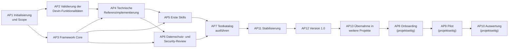

# Implementierungs-Roadmap

| Attribut | Wert |
|---|---|
| ID | `FW-DOC-ROADMAP` |
| Version | `0.1.0` |
| Status | `entwurf` |
| Owner (Rolle) | `<FRAMEWORK_OWNER>` |

> Es werden keine Termine oder Aufwände vorgegeben; die Steuerung erfolgt über Prioritäten (P1 = zuerst) und logische Abhängigkeiten. Rollen sind generisch. Die Erstfassung 0.1.0 dieses Repositorys deckt die inhaltlichen Ergebnisse von AP3–AP5 in Entwurfsqualität bereits ab; die zugehörigen Arbeitspakete bestätigen, validieren und härten sie.

## Stand nach Release 0.15.0 (2026-09-10)

Wird mit jedem Release fortgeschrieben. Er beantwortet die Frage, womit weiterzuarbeiten ist,
ohne dass man dafür den gesamten Änderungsverlauf lesen muss.

### Was 0.5.0 bis 0.15.0 gebracht haben

| Thema | Ergebnis | Beleg |
|---|---|---|
| Release-Definition | 1.0.0 heißt „technisch validiert und übertragbar", fünf prüfbare Kriterien; Pilot und Onboarding sind projektseitig | D-11, `CR-2026-001` |
| Querverweisprüfung | `FW-KO-04` umgesetzt und bestanden – der erste Testfall des Katalogs überhaupt | `tests/protocols/2026-09-10-FW-KO-04.md` |
| Client Packs | Abbildungsschicht mit Fähigkeitsmatrix; zwei Packs: `devin-desktop`, `claude-code` | D-12 bis D-14 |
| Kern neutralisiert | 61 von 63 Client-Bindungen ersetzt; Begriffe statt Pfade, Glossar als Abbildung | D-15, `docs/RUNTIME_GLOSSARY.md` |
| Keine Doppelpflege | Skills, Wurzel-Anweisung, Core-Regeltexte, Agentenprofil, Overlay-Vorlage liegen einmal im Kern | D-16, D-17 |
| Berechtigungen und Hooks | letzte Doppelpflege beseitigt, als **Semantikabbildung** statt Formtransformation; drei Zusicherungen werden erzwungen statt zugesagt | D-18, `CR-2026-008`, `clientmap.py` |
| Name | Das Framework heißt **Leitwerk**, das Kernverzeichnis `leitwerk-core/`; der Name folgt damit dem Inhalt | D-19, `CR-2026-009` |
| Client Pack minimal | Vier Dateien statt achtzig; `seed_paths` leer, die gesamte Saat kommt aus dem Kern | D-20, `CR-2026-010` |
| Hauptdokument | Baut aus einem frischen Auscheckstand; Laufzeitdateien aus einer Referenzinstallation mit Herkunftsangabe; Abbildungsschicht eingearbeitet | D-21, `CR-2026-011` |
| Schreibschutz | Das **gesamte** Kernverzeichnis ist geschützt, nicht nur `framework/**`; der zweite Testfall des Katalogs ist bestanden | D-22, `CR-2026-012`, `tests/protocols/2026-09-10-FW-ZA-05.md` |
| Übernahme belegt | Übungsrepository von 0.4.0 auf 0.10.0 gehoben – sechs Releases in einem Schritt, ein Handgriff von Hand; Kriterium 5 von D-11 technisch belegt | `FW-RE-02`, `tests/protocols/2026-09-10-FW-RE-02.md` |
| Prüfungen, die prüfen | Vier Blindstellen des Validators behoben; ein Testfall gilt erst mit Wirksamkeitsnachweis als bestanden | D-23, `CR-2026-013`, `tests/protocols/2026-09-10-FW-KO-01.md` |
| Kurzform trägt | Sieben Abweichungen zwischen geladener Kurzform und kanonischer Langform behoben; Laufzeitschicht ohne Client-Bindung | D-24, `CR-2026-014`, `tests/protocols/2026-09-10-FW-KO-02.md` |
| Versionskette sagt etwas | Versionsfelder werden auf **Stimmigkeit** geprüft, nicht nur auf Anwesenheit; 13 Skills, 10 Checklisten und 13 Prompts nach zwölf Releases erstmals angehoben; der dritte Review-Testfall ist bestanden | D-25, `CR-2026-015`, `tests/protocols/2026-09-10-FW-VN-01-wiederholung.md` |
| AP2 begonnen | Das Pack `claude-code` erstmals gegen eine reale Installation gefahren: neun Befunde, drei schwer. Eine Kernzusage verfiel beim Rendern, 18 Regeln waren wirkungslos, die vorgeschriebene Pruefung war nie gelaufen | D-26, `CR-2026-016`, `tests/protocols/2026-09-10-AP2-claude-code.md` |
| Ladebedingungen abgebildet | `.claude/rules/` mit `paths:` bildet R2 und R3 ab; keine Einstufung des Packs steht mehr auf `[NICHT ABBILDBAR]`. Eine aktivierte Role-Pack-Regel wurde bei diesem Client nie geladen | D-27, `CR-2026-017`, AP2-Protokoll Nachtrag 2 |

Mit 0.10.0 schützen die Schreibverbote nicht mehr nur die Regeltexte, sondern auch die fünf
Skripte, die die Schutzzusagen durchsetzen – `install.py`, `clientmap.py`, den Validator und
die beiden Hook-Skripte. Vorher konnte ein KI-Client die Datei ändern, die seine eigenen
Regeln erzeugt, und die Prüfung abschalten, die das bemerkt hätte. Die Migration bestehender
Installationen kostet zwei Zeilen und wird vom Validator erzwungen, nicht bloß angekündigt.

Mit 0.15.0 verliert auch eine **Ladebedingung** keine Zusage mehr. Das Pack `claude-code`
führte R2 („Regeldateien mit Ladebedingungen") und R3 („Regeln an Dateimuster bindbar –
Grundlage der Technology Packs") als `[NICHT ABBILDBAR]`, begründet mit „`@pfad`-Importe werden
immer geladen". Richtig für Importe, falsch für den Client: `.claude/rules/*.md` mit
`paths:`-Frontmatter bindet eine Regel an Glob-Muster, und **eine Regeldatei ohne `paths` lädt
unbedingt – ohne Import**.

An derselben Fehlannahme hing mehr als zwei Matrixzeilen. **Eine aktivierte Role-Pack-Regel
wurde bei diesem Client nie geladen** (AP2-CC-10): `install.py` band nur die vier Core-Regeln
ein, alles Übrige lag in der Regelablage und wirkte nicht – genau der stille Fehlerfall, den das
Client Pack selbst beschrieben hatte, eingetreten am framework-eigenen Mechanismus. Dieselben
Dateien liefen zudem nie durch die Formtransformation, ebenso wenig die Regelvorlagen.

Seit D-27 wird jeder Ladetrigger der Kernquelle auf die Bedingungssprache des Zielclients
abgebildet – `glob` auf `paths`, `always_on` und `model_decision` auf unbedingtes Laden – und ein
Ladetrigger ohne Eintrag lässt die Installation scheitern, und zwar vollständig statt mitten im
Schreiben. Umgekehrt gilt die Grenze der neuen Fähigkeit: **Eine Kernregel darf keine
Ladebedingung tragen**, sonst wäre die Bindung an Dateimuster eine Lockerung. Sechs Sonden
belegen die neuen Prüfungen, vier Gegenproben zeigen, dass keine bestehende verdrängt wurde.

Nebenbefund mit eigener Nummer: **`claudeMdExcludes` kann Regeldateien nutzerlokal vom Laden
ausnehmen** (AP2-CC-11) – eine Lockerung und damit eine Lücke in B9, die vor 0.15.0 größer war
als danach und nur bisher niemandem aufgefallen ist. Sie ist ausgewiesen, nicht geschlossen.

Mit 0.14.0 verliert eine Abbildung keine Zusage mehr. `AP2` fuer das Pack `claude-code` - der
erste Durchlauf ueberhaupt, acht Releases nach seiner Einfuehrung - ergab neun Befunde, drei
davon schwer, und alle drei mit derselben Ursache: **Das Pack war nie gegen eine reale
Installation gefahren worden**, obwohl der Client die ganze Zeit erreichbar war.

Der schwerste: Die Semantikabbildung verwarf `triggers` ersatzlos, weil der Client das Feld nicht
kennt. Damit verfiel die Zusage S4 - schreibende Skills nur benutzergetriggert - genau bei der
Installation, waehrend der Validator sie in der Quelle weiter erzwang. **Das Modell konnte
`fw-change-small` selbst waehlen, einen Skill mit `Edit`, `Write` und `Bash`.** Der Client hat ein
Feld dafuer: `disable-model-invocation`.

Der zweite: 18 Regeln der erzeugten Berechtigungsdatei werden vom Client angenommen, nie
konsultiert und beim Sitzungsstart als Warnung gemeldet - vier davon forderte
`_core_rules_integrity` sogar ein. Der dritte erklaert die ersten beiden: Die in Abschnitt 7 des
Packs vorgeschriebene Pruefung - installieren, dann validieren - meldete zwoelf Fehler und war
deshalb nie gelaufen; sie haette den ersten Befund ausserdem gar nicht sehen koennen, weil sie
die kommagetrennte Werkzeugliste der installierten Fassung zeichenweise las.

Seit D-26 gilt: Kann der Zielclient eine Aussage der Quelle nicht in derselben Form tragen, wird
sie abgebildet oder die Installation scheitert. Umgekehrt wird eine Regel, die der Client nicht
auswertet, gar nicht erst erzeugt.

Mit 0.13.0 sagt die Nachweiskette wieder etwas aus. `FW-VN-01` ergab neun Befunde; der
tragende war keine fehlende Angabe, sondern eine, die sich nie bewegt: **Alle 13 Skills standen
unverändert auf `0.1.0`, obwohl alle 13 `SKILL.md` geändert worden waren** – 126 Zeilen in 0.5.0
und 0.7.0. Wirksam wurde das im Nutzungsvermerk des Merge Requests: Die Kurzform für
Kontrollstufe niedrig nannte weder Framework- noch Overlay-Version, ihre einzige Versionsangabe
waren die Skills. Bei Kontrollstufe niedrig enthielt ein Merge Request damit keine
Versionsangabe, die sich je geändert hatte – formal vollständig, inhaltlich leer.

Fünf Sonden blieben sämtlich unbemerkt, drei Gegenproben wurden gemeldet: Der Validator prüfte
die **Anwesenheit** von Versionsfeldern und niemals ihren **Inhalt**. Prüfung 13 vergleicht
jetzt die drei Ablageorte der Overlay-Version miteinander, die Steckbriefangabe gegen
`leitwerk-core/VERSION` und jedes Versionsfeld gegen `MAJOR.MINOR.PATCH`. Seit D-25 nennen nur
noch die Artefakte eine kompatible Framework-Version, die vom Kern abweichen können – Overlay
und Client Pack; für alles, was byte-gleich im Release liegt, ist `VERSION` im selben
Verzeichnis die Angabe.

Mit 0.12.0 sagt die geladene Kurzform dasselbe wie die kanonische Langform. Der Abgleich
`FW-KO-02` ergab sieben Abweichungen; die schwerste war keine widersprüchliche Regel, sondern
eine fehlende: **Vier der zwölf Delegationsverbote kamen in keiner geladenen Datei vor.** Die
Langform steht nicht im Kontext einer Sitzung – eine Regel, die nur dort steht, wirkt nicht.
Seit D-24 wird die Richtung jeder Auflösung einzeln begründet, statt pauschal die Langform
gewinnen zu lassen.

Mit 0.11.0 prüfen die Prüfungen, was sie zu prüfen behaupten. `FW-KO-01` war grün – und ließ
sechs von 22 gezielt eingebrachten Defekten durch. Vier davon waren echte Blindstellen: Die
Prüfung auf vier Backticks hatte unter Windows nie ausgelöst, die Quellen des Hauptdokuments
waren von der Inhaltsprüfung ausgenommen, ein Overlay konnte sich über seinen eigenen Status
widersprechen, und derselbe Schutz war im Hook strenger als im Validator. Seit D-23 gilt ein
Testfall erst als bestanden, wenn neben dem grünen Lauf ein Wirksamkeitsnachweis vorliegt.

Nach 0.10.0 ist das Übungsrepository von 0.4.0 auf den damaligen Stand gehoben – als
Aktualisierung, nicht als Neuinstallation, und damit über sechs Releases hinweg. Der einzige
Handgriff war der im CHANGELOG angekündigte: zwei Zeilen in der Berechtigungsdatei, vom
Validator zuvor mit genau zwei Fehlern eingefordert. Kriterium 5 von D-11 ist damit
technisch belegt; organisatorisch bleibt es offen, weil das Übungsrepository keinen
Organisationsbezug hat.

Mit 0.9.0 ist das Hauptdokument wieder ein Lieferbestandteil: Es baut aus einem frischen
Auscheckstand, weist bei jeder Laufzeitdatei aus, aus welchem Client Pack sie stammt, und
kennt die Abbildungsschicht. Vorher gelang der Bau nur, wenn zufällig eine Installation im
Arbeitsverzeichnis lag.

Mit 0.8.0 enthält ein Client Pack nur noch, was zwei Clients tatsächlich unterscheidet: die
Pfadabbildung, die Semantikabbildung, die Fähigkeitsmatrix und zwei erklärende READMEs. Jede
Doppelpflege im Kern ist beseitigt.

Mit 0.7.0 ist der letzte P3-Punkt der Liste erledigt: Der Name folgt dem Inhalt. Die
Umbenennung war seit 0.5.0 vorgesehen und wurde bewusst zurückgestellt, bis `FW-KO-04` sie
absichern konnte – die Prüfung meldete gegen beide Installationen null Fehler.

Mit 0.6.0 ist das Verschärfungsprinzip
an der Stelle, an der die Kernzusagen B1 bis B6 hängen, eine geprüfte Eigenschaft: Eine Regel,
die ein Client nicht abbilden kann, lässt die Installation scheitern, statt stillschweigend zu
entfallen – und der Validator gleicht die installierte Berechtigungsdatei gegen die Kernquelle
ab, nicht nur gegen sich selbst.

### Nächste Schritte, nach Priorität

**P1 – AP2: Mechanismen validieren. Begonnen.**

**Client Pack `claude-code`: alle zehn Prüfmarker abgearbeitet** (Clientversion 2.1.267,
`tests/protocols/2026-09-10-AP2-claude-code.md`). Neun Befunde, davon drei schwer. Der Client
war die ganze Zeit erreichbar – das Framework wird in einer Claude-Code-Sitzung entwickelt;
das Pack trug trotzdem seit acht Releases `Geprüfte Clientversion: <TBD>`.

Das Befundmuster ist bemerkenswert: **Sechs von neun Befunden lauten, das Pack habe
unterschätzt, was der Client leistet.** Kein einziger lautet, es habe eine Fähigkeit
behauptet, die fehlt.

**Sechs Befunde sind behoben** – drei mit 0.14.0 (`CR-2026-016`, D-26), drei mit 0.15.0
(`CR-2026-017`, D-27). Je einer kam bei der Behebung dazu und erklaert die anderen:

- **AP2-CC-01:** Die Semantikabbildung verwarf `triggers` ersatzlos. Die Zusage S4 verfiel damit
  bei der Installation, obwohl der Client mit `disable-model-invocation` ein Feld dafuer hat.
  Jetzt abgebildet; 9 von 12 Skills tragen die Sperre.
- **AP2-CC-02:** 18 wirkungslose Regeln je Installation, vier davon von `_core_rules_integrity`
  eingefordert. Pfadregeln werden nur noch fuer `Read` und `Edit` erzeugt; die Berechtigungsdatei
  schrumpft von 83 auf 65 Regeln.
- **AP2-CC-09:** Die in Abschnitt 7 des Packs vorgeschriebene Pruefung - installieren, dann
  validieren - meldete zwoelf Fehler und war deshalb nie gelaufen. Sie haette AP2-CC-01 ausserdem
  nicht sehen koennen, weil sie die kommagetrennte Werkzeugliste zeichenweise las. Beide Befehle
  laufen jetzt nacheinander mit 0 Fehlern.

- **AP2-CC-03:** R2 und R3 standen auf `[NICHT ABBILDBAR]`, obwohl der Client Regeldateien mit
  Ladebedingungen kennt. Die Regelablage liegt jetzt in `.claude/rules/`, die Ladetrigger werden
  abgebildet, ein Technology Pack laedt ueber `paths:`.
- **AP2-CC-10:** Eine aktivierte Role-Pack-Regel wurde nie geladen und lief nie durch die
  Formtransformation. Beides behoben; eine Regeldatei wirkt jetzt ohne Import.
- **AP2-CC-11:** `claudeMdExcludes` kann Regeldateien nutzerlokal vom Laden ausnehmen – eine
  Luecke in B9. **Ausgewiesen, nicht geschlossen**; ob verwaltete Einstellungen eine
  Gegenmassnahme hergeben, haengt an den Enterprise-Markern.

Zehn Sonden nach D-23 belegen die neuen Pruefungen (vier zu 0.14.0, sechs zu 0.15.0), alle
gemeldet; die vier Gegenproben zu 0.15.0 zeigen, dass keine bestehende Pruefung verdraengt wurde.

**Keine Einstufung des Packs steht mehr auf `[NICHT ABBILDBAR]`** – 4 vor AP2, jetzt 0. Alle vier
waren Unterschaetzungen des Clients.

**Offen bei `claude-code`:** die Wirkungsnachweise. Sie brauchen eine Sitzung, die **in** der
Testinstallation startet, weil Berechtigungen und Regeln beim Sitzungsstart gelesen werden; aus
einer Sitzung mit anderem Arbeitsverzeichnis sind sie nicht führbar. Der einfachste ist
geschenkt: Die Startwarnungen aus AP2-CC-02 erscheinen ohne Zutun und benennen jede wirkungslose
Regel. Seit 0.15.0 gehört ein zweiter dazu – dass eine Regel ohne `paths` tatsächlich im Kontext
steht und eine Regel mit `paths` erst nach dem Lesen einer passenden Datei.

**Offen als Gegenzeichnung:** Nachtrag 2 des AP2-Protokolls ist **vorgelegt, nicht abgezeichnet**.
Die Prüfmethode `review` verlangt eine zweite Rolle; drei Auflösungen mit Ermessensspielraum (E1
bis E3) liegen `<FRAMEWORK_OWNER>` zur Einzelentscheidung vor.

**Offen bei `devin-desktop`:** alle zwölf Prüfmarker. Sie brauchen eine Installation von Devin
Desktop; nichts aus dem `claude-code`-Protokoll überträgt sich darauf.

**Offen übergreifend:** die verbindliche Zielversion je Client. Das Protokoll hält fest, gegen
welche Version geprüft wurde (2.1.267); *freigegeben für* eine Version ist das Pack damit
nicht – das ist eine Festlegung des `<FRAMEWORK_OWNER>`.

Danach den Schutz-Hook auf fail-closed umstellen – bei `claude-code` ist das Blockierverhalten
bereits belegt.

**P2 – Testkatalog ausführen.** 30 von 37 Testfällen stehen auf `offen`, keiner auf
`fehlgeschlagen`. Kriterium 2 von D-11. Die skriptbaren Testfälle sind abgearbeitet und alle
drei bisher ausführbaren Review-Testfälle dazu: `FW-KO-01`, `FW-KO-02`, `FW-KO-04`, `FW-DS-03`,
`FW-ZA-05`, `FW-RE-02` und `FW-VN-01` sind bestanden und protokolliert.

`FW-KO-02` ist durchgeführt, seine sieben Befunde sind behoben und die Gegenzeichnung durch
`<FRAMEWORK_OWNER>` liegt vor – damit `bestanden`.

`FW-VN-01` (Versionskette) ist `bestanden`. Der Lauf ergab neun Befunde, fünf davon durch Sonden
belegt (`tests/protocols/2026-09-10-FW-VN-01.md`); sie sind mit `CR-2026-015` behoben, der
Wiederholungslauf meldet alle fünf Sonden
(`tests/protocols/2026-09-10-FW-VN-01-wiederholung.md`), und die Gegenzeichnung liegt vor. Die
beiden Ermessensentscheidungen wurden einzeln vorgelegt und entschieden: E1 – Abschnitt 1.2 des
Release-Prozesses einschränken statt in 35 Artefakten einlösen; E2 – Skill-Versionen anheben und
die daraus folgende Testpflicht bis AP2 offen tragen. Der Vorlauf behält seinen Ergebnisstatus
`fehlgeschlagen`; er hält fest, was der Testfall vorgefunden hat.

**Folgearbeit aus der Versionsanhebung (P2).** `08-skill-conventions.md` Abschnitt 7 verlangt
bei jeder Versionsänderung die erneute Ausführung der Testfälle in `TESTS.md` je Skill. Durch
die Anhebung auf `0.1.1` betrifft das alle 13 Skills. Die Testfälle sind sämtlich `sitzung` und
hängen damit an AP2; die Pflicht bleibt bis dahin offen. Das war der ausdrücklich vorgelegte
Preis der Entscheidung E2: Eine offene Testpflicht ist in AP2 sichtbar, eine nichtssagende
Versionsangabe nicht.

Ohne reale Installation bleibt `FW-AK-01` (`[DOK]`-Aussagen gegen die aktuelle
Herstellerdokumentation – braucht Zugang zu dieser Dokumentation). Alles Übrige sind
Sitzungstests und hängt an AP2.

**Erledigt – Übungsrepository auf 0.13.0.** `install.py --update` hat 39 Core-Dateien erneuert
und die 20 Projektdateien unangetastet gelassen; die Berechtigungsdatei war nicht betroffen.
**Prüfung 13 hat beim ersten Lauf gegen den neuen Kern genau einen Fehler gemeldet** – die
Steckbriefangabe stand noch auf `0.12.x` – und damit im ersten Praxisfall geleistet, wofür sie
gebaut wurde.

Der Fund dieser Aktualisierung liegt aber außerhalb dessen, was der Validator sehen kann: Die
Merge-Request-Vorlage des Projekts trug im Beispielblock die **festen** Werte
`Framework-Version: 0.2.0 · Overlay-Version: 0.1.0` und war damit über elf Releases hinweg
falsch – in genau der Datei, aus der die Nachweiskette in jeden Merge Request übernommen wird.
Derselbe Befund wie `FW-VN-01` im Framework, projektseitig und außerhalb der Reichweite jeder
Prüfung, weil die Vorlage dem Projekt gehört. `ADOPTION_GUIDE` Schritt 3 empfiehlt jetzt
Platzhalter statt Werte; die Vorlage des Übungsrepositorys ist entsprechend umgestellt.

**Zu erwägen (P3):** ob der Validator eine im Overlay registrierte Merge-Request-Vorlage
(`<MR_TEMPLATE_PATH>`) auf feste Versionswerte prüfen soll. Dagegen spricht, dass die Vorlage
Ebene 4 ist und das Framework ihr Format nicht vorschreibt; dafür spricht D-25 – ein von Hand
gepflegter Wert ohne Prüfung veraltet.

**P2 – Strukturentscheidungen bestätigen.** D-01 bis D-10 tragen weiterhin den Status
`entschieden (Vorschlag)`. Kriterium 4 von D-11 verlangt, dass kein Decision Record mehr so
steht. D-02 ist bereits fortgeschrieben. D-04 ist der nächste Kandidat: Er beschreibt die
Berechtigungsdatei noch client-gebunden und ohne die Kernregelintegrität.

**P3 – „Devin" als Akteursbezeichnung aus den Langform-Modulen lösen.** Noch 76 Nennungen in
elf Modulen (vor 0.13.0: 83 – die Umbenennung des Nutzungsvermerks hat sieben davon gelöst).
Sie wirken nicht auf das Verhalten, weil die Langform nicht in die Sitzung geladen wird – die
Laufzeitschicht ist seit 0.12.0 frei davon –, widersprechen aber der Zusage eines
werkzeugneutralen Kerns. D-15 hatte Pfade ersetzt, nicht die Akteursbezeichnung. Ein Teil der
Nennungen meint den Client korrekt („Devin Desktop") und bleibt.

**P3 – Word-Fassung erzeugen.** `build-docx.py` folgt dem Markdown und braucht keine
Anpassung, wurde seit dem Umbau des Hauptdokuments aber nicht ausgeführt; `pandoc` und `mmdc`
fehlten in der Umgebung. Vor der nächsten Auslieferung einmal bauen.

**P3 – Modulstatus heben.** Alle Module stehen auf `entwurf`; Kriterium 3 von D-11.

### Bewusst offen gelassen

- Zwei Pfadnennungen in AP2 dieses Dokuments: Das Arbeitspaket validiert die Mechanismen *eines*
  Clients und nennt sie deshalb konkret.
- `PyYAML` ist für den Betrieb nicht vorausgesetzt, für einen Nachweis schon: Ohne das Modul
  prüft der Validator Frontmatter und Overlay-Manifest eingeschränkt und sagt das seit 0.11.0
  als Warnung. Der Testkatalog führt es als Voraussetzung der Skripttests.
- Ein Client Pack fügt eine Verschachtelungsebene hinzu; unter Windows bleiben bei `MAX_PATH`
  rund 149 Zeichen für den Projektpfad.
- Bei `claude-code` liegen die Hooks in der Berechtigungsdatei und damit in der Saat. Eine
  Änderung an den Hooks des Kerns erreicht ein bestehendes Projekt dieses Packs nicht über
  `install.py --update`; sie ist beim Release-Wechsel von Hand nachzuziehen. Eine automatische
  Teilzusammenführung in eine Datei, die dem Projekt gehört, wäre die schlechtere Lösung.
- Die Importmechanik der Wurzel-Anweisung (`root_instruction_imports`, Marke `RUNTIME_IMPORTS`)
  ist seit 0.15.0 von **keinem** ausgelieferten Client Pack mehr benutzt: Beide laden ihre
  Regelablage selbst. Sie bleibt manifestgesteuert für ein künftiges Pack erhalten und ist damit
  unerprobter Kerncode. Die Gegenposition steht in `CR-2026-016` – dort wurde Vorhalten „für den
  Fall" ausdrücklich verworfen; der Unterschied ist, dass eine wirkungslose Berechtigungsregel
  eine Wirkung behauptet, während dieser Zweig gar nichts behauptet.
- `claudeMdExcludes` kann bei `claude-code` Regeldateien nutzerlokal vom Laden ausnehmen und ist
  damit eine Lockerung, die B9 ausschließt (AP2-CC-11). Technisch verhindert wird sie nicht; nur
  eine über verwaltete Einstellungen ausgelieferte Anweisungsdatei ist geschützt.
- Ein Shell-Befehl, der in den Kern schreibt, wird vom Schutz-Hook nicht erfasst; dort trägt
  allein die `deny`-Liste der Berechtigungsdatei. Das gilt für jedes Pfadverbot gleichermaßen
  und ist kein Sonderfall des Kernverzeichnisses.

## Abhängigkeitsübersicht

Textfassung der Abhängigkeiten: AP2 und AP3 folgen auf AP1 und laufen parallel; AP4 benötigt AP2 und AP3; AP5 benötigt AP3 und AP4; AP6 benötigt AP3 und AP4 (Review der realen Konfiguration); AP7 benötigt AP5 und AP6; AP11 folgt AP7; AP12 folgt AP11; AP13 folgt AP12; AP8 benötigt AP13; AP9 folgt AP8; AP10 folgt AP9.

> **Zuordnung seit CR-2026-001 (D-11):** AP1–AP7, AP11 und AP12 liegen beim Framework Owner und führen zum Release 1.0.0. AP8 (Onboarding), AP9 (Pilot) und AP10 (Auswertung) sind **projektseitige** Arbeitspakete der aufnehmenden Organisation und setzen eine erfolgte Übernahme (AP13) voraus. Sie sind ausdrücklich **keine** Vorbedingung für 1.0.0 – ein Release 1.0.0 erklärt nicht, dass das Framework im Realbetrieb erprobt wurde.

## Arbeitspakete

### AP1 – Initialisierung und Scope (Priorität P1)

| Feld | Inhalt |
|---|---|
| Ziel | Getragener Auftrag: Geltungsbereich, Rollenbesetzung, organisatorische Voraussetzungen geklärt |
| Aktivitäten | Klärungstabelle und Decision Log durchgehen (K-01…K-20); Rollen zuordnen (Framework Owner, Overlay Owner, Kontakte); Planstufe und Team-Einstellungen erheben; Datenschutz- und Vertragsprüfung beauftragen; Feedback- und Ablagekanäle festlegen |
| Eingaben | dieses Framework 0.1.0; Organisationsrichtlinien; Vertragsunterlagen |
| Ergebnisse | besetzte Rollen (außerhalb des Repos); beauftragte Prüfungen; gepflegtes Decision Log; Scope-Notiz |
| Abhängigkeiten | keine |
| Verantwortliche Rolle | Projektleitung mit `<FRAMEWORK_OWNER>` |
| Abnahmekriterien | alle „offen"-Punkte der Klärungstabelle haben Owner und Weg; K-05/K-06 beauftragt |
| Risiken | Prüfungen verzögern alles Nachfolgende → früh starten, Rest parallelisieren |
| Offene Entscheidungen | `<TBD: Planstufe>`, `<TBD: Vertragsprüfung>`, `<TBD: Nutzungsumfang Cloud/CLI>` |

### AP2 – Validierung der Devin-Funktionalitäten (P1)

> Dieses Arbeitspaket ist bewusst clientspezifisch: Es validiert die Mechanismen **eines** KI-Clients. Für jedes weitere Client Pack ist es mit der Fähigkeitsmatrix des jeweiligen Packs zu wiederholen (`leitwerk-core/clients/README.md`).

| Feld | Inhalt |
|---|---|
| Ziel | Alle `[DOK]`/`[EMPF]`-Mechanismen und alle `<VERIFY AGAINST CURRENT DEVIN DOCUMENTATION>`-Marker in einer realen Installation bestätigt oder korrigiert |
| Aktivitäten | Testinstallation (Zielversion notieren); prüfen: AGENTS.md-Laden, `.devin/rules`-Trigger, Zeichenlimits, Skill-Discovery (`.devin/skills/` und `.agents/skills/`), `/skill`-Aufruf, `config.json`-Schema und Muster-Semantik, Session-Grant-Stufen, Hook-Schema (stdin-Felder, Blockierung) und danach `FW_HOOK_FAIL_CLOSED=1` als Standard setzen, Subagent-Profile, Plan-Modus-Dateien, MCP-Konfigurationsdateien, Sandbox-Verhalten je Betriebssystem, Enterprise-Einstellungen; Belegstatus-Tabelle und betroffene Dateien aktualisieren |
| Eingaben | Referenzimplementierung 0.1.0; offizielle Dokumentation; Quellenliste des Hauptdokuments |
| Ergebnisse | Validierungsprotokoll je Mechanismus (FW-AK-02-Format); aktualisierte Marker; CRs für Abweichungen |
| Abhängigkeiten | AP1 (Zugang, Planstufe) |
| Verantwortliche Rolle | DevOps Engineer oder Entwickler mit `<FRAMEWORK_OWNER>` |
| Abnahmekriterien | kein unbestätigter `[DOK]`-Eintrag mehr; VERIFY-Liste leer oder in CRs überführt |
| Risiken | Produktstand ändert sich während der Einführung → Changelog-Beobachtung ab sofort (RELEASE_PROCESS 6) |
| Offene Entscheidungen | `<TBD: verbindliche Zielversion von Devin Desktop>` |

### AP3 – Framework Core (P1)

| Feld | Inhalt |
|---|---|
| Ziel | Core-Module fachlich abgenommen (Status je Modul von `entwurf` auf `pilot`) |
| Aktivitäten | Review aller `leitwerk-core/framework/core/`-Module und der Prioritätshierarchie durch die benannten Rollen; Einarbeitung von Organisationsvorgaben (Ebene B, Klassifizierungs-Mapping); Beschluss offener Strukturentscheidungen (D-01…D-10 bestätigen) |
| Eingaben | Erstfassung 0.1.0; Organisationsrichtlinien; Ergebnis K-06 |
| Ergebnisse | abgenommene Core-Module; gefülltes `org-policies/`-Mapping; aktualisiertes Decision Log |
| Abhängigkeiten | AP1 |
| Verantwortliche Rolle | `<FRAMEWORK_OWNER>` mit `<SECURITY_CONTACT>`, `<DATA_PROTECTION_CONTACT>`, `<ARCHITECT_ROLE>` |
| Abnahmekriterien | jedes Modul reviewt (Nachweis); keine offenen Widerspruchsbefunde; Hierarchie bestätigt |
| Risiken | Übersteuerung durch Einzelmeinungen → Änderungsanträge statt Ad-hoc-Edits |
| Offene Entscheidungen | Bestätigung der 8-stufigen Hierarchie (K-08) |

### AP4 – Technische Referenzimplementierung (P1)

| Feld | Inhalt |
|---|---|
| Ziel | Laufzeitschicht in einer realen Umgebung lauffähig und mit dem Overlay des Erstprojekts befüllt |
| Aktivitäten | Overlay ausfüllen (alle Abschnitte, `20-project-overlay.md`); `config.json` mit realen Pfaden und Befehlen; Hooks nach AP2-Schema härten (fail-closed); erstes Technology Pack für `<TECH_STACK>` erstellen; Übungsrepository erzeugen |
| Eingaben | AP2-Protokoll; AP3-Core; Projektangaben |
| Ergebnisse | aktivierbares Overlay (Status noch inaktiv); Technology Pack v0.1; Übungsrepository |
| Abhängigkeiten | AP2, AP3 |
| Verantwortliche Rolle | Overlay Owner (`<APPROVAL_ROLE>`) mit DevOps Engineer |
| Abnahmekriterien | `validate-framework.py --strict-overlay` fehlerfrei bis auf den Status; Hook-Selbsttests grün |
| Risiken | Zu großzügige Pfad-/Befehlsfreigaben aus Bequemlichkeit → Security-Review in AP6 prüft gezielt |
| Offene Entscheidungen | `<TBD: Schwellenwert CHANGE_SIZE_THRESHOLD>`, `<TBD: kritische Komponenten>` |

### AP5 – Erste Skills (P2)

| Feld | Inhalt |
|---|---|
| Ziel | Referenz-Skills auf dem Übungsrepository erprobt; Status `pilot` |
| Aktivitäten | Skill-Testfälle (`SK-*-P/N`) ausführen; Formulierungen nachschärfen; Skill-Versionen und CHANGELOGs pflegen; gegebenenfalls erste `prj-*`-Skills nach Standard |
| Eingaben | AP4-Umgebung; Skill-Erstfassungen |
| Ergebnisse | Testprotokolle; Skills im Status `pilot`; CR-Liste für Auffälligkeiten |
| Abhängigkeiten | AP3, AP4 |
| Verantwortliche Rolle | Modul-Owner Skills (bis Benennung: `<FRAMEWORK_OWNER>`) mit zwei Entwicklern |
| Abnahmekriterien | alle P0- und N0-Tests je Skill bestanden oder mit CR adressiert |
| Risiken | Skills zu lang für stabiles Verhalten → kürzen, Beispiele in EXAMPLES.md belassen |
| Offene Entscheidungen | Benennung der Modul-Owner |

### AP6 – Datenschutz- und Security-Review (P1)

| Feld | Inhalt |
|---|---|
| Ziel | Formale Freigabe des Frameworks und der Erstprojekt-Konfiguration durch Datenschutz und Informationssicherheit |
| Aktivitäten | Review von FW-CORE-02/03, Kontextklassen-Mapping, `config.json`, Hooks, MCP-Haltung, Vorfallprozess; Abgleich mit K-06-Ergebnis; Auflagen dokumentieren |
| Eingaben | AP3-Module; AP4-Konfiguration; Vertragsprüfung |
| Ergebnisse | Freigabevermerk mit Auflagen; CRs; Einträge in `org-policies/` |
| Abhängigkeiten | AP3, AP4 |
| Verantwortliche Rolle | `<SECURITY_CONTACT>` und `<DATA_PROTECTION_CONTACT>` |
| Abnahmekriterien | schriftliche Freigabe liegt vor; Auflagen als CRs oder Overlay-Einträge umgesetzt beziehungsweise terminiert |
| Risiken | Freigabe unter Vorbehalt wird als Vollfreigabe gelesen → Auflagen in Overlay Abschnitt 1 sichtbar führen |
| Offene Entscheidungen | `<TBD: Auflagen>` |

### AP7 – Testkatalog (P2)

| Feld | Inhalt |
|---|---|
| Ziel | Vollständiger Testkatalog-Lauf bestanden; Framework-Qualität nachgewiesen |
| Aktivitäten | Alle Klassen (KO, PO, NE, DS, PI, SC, FI, ZA, RE, VN, AK) ausführen; Protokoll ablegen; Fehlschläge als CRs; Wiederholungslauf |
| Eingaben | AP5-Skills; AP6-Auflagen; AP4-Umgebung |
| Ergebnisse | Testprotokoll; bereinigte Befunde; belastbarer Stand für das Onboarding |
| Abhängigkeiten | AP5, AP6 |
| Verantwortliche Rolle | Tester/QA mit `<FRAMEWORK_OWNER>` |
| Abnahmekriterien | alle Basistests bestanden; keine offenen Fehlschläge ohne CR |
| Risiken | Sitzungs-Tests nicht reproduzierbar dokumentiert → Testblätter mit Version/Modell/Datum führen |
| Offene Entscheidungen | `<TBD: Ablage der Testprotokolle>` |

### AP8 – Onboarding (P3, projektseitig)

| Feld | Inhalt |
|---|---|
| Ziel | Erste Nutzergruppe befähigt und freigegeben; Onboarding-Material praxisbewährt |
| Aktivitäten | Mentorinnen und Mentoren briefen; Übungsrepository mit Ködern scharf schalten; Durchläufe nach GUIDE/CL-09; Material-Feedback einarbeiten |
| Eingaben | AP7-Stand; Onboarding-Paket |
| Ergebnisse | freigegebene Erstnutzer; Onboarding-Protokolle; Material-CRs |
| Abhängigkeiten | AP13 (Übernahme in ein Projekt); nicht Vorbedingung für AP12 |
| Verantwortliche Rolle | Mentorinnen und Mentoren mit `<FRAMEWORK_OWNER>` |
| Abnahmekriterien | alle Pilotteilnehmer mit dokumentierter Freigabe (COMPLETION_CRITERIA) |
| Risiken | Onboarding als Formalie behandelt → Köderübungen sind bestehenspflichtig |
| Offene Entscheidungen | keine |

### AP9 – Pilot (P3, projektseitig)

| Feld | Inhalt |
|---|---|
| Ziel | Realbetrieb in der Pilotgruppe gemäß `leitwerk-core/pilot/PILOT_CONCEPT.md` mit laufender Messung |
| Aktivitäten | Referenzbasis erheben; Etikettierung im `<ISSUE_TRACKER>`; Betrieb mit Review-Punkten; Feedback- und Vorfallbehandlung; Zwischenanpassungen als CRs |
| Eingaben | AP8-Nutzer; Metrikdefinitionen |
| Ergebnisse | Metrikdaten; Review-Protokolle; CR-Liste |
| Abhängigkeiten | AP8; nicht Vorbedingung für AP12 |
| Verantwortliche Rolle | Projektleitung (Pilot) mit Overlay Owner |
| Abnahmekriterien | Pilot über `<PILOT_DURATION>` ohne Abbruchkriterium beendet oder Abbruch sauber dokumentiert |
| Risiken | Metrik-Übersteuerung des Verhaltens → Kommunikation „bewertet Prozesse, nie Personen" konsequent halten |
| Offene Entscheidungen | `<PILOT_DURATION>`, `<TBD: Zielwerte>` |

### AP10 – Auswertung (P3, projektseitig)

| Feld | Inhalt |
|---|---|
| Ziel | Belastbare Entscheidung: Fortführung, Anpassung oder Beendigung |
| Aktivitäten | Abschlussbericht (Bündelbetrachtung, Kosten/Nutzen, Vorfälle, Akzeptanz); Lessons Learned; Entscheidungsvorlage |
| Eingaben | AP9-Daten und -Protokolle |
| Ergebnisse | Abschlussbericht; dokumentierte Entscheidung im Decision Log |
| Abhängigkeiten | AP9; nicht Vorbedingung für AP12 |
| Verantwortliche Rolle | Projektleitung mit `<FRAMEWORK_OWNER>` und beteiligten Rollen |
| Abnahmekriterien | Entscheidung mit Begründung; abgeleitete CR-Liste priorisiert |
| Risiken | Bestätigungsfehler (nur positive Signale berichten) → Bericht enthält verpflichtend die Gegenargumente |
| Offene Entscheidungen | Ergebnis selbst |

### AP11 – Stabilisierung (P2)

| Feld | Inhalt |
|---|---|
| Ziel | Pilot-Erkenntnisse eingearbeitet; Framework konsistent und dokumentationsfest |
| Aktivitäten | Priorisierte CRs umsetzen; Skills auf `aktiv` heben, wo bewährt; Regression (FW-RE); Dokumente und Onboarding aktualisieren |
| Eingaben | CR-Liste aus AP2, AP5, AP6 und AP7 |
| Ergebnisse | bereinigter Stand; Testprotokoll; Release-Kandidat |
| Abhängigkeiten | AP7 (seit CR-2026-001; zuvor AP10) |
| Verantwortliche Rolle | `<FRAMEWORK_OWNER>` mit Modul-Ownern |
| Abnahmekriterien | CR-Liste abgearbeitet oder begründet verschoben; Testkatalog grün |
| Risiken | Scope-Kriechen durch Wunschliste → nur test- und validierungsbegründete CRs für 1.0 |
| Offene Entscheidungen | Verschiebeliste |

### AP12 – Version 1.0 (P2)

| Feld | Inhalt |
|---|---|
| Ziel | Release 1.0.0 als verbindlicher, übertragbarer Stand im Sinne von D-11: technisch validiert und übertragbar |
| Aktivitäten | `leitwerk-core/checklists/11-framework-release.md` vollständig; Archiv; Kommunikations- und Migrationspaket; Bestandsliste initialisieren |
| Eingaben | AP11-Kandidat |
| Ergebnisse | Release 1.0.0 mit Nachweisen |
| Abhängigkeiten | AP11 (nicht AP8–AP10, siehe CR-2026-001) |
| Verantwortliche Rolle | `<FRAMEWORK_OWNER>` |
| Abnahmekriterien | Die fünf Kriterien aus D-11 erfüllt: kein unbearbeiteter VERIFY-Marker; kein Testfall mit Ergebnisstatus `offen`; alle Modulstatus oberhalb `entwurf`; kein Decision Record im Status `entschieden (Vorschlag)`; Übernahme in ein zweites Projekt nachgewiesen. Release-Checkliste `FW-CL-11` ohne offene MUSS-Punkte; Freigabe dokumentiert |
| Risiken | Release ohne AK-Prüfung veraltet sofort → FW-AK-01/02 sind Teil der Checkliste |
| Offene Entscheidungen | keine |

### AP13 – Übernahme in weitere Projekte (P3)

| Feld | Inhalt |
|---|---|
| Ziel | Wiederholbare Übernahme mit sinkendem Aufwand je Projekt |
| Aktivitäten | Übernahmen nach `ADOPTION_GUIDE.md` + CL-10; je Projekt Overlay, Packs, Übungsrepository, Onboarding; Erfahrungen in Guide und Checkliste zurückführen; Bestandsliste pflegen |
| Eingaben | Release 1.0.0; Projektkontexte |
| Ergebnisse | aktivierte Projekte; gepflegte Bestandsliste; verbesserter Guide |
| Abhängigkeiten | AP12 |
| Verantwortliche Rolle | jeweilige Overlay Owner mit `<FRAMEWORK_OWNER>` |
| Abnahmekriterien | je Projekt: CL-10 vollständig, Basistests bestanden, Onboarding vor Nutzung |
| Risiken | Kopien driften vom Release ab → nur Release-Archive, Abgleich in CL-10 |
| Offene Entscheidungen | `<TBD: Reihenfolge der Projekte>` |
